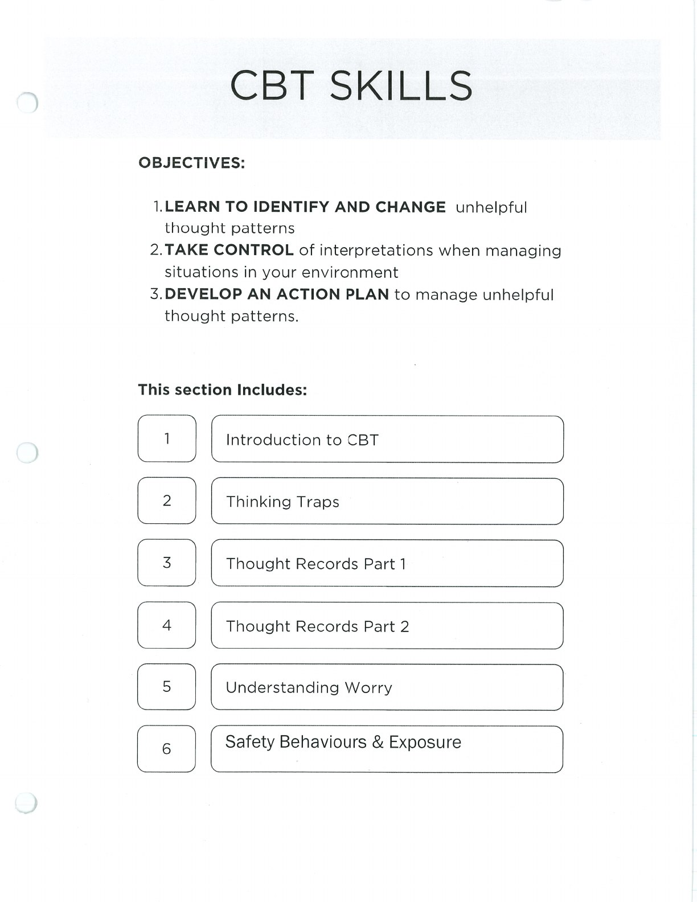
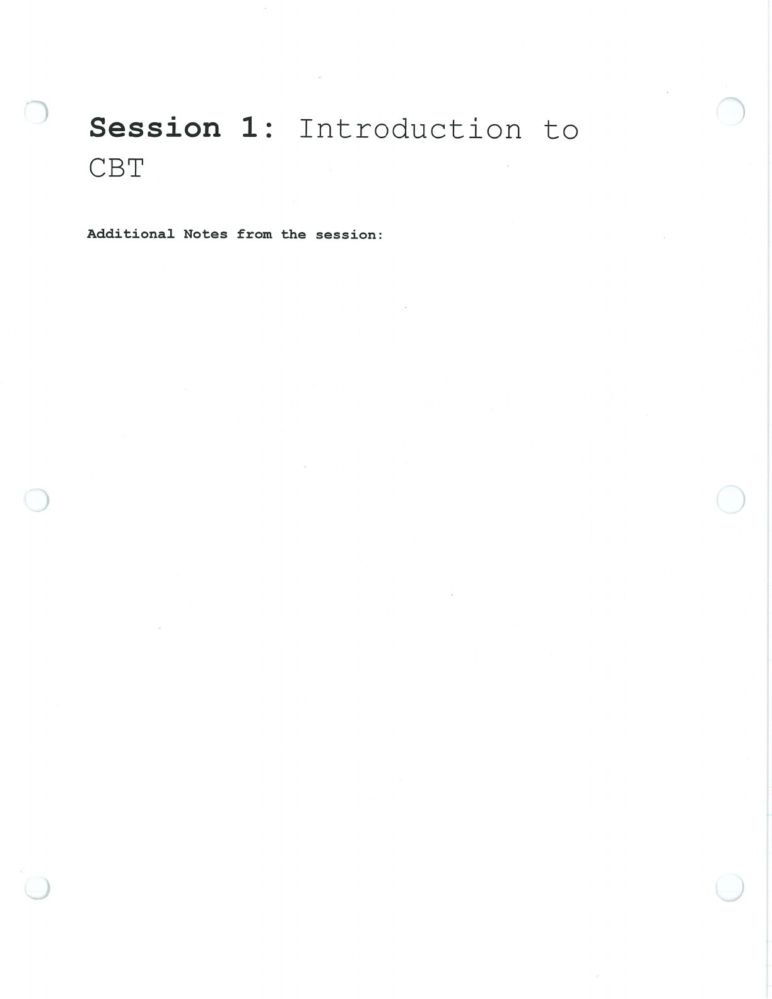

CBT skills examine patterns and test more balanced, useful ways of understanding and responding.

## Handouts and Worksheets {#handouts-and-worksheets}

### Introduction to CBT - binder-p0021 {#binder-p0021}

binder-p0021

<!-- binder-resource: binder-p0021 -->

[{.img-fluid fig-alt="Preview of Introduction to CBT (binder-p0021)"}](../../assets/binder/binder-p0021.jpg)

[Open full page](../../assets/binder/binder-p0021.jpg)

### Introduction to CBT - binder-p0022 {#binder-p0022}

binder-p0022

<!-- binder-resource: binder-p0022 -->

[{.img-fluid fig-alt="Preview of Introduction to CBT (binder-p0022)"}](../../assets/binder/binder-p0022.jpg)

[Open full page](../../assets/binder/binder-p0022.jpg)
