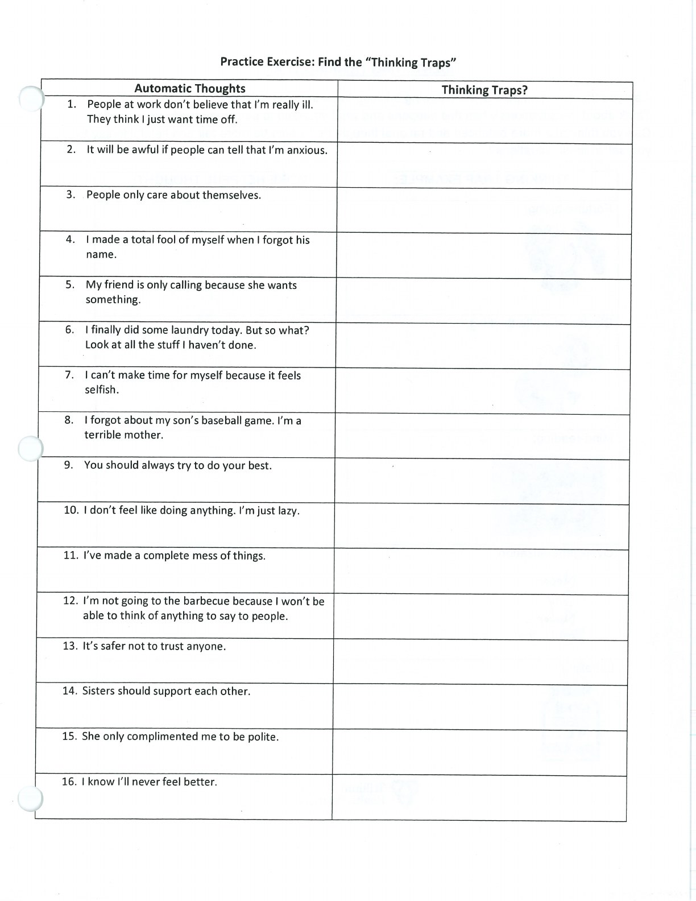
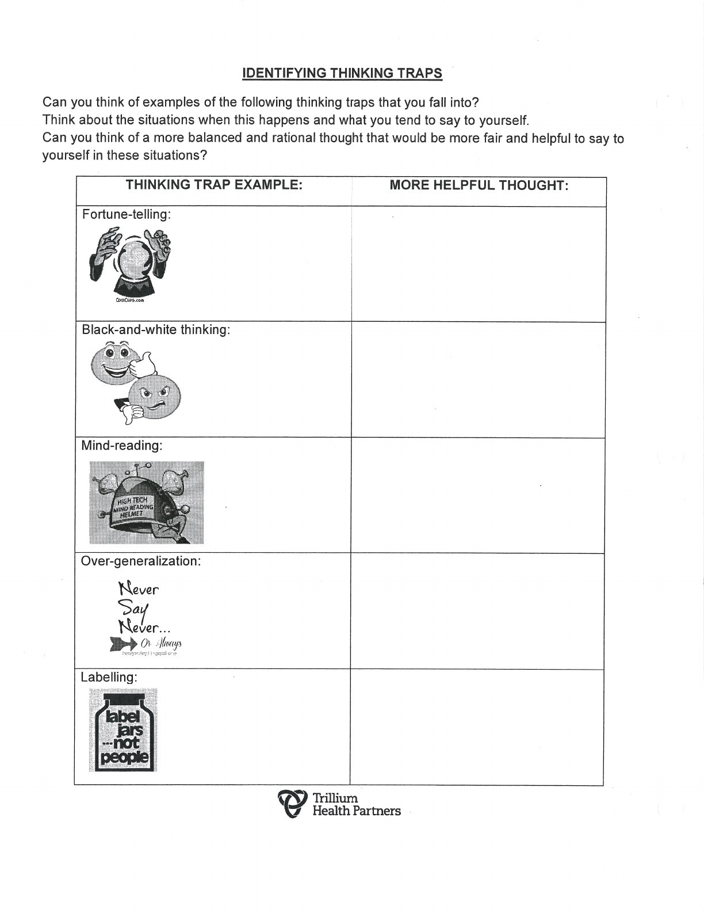
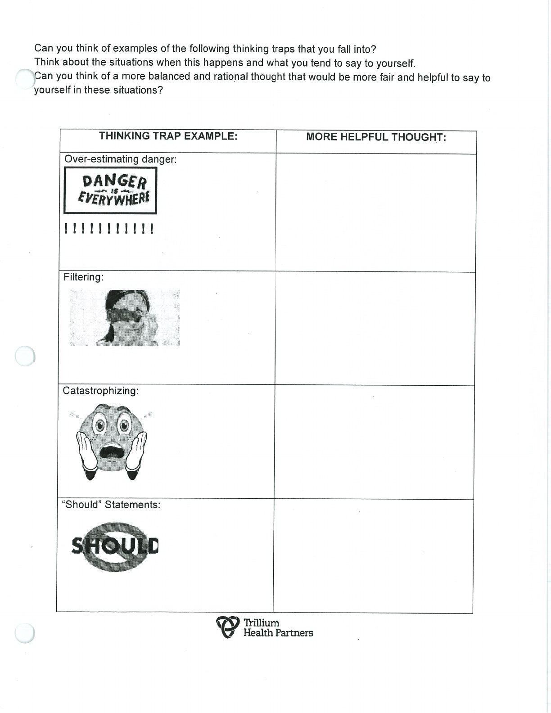
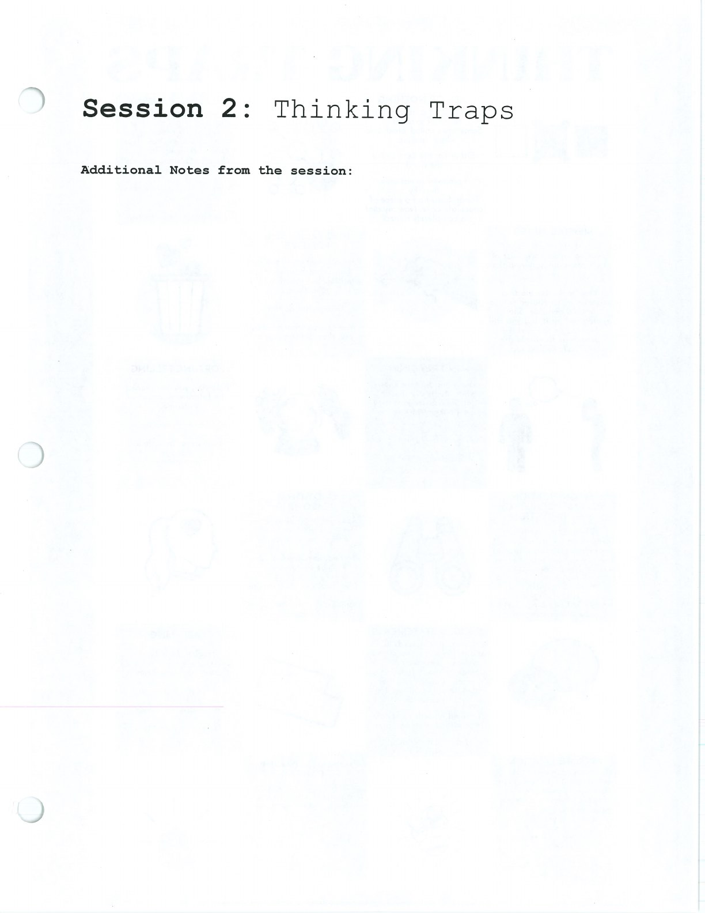

Thinking traps are habits of interpretation. Naming one creates an opportunity to check it.

## Handouts and Worksheets {#handouts-and-worksheets}

### Thinking Traps - binder-p0016 {#binder-p0016}

binder-p0016

<!-- binder-resource: binder-p0016 -->

[{.img-fluid fig-alt="Preview of Thinking Traps (binder-p0016)"}](../../assets/binder/binder-p0016.jpg)

[Open full page](../../assets/binder/binder-p0016.jpg)

### Thinking Traps - binder-p0017 {#binder-p0017}

binder-p0017

<!-- binder-resource: binder-p0017 -->

[{.img-fluid fig-alt="Preview of Thinking Traps (binder-p0017)"}](../../assets/binder/binder-p0017.jpg)

[Open full page](../../assets/binder/binder-p0017.jpg)

### Thinking Traps - binder-p0018 {#binder-p0018}

binder-p0018

<!-- binder-resource: binder-p0018 -->

[{.img-fluid fig-alt="Preview of Thinking Traps (binder-p0018)"}](../../assets/binder/binder-p0018.jpg)

[Open full page](../../assets/binder/binder-p0018.jpg)

### Thinking Traps - binder-p0020 {#binder-p0020}

binder-p0020

<!-- binder-resource: binder-p0020 -->

[{.img-fluid fig-alt="Preview of Thinking Traps (binder-p0020)"}](../../assets/binder/binder-p0020.jpg)

[Open full page](../../assets/binder/binder-p0020.jpg)
