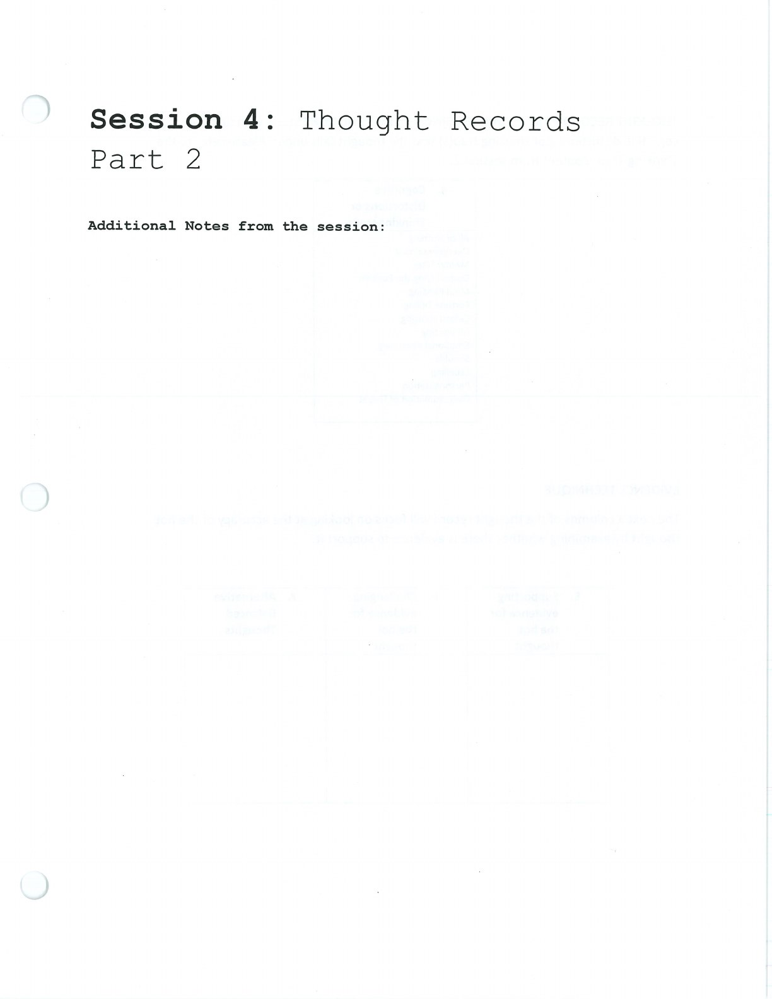
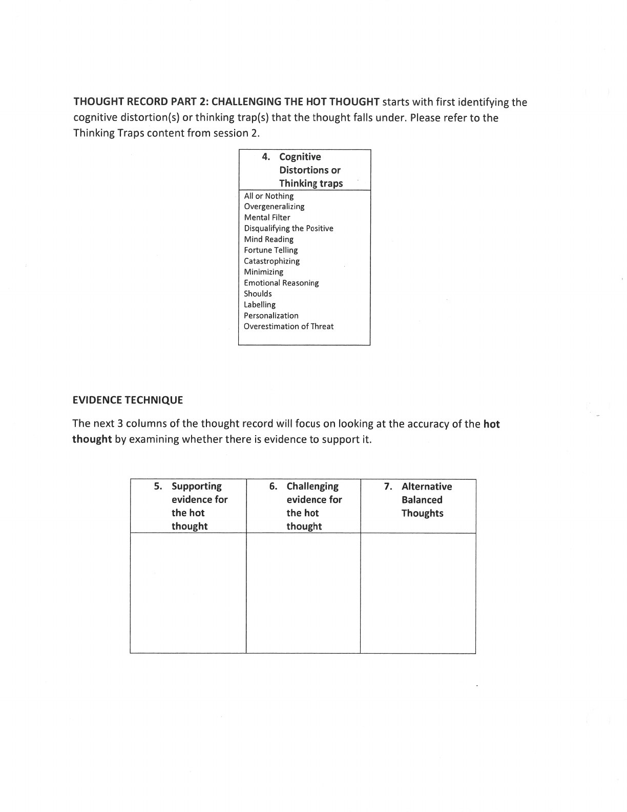
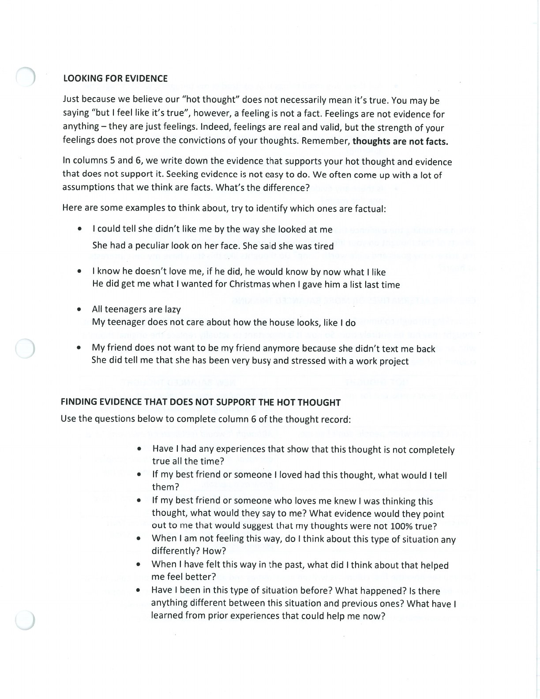
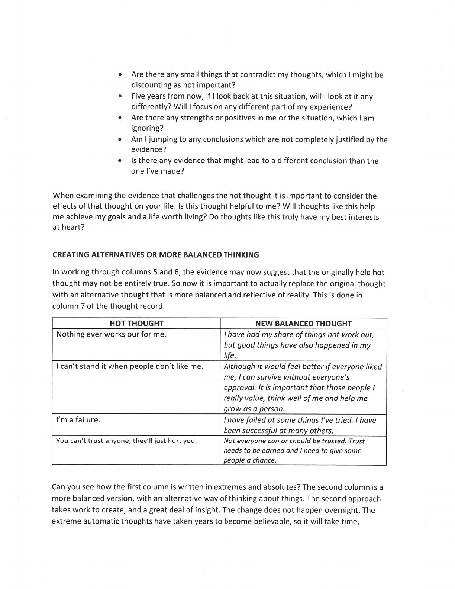
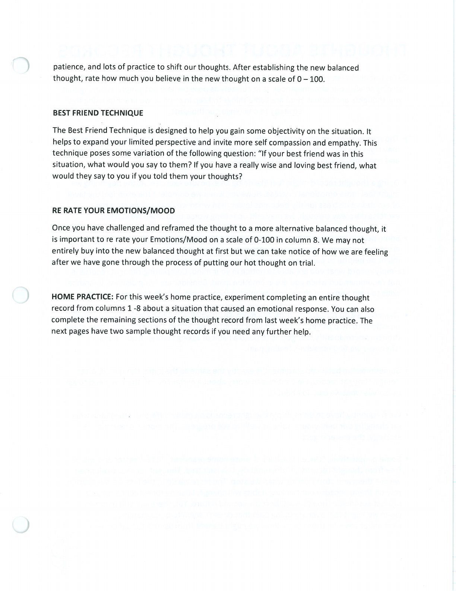

Part 2 continues a thought record by identifying thinking traps, examining supporting and challenging evidence, and creating a balanced alternative. The aim is a fairer thought that fits the evidence and supports effective action, not forced positivity.

## Challenging the Hot Thought {#challenging-the-hot-thought}

Ask what evidence supports the thought, what evidence does not support it, and what you might say to a close friend in the same situation.

## Balanced Alternatives {#balanced-alternatives}

Develop an alternative that acknowledges the difficulty without treating the original hot thought as the only possible interpretation.

## Handouts and Worksheets {#handouts-and-worksheets}

### Thought Records Part 2 - binder-p0011 {#binder-p0011}

binder-p0011

<!-- binder-resource: binder-p0011 -->

[{.img-fluid fig-alt="Preview of Thought Records Part 2 (binder-p0011)"}](../../assets/binder/binder-p0011.jpg)

[Open full page](../../assets/binder/binder-p0011.jpg)

### Thought Records Part 2 - binder-p0012 {#binder-p0012}

binder-p0012

<!-- binder-resource: binder-p0012 -->

[{.img-fluid fig-alt="Preview of Thought Records Part 2 (binder-p0012)"}](../../assets/binder/binder-p0012.jpg)

[Open full page](../../assets/binder/binder-p0012.jpg)

### Thought Records Part 2 - binder-p0013 {#binder-p0013}

binder-p0013

<!-- binder-resource: binder-p0013 -->

[{.img-fluid fig-alt="Preview of Thought Records Part 2 (binder-p0013)"}](../../assets/binder/binder-p0013.jpg)

[Open full page](../../assets/binder/binder-p0013.jpg)

### Thought Records Part 2 - binder-p0014 {#binder-p0014}

binder-p0014

<!-- binder-resource: binder-p0014 -->

[{.img-fluid fig-alt="Preview of Thought Records Part 2 (binder-p0014)"}](../../assets/binder/binder-p0014.jpg)

[Open full page](../../assets/binder/binder-p0014.jpg)

### Thought Records Part 2 - binder-p0015 {#binder-p0015}

binder-p0015

<!-- binder-resource: binder-p0015 -->

[{.img-fluid fig-alt="Preview of Thought Records Part 2 (binder-p0015)"}](../../assets/binder/binder-p0015.jpg)

[Open full page](../../assets/binder/binder-p0015.jpg)
