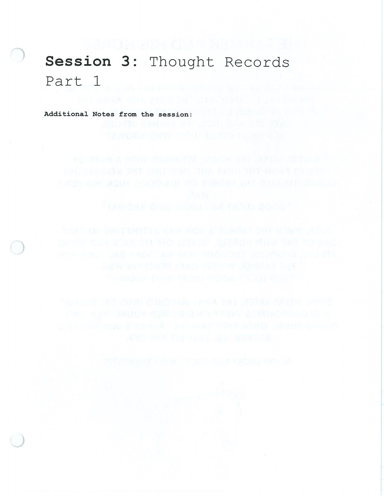

Part 1 slows a difficult moment down so you can identify the situation, emotion, automatic thought, and initial response.

## Handouts and Worksheets {#handouts-and-worksheets}

### Thought Records Part 1 - binder-p0019 {#binder-p0019}

binder-p0019

<!-- binder-resource: binder-p0019 -->

[{.img-fluid fig-alt="Preview of Thought Records Part 1 (binder-p0019)"}](../../assets/binder/binder-p0019.jpg)

[Open full page](../../assets/binder/binder-p0019.jpg)
