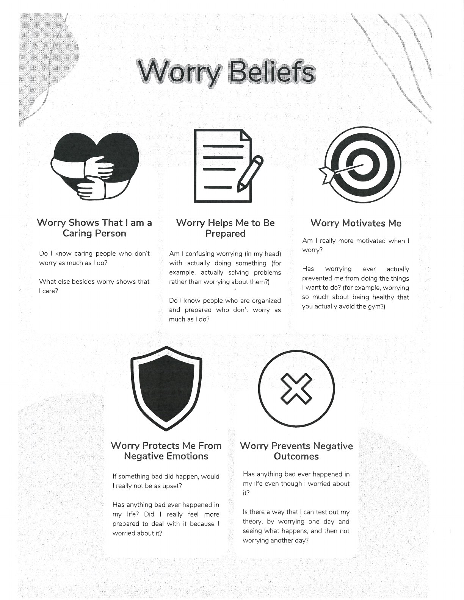
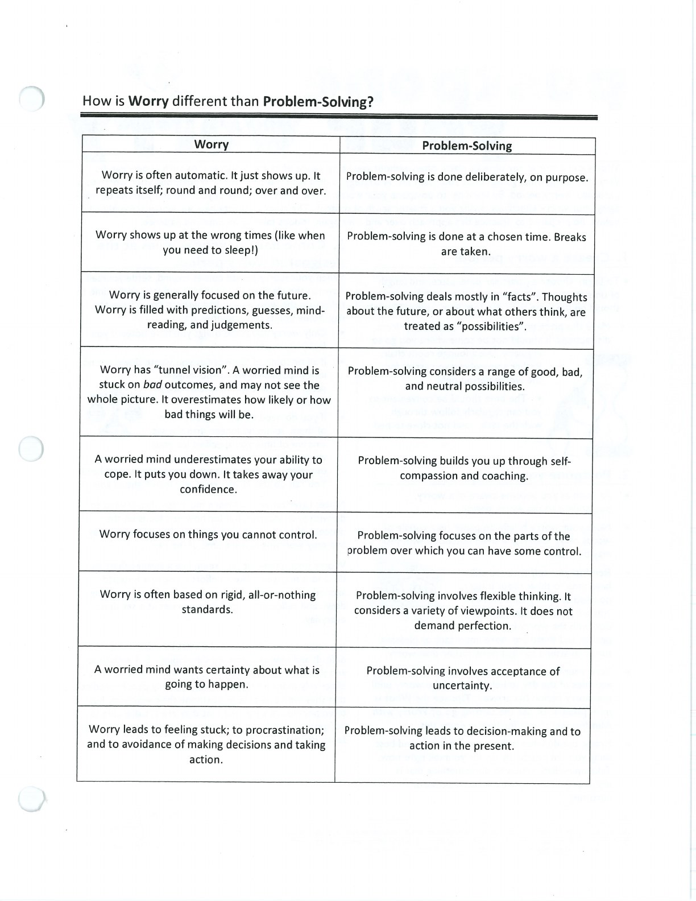

Worry can feel protective while also increasing avoidance and uncertainty. Understanding its function helps you choose a response.

## Five Factor Model {#five-factor-model}

Map the situation, thoughts, emotions, body sensations, and actions to see how the parts influence one another.

## Worry Tree {#worry-tree}

Separate worries you can act on from hypothetical worries that call for attention-shifting or acceptance.

## Worry Time {#worry-time}

Note worries when they arise and return to them during a planned, limited period so they take up less of the day.

## Handouts and Worksheets {#handouts-and-worksheets}

### Understanding Worry - binder-p0009 {#binder-p0009}

binder-p0009

<!-- binder-resource: binder-p0009 -->

[{.img-fluid fig-alt="Preview of Understanding Worry (binder-p0009)"}](../../assets/binder/binder-p0009.jpg)

[Open full page](../../assets/binder/binder-p0009.jpg)

### Understanding Worry - binder-p0010 {#binder-p0010}

binder-p0010

<!-- binder-resource: binder-p0010 -->

[{.img-fluid fig-alt="Preview of Understanding Worry (binder-p0010)"}](../../assets/binder/binder-p0010.jpg)

[Open full page](../../assets/binder/binder-p0010.jpg)
