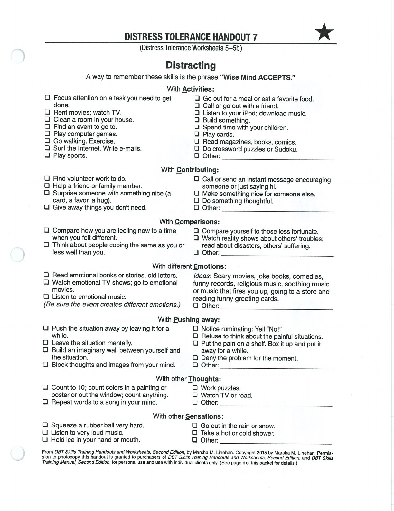
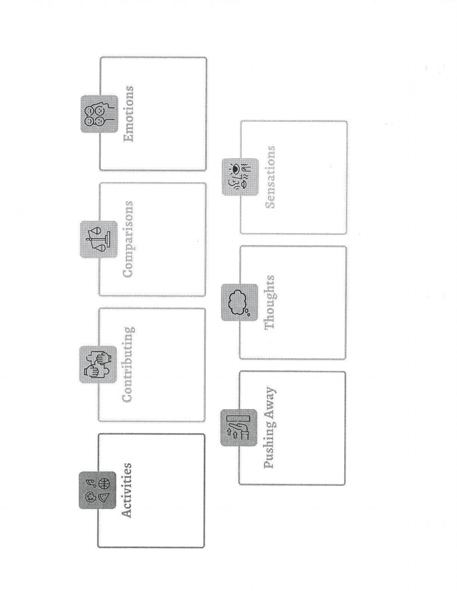

ACCEPTS offers several ways to shift attention until you can respond more effectively.

## Activities {#activities}

## Contributing {#contributing}

## Comparisons {#comparisons}

## Opposite Emotion {#opposite-emotion}

## Pushing Away {#pushing-away}

## Thoughts {#thoughts}

## Sensations {#sensations}

## Handouts and Worksheets {#handouts-and-worksheets}

### Wise Mind ACCEPTS / Distraction - binder-p0122 {#binder-p0122}

binder-p0122

<!-- binder-resource: binder-p0122 -->

[{.img-fluid fig-alt="Preview of Wise Mind ACCEPTS / Distraction (binder-p0122)"}](../../assets/binder/binder-p0122.jpg)

[Open full page](../../assets/binder/binder-p0122.jpg)

### Wise Mind ACCEPTS / Distraction - binder-p0123 {#binder-p0123}

binder-p0123

<!-- binder-resource: binder-p0123 -->

[{.img-fluid fig-alt="Preview of Wise Mind ACCEPTS / Distraction (binder-p0123)"}](../../assets/binder/binder-p0123.jpg)

[Open full page](../../assets/binder/binder-p0123.jpg)
