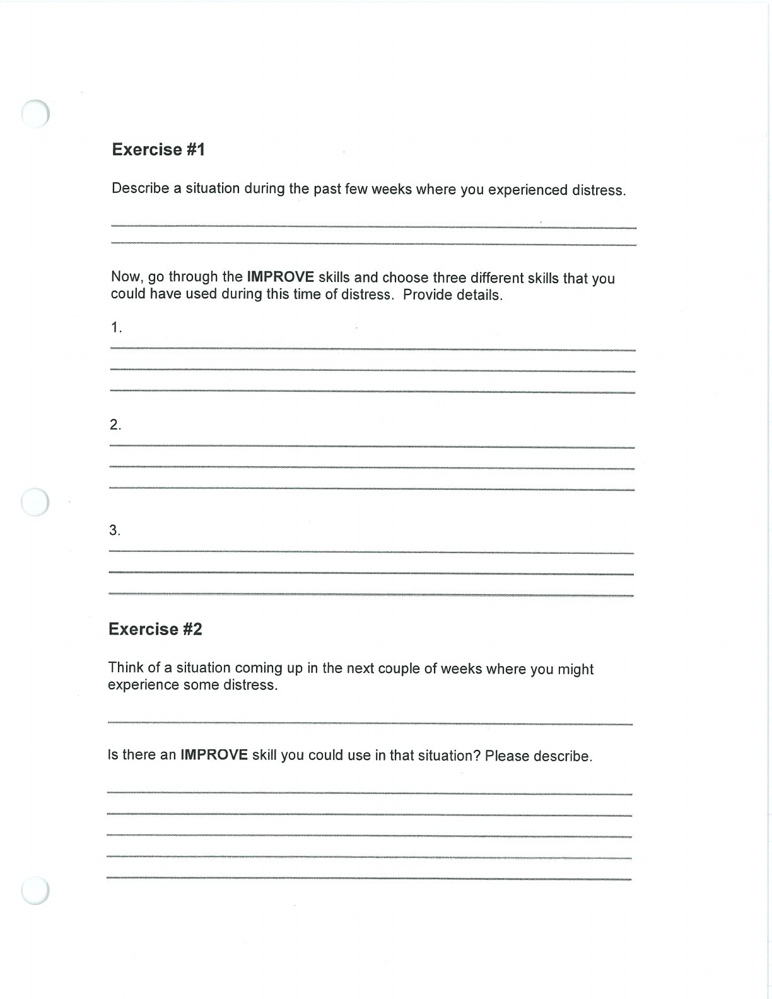
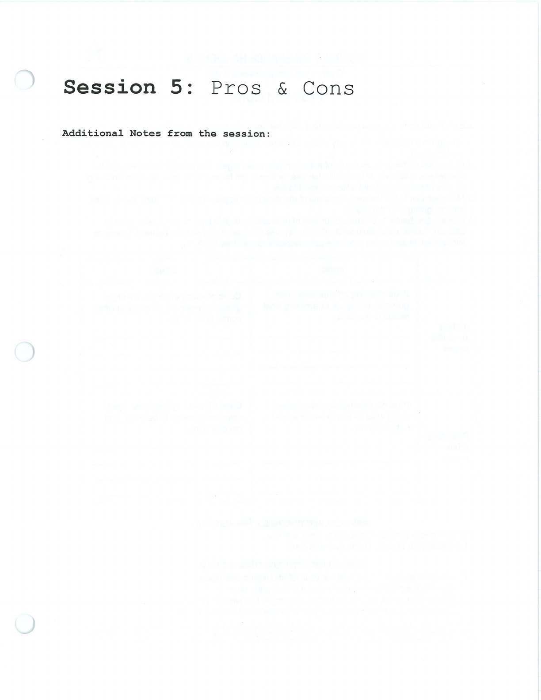

IMPROVE collects ways to support yourself while moving through distress.

## Imagery {#imagery}

## Meaning {#meaning}

## Prayer {#prayer}

## Relaxation {#relaxation}

## One Thing in the Moment {#one-thing-in-the-moment}

## Vacation {#vacation}

## Self-Encouragement {#self-encouragement}

## Handouts and Worksheets {#handouts-and-worksheets}

### IMPROVE the Moment - binder-p0118 {#binder-p0118}

binder-p0118

<!-- binder-resource: binder-p0118 -->

[{.img-fluid fig-alt="Preview of IMPROVE the Moment (binder-p0118)"}](../../assets/binder/binder-p0118.jpg)

[Open full page](../../assets/binder/binder-p0118.jpg)

### IMPROVE the Moment - binder-p0119 {#binder-p0119}

binder-p0119

<!-- binder-resource: binder-p0119 -->

[{.img-fluid fig-alt="Preview of IMPROVE the Moment (binder-p0119)"}](../../assets/binder/binder-p0119.jpg)

[Open full page](../../assets/binder/binder-p0119.jpg)
