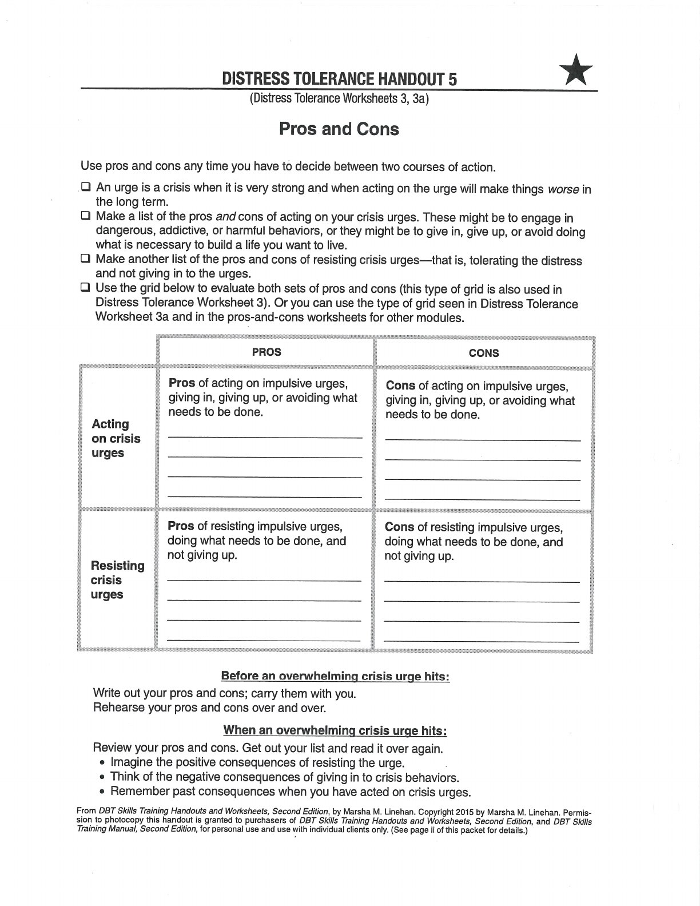
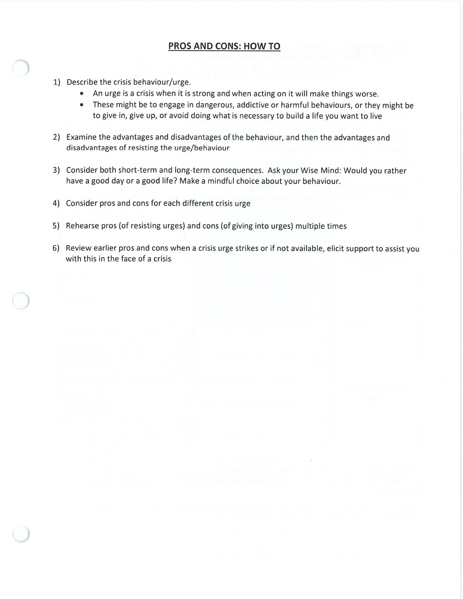

A pros-and-cons grid slows urgent decisions down and brings longer-term consequences back into view.

## Handouts and Worksheets {#handouts-and-worksheets}

### Pros and Cons - binder-p0120 {#binder-p0120}

binder-p0120

<!-- binder-resource: binder-p0120 -->

[{.img-fluid fig-alt="Preview of Pros and Cons (binder-p0120)"}](../../assets/binder/binder-p0120.jpg)

[Open full page](../../assets/binder/binder-p0120.jpg)

### Pros and Cons - binder-p0121 {#binder-p0121}

binder-p0121

<!-- binder-resource: binder-p0121 -->

[{.img-fluid fig-alt="Preview of Pros and Cons (binder-p0121)"}](../../assets/binder/binder-p0121.jpg)

[Open full page](../../assets/binder/binder-p0121.jpg)
