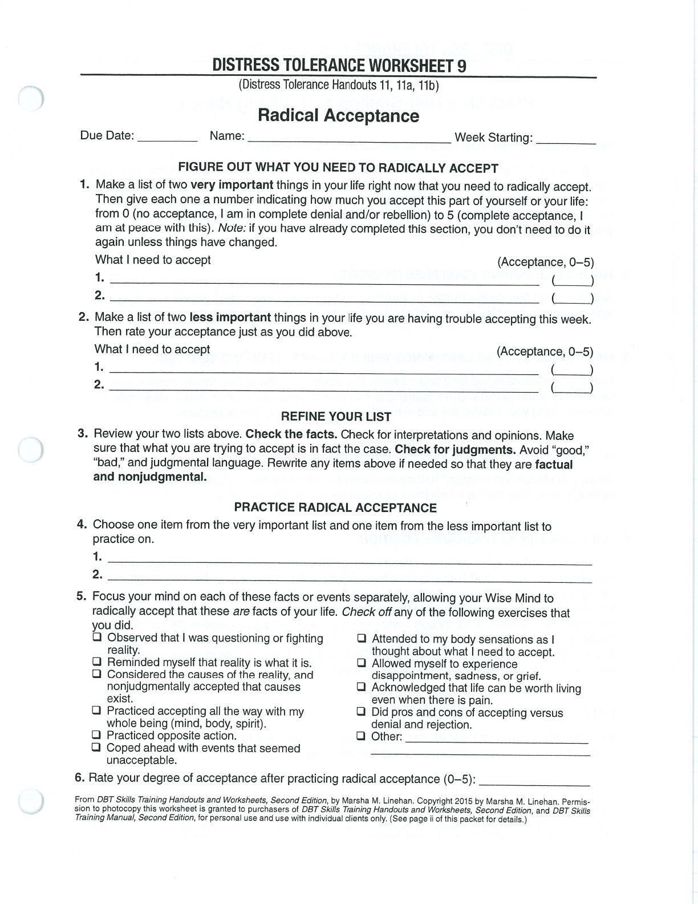
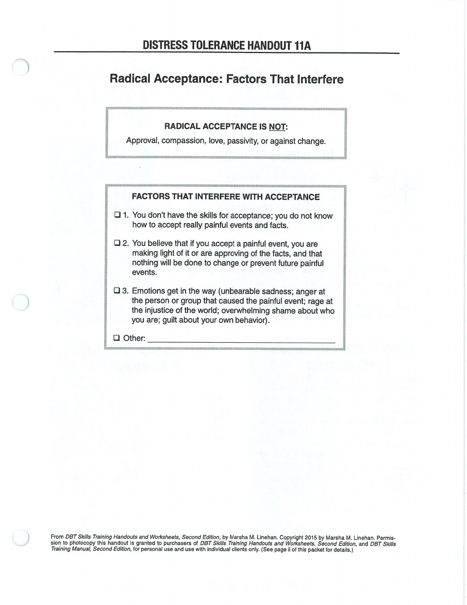

Radical acceptance is recognizing reality without approval, passivity, or giving up.

## Handouts and Worksheets {#handouts-and-worksheets}

### Radical Acceptance - binder-p0114 {#binder-p0114}

binder-p0114

<!-- binder-resource: binder-p0114 -->

[{.img-fluid fig-alt="Preview of Radical Acceptance (binder-p0114)"}](../../assets/binder/binder-p0114.jpg)

[Open full page](../../assets/binder/binder-p0114.jpg)

### Factors That Interfere with Radical Acceptance - binder-p0117 {#binder-p0117}

binder-p0117

<!-- binder-resource: binder-p0117 -->

[{.img-fluid fig-alt="Preview of Factors That Interfere with Radical Acceptance (binder-p0117)"}](../../assets/binder/binder-p0117.jpg)

[Open full page](../../assets/binder/binder-p0117.jpg)
