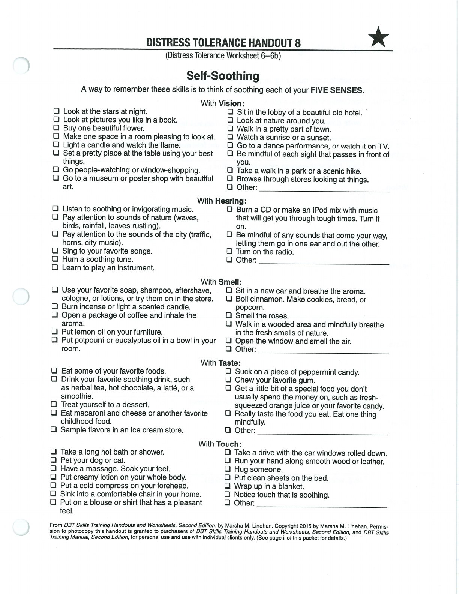
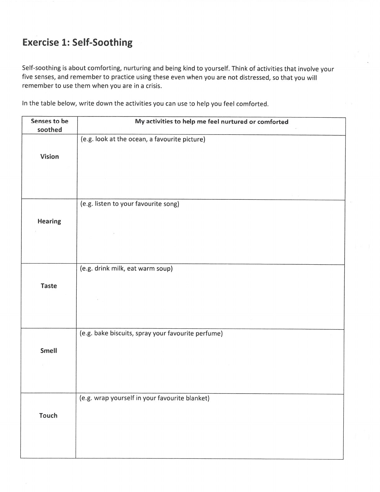

Self-soothing means intentionally choosing comforting experiences through your senses.

## Vision {#vision}

## Hearing {#hearing}

## Taste {#taste}

## Smell {#smell}

## Touch {#touch}

## Handouts and Worksheets {#handouts-and-worksheets}

### Self-Soothe with the 5 Senses - binder-p0124 {#binder-p0124}

binder-p0124

<!-- binder-resource: binder-p0124 -->

[{.img-fluid fig-alt="Preview of Self-Soothe with the 5 Senses (binder-p0124)"}](../../assets/binder/binder-p0124.jpg)

[Open full page](../../assets/binder/binder-p0124.jpg)

### Self-Soothe with the 5 Senses - binder-p0125 {#binder-p0125}

binder-p0125

<!-- binder-resource: binder-p0125 -->

[{.img-fluid fig-alt="Preview of Self-Soothe with the 5 Senses (binder-p0125)"}](../../assets/binder/binder-p0125.jpg)

[Open full page](../../assets/binder/binder-p0125.jpg)
