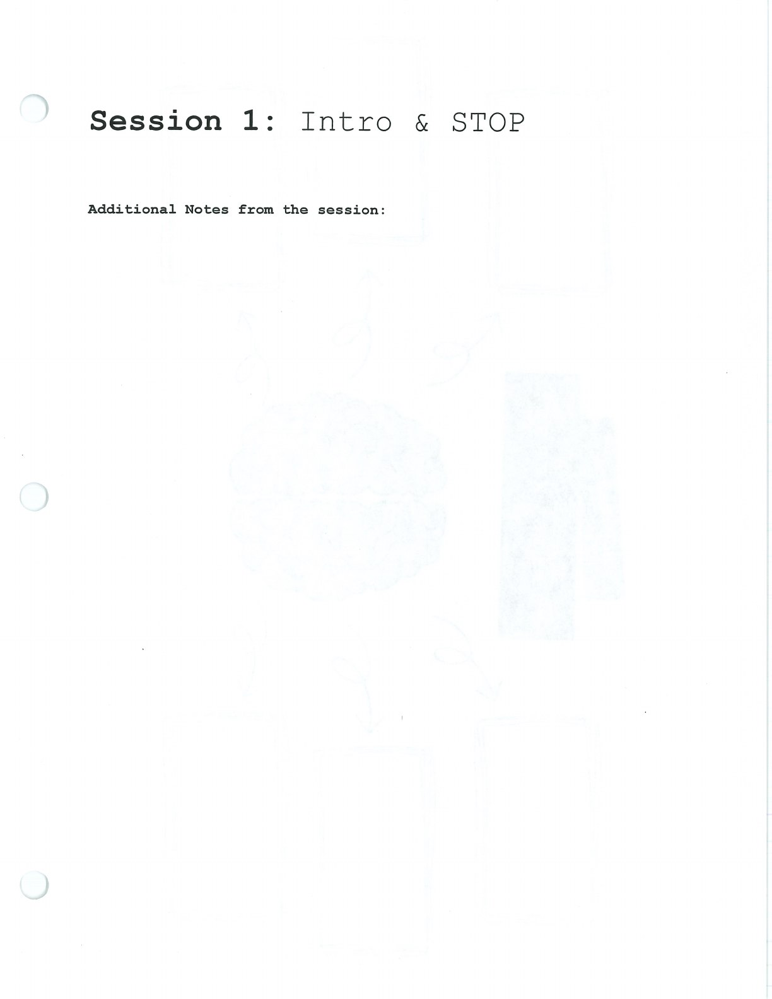
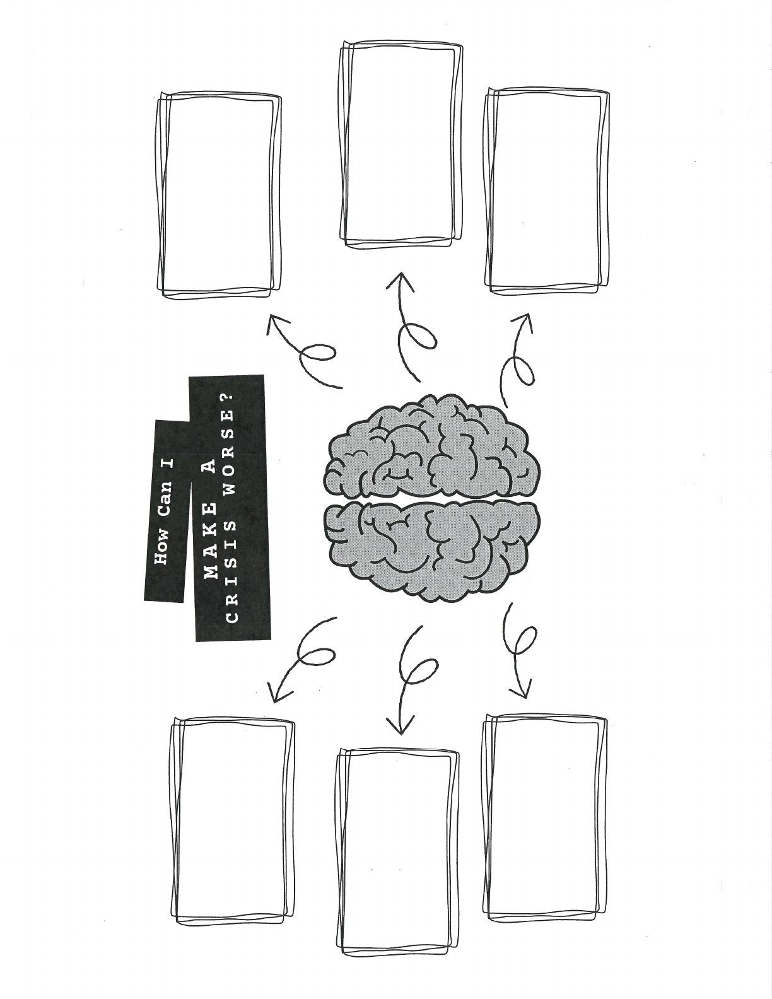
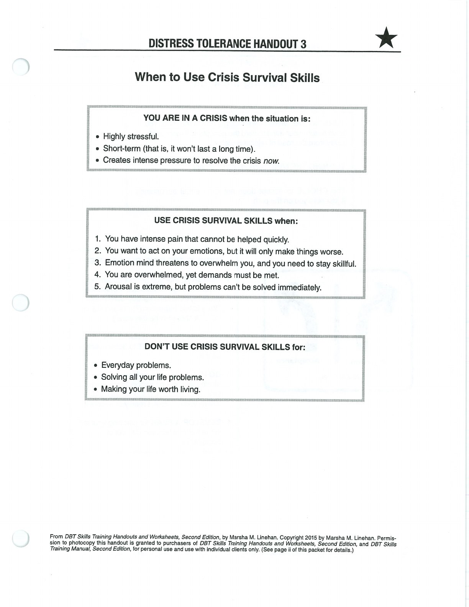

Distress tolerance skills help you survive intense moments without making the situation worse.

## STOP {#stop}

Stop. Take a step back. Observe what is happening inside and around you. Proceed mindfully.

## When to Use Crisis Survival Skills {#crisis-survival}

## Handouts and Worksheets {#handouts-and-worksheets}

### STOP and Crisis Survival - binder-p0129 {#binder-p0129}

binder-p0129

<!-- binder-resource: binder-p0129 -->

[{.img-fluid fig-alt="Preview of STOP and Crisis Survival (binder-p0129)"}](../../assets/binder/binder-p0129.jpg)

[Open full page](../../assets/binder/binder-p0129.jpg)

### STOP and Crisis Survival - binder-p0130 {#binder-p0130}

binder-p0130

<!-- binder-resource: binder-p0130 -->

[{.img-fluid fig-alt="Preview of STOP and Crisis Survival (binder-p0130)"}](../../assets/binder/binder-p0130.jpg)

[Open full page](../../assets/binder/binder-p0130.jpg)

### STOP and Crisis Survival - binder-p0131 {#binder-p0131}

binder-p0131

<!-- binder-resource: binder-p0131 -->

[{.img-fluid fig-alt="Preview of STOP and Crisis Survival (binder-p0131)"}](../../assets/binder/binder-p0131.jpg)

[Open full page](../../assets/binder/binder-p0131.jpg)
