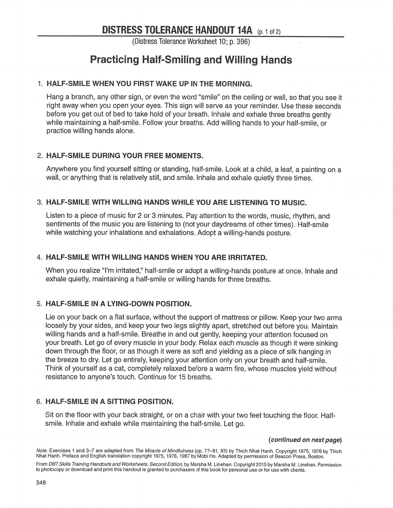
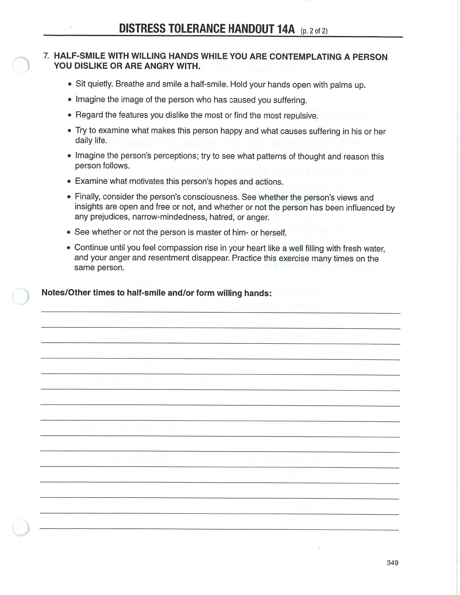

Willingness is doing what the situation calls for, with awareness and without adding avoidable resistance.

## Willingness {#willingness}

## Willing Hands {#willing-hands}

## Half-Smiling {#half-smiling}

## Handouts and Worksheets {#handouts-and-worksheets}

### Half-Smiling and Willing Hands - binder-p0115 {#binder-p0115}

binder-p0115

<!-- binder-resource: binder-p0115 -->

[{.img-fluid fig-alt="Preview of Half-Smiling and Willing Hands (binder-p0115)"}](../../assets/binder/binder-p0115.jpg)

[Open full page](../../assets/binder/binder-p0115.jpg)

### Half-Smiling and Willing Hands - binder-p0116 {#binder-p0116}

binder-p0116

<!-- binder-resource: binder-p0116 -->

[{.img-fluid fig-alt="Preview of Half-Smiling and Willing Hands (binder-p0116)"}](../../assets/binder/binder-p0116.jpg)

[Open full page](../../assets/binder/binder-p0116.jpg)
