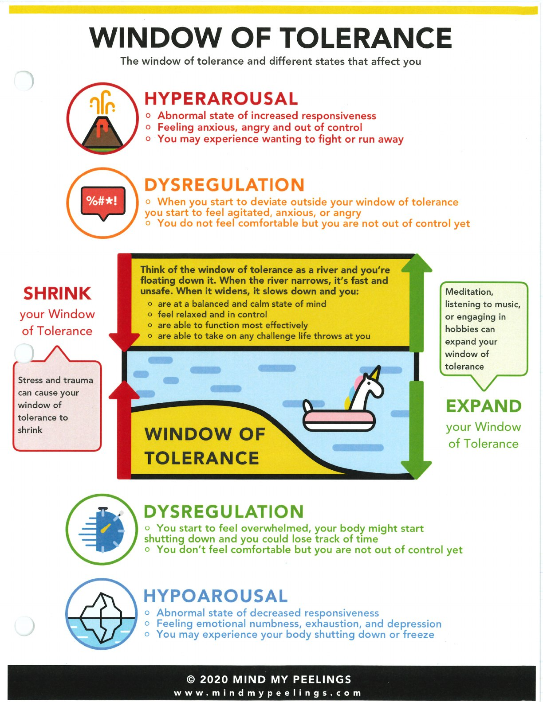
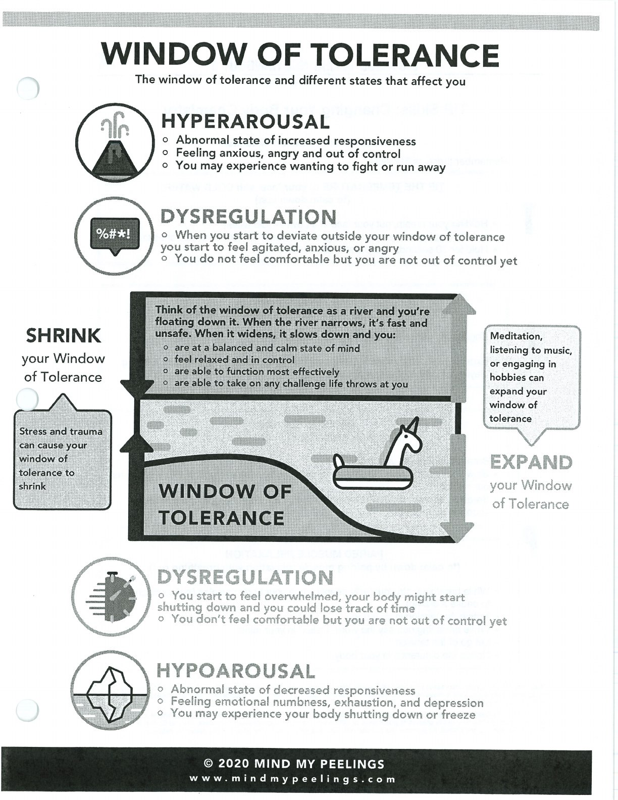
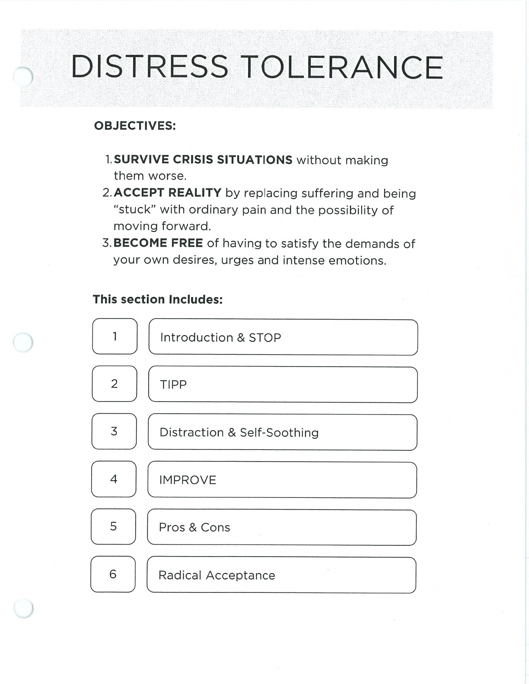

The window of tolerance is a practical map for noticing nervous-system states and choosing a fitting skill.

## Handouts and Worksheets {#handouts-and-worksheets}

### Window of Tolerance - binder-p0126 {#binder-p0126}

binder-p0126

<!-- binder-resource: binder-p0126 -->

[{.img-fluid fig-alt="Preview of Window of Tolerance (binder-p0126)"}](../../assets/binder/binder-p0126.jpg)

[Open full page](../../assets/binder/binder-p0126.jpg)

### Window of Tolerance - binder-p0127 {#binder-p0127}

binder-p0127

<!-- binder-resource: binder-p0127 -->

[{.img-fluid fig-alt="Preview of Window of Tolerance (binder-p0127)"}](../../assets/binder/binder-p0127.jpg)

[Open full page](../../assets/binder/binder-p0127.jpg)

### Window of Tolerance - binder-p0128 {#binder-p0128}

binder-p0128

<!-- binder-resource: binder-p0128 -->

[{.img-fluid fig-alt="Preview of Window of Tolerance (binder-p0128)"}](../../assets/binder/binder-p0128.jpg)

[Open full page](../../assets/binder/binder-p0128.jpg)
