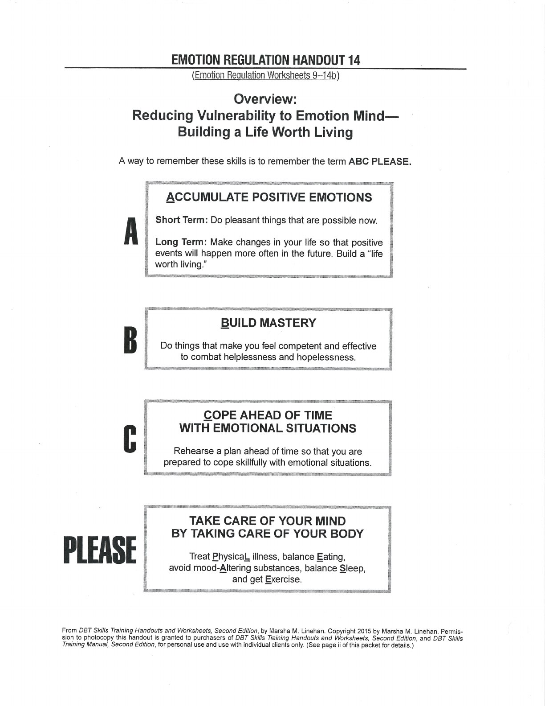

ABC PLEASE combines long-term resilience practices with daily body care.

## Accumulating Positive Emotions {#accumulating-positive-emotions}

## Build Mastery {#build-mastery}

## Cope Ahead {#cope-ahead}

## Treat Physical Illness {#treat-physical-illness}

## Balanced Eating {#balanced-eating}

## Avoid Mood-Altering Substances {#avoid-mood-altering-substances}

## Balanced Sleep {#balanced-sleep}

## Exercise {#exercise}

## Handouts and Worksheets {#handouts-and-worksheets}

### ABC PLEASE - binder-p0031 {#binder-p0031}

binder-p0031

<!-- binder-resource: binder-p0031 -->

[{.img-fluid fig-alt="Preview of ABC PLEASE (binder-p0031)"}](../../assets/binder/binder-p0031.jpg)

[Open full page](../../assets/binder/binder-p0031.jpg)
