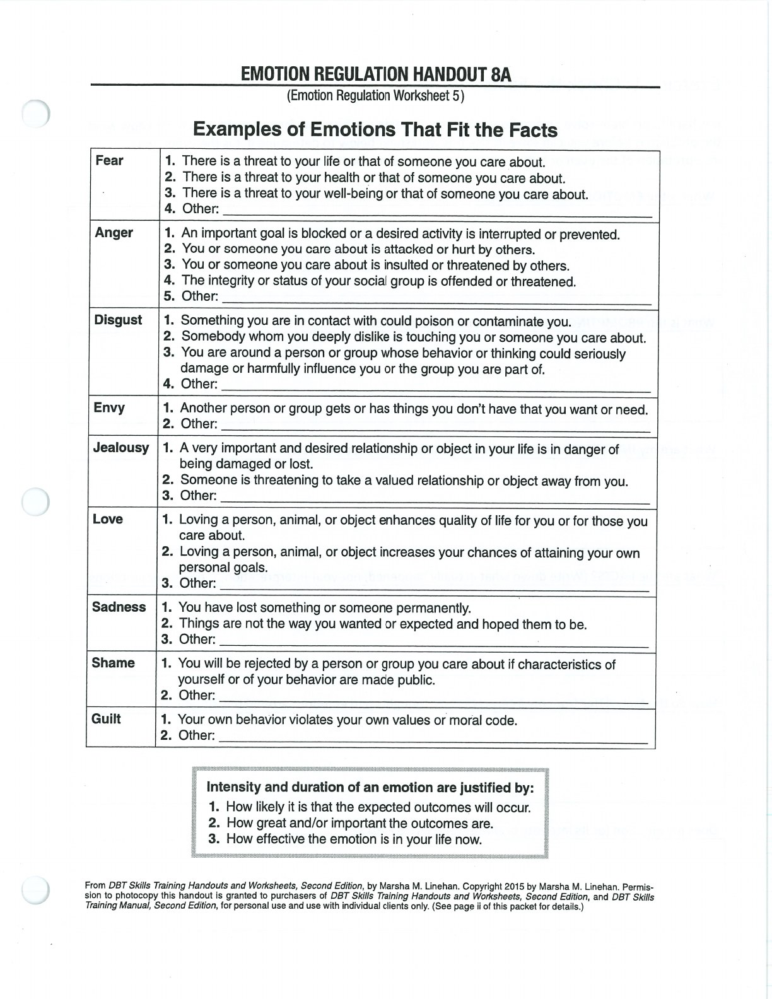
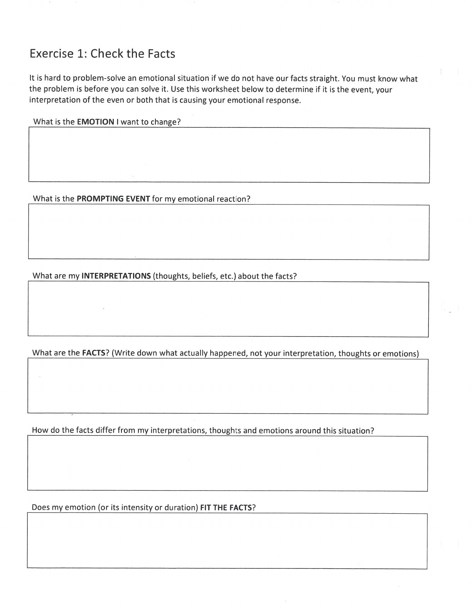

Check the Facts asks whether an emotion, its intensity, and its duration fit the available evidence.

## Handouts and Worksheets {#handouts-and-worksheets}

### Check the Facts - binder-p0039 {#binder-p0039}

binder-p0039

<!-- binder-resource: binder-p0039 -->

[{.img-fluid fig-alt="Preview of Check the Facts (binder-p0039)"}](../../assets/binder/binder-p0039.jpg)

[Open full page](../../assets/binder/binder-p0039.jpg)

### Check the Facts - binder-p0040 {#binder-p0040}

binder-p0040

<!-- binder-resource: binder-p0040 -->

[{.img-fluid fig-alt="Preview of Check the Facts (binder-p0040)"}](../../assets/binder/binder-p0040.jpg)

[Open full page](../../assets/binder/binder-p0040.jpg)
