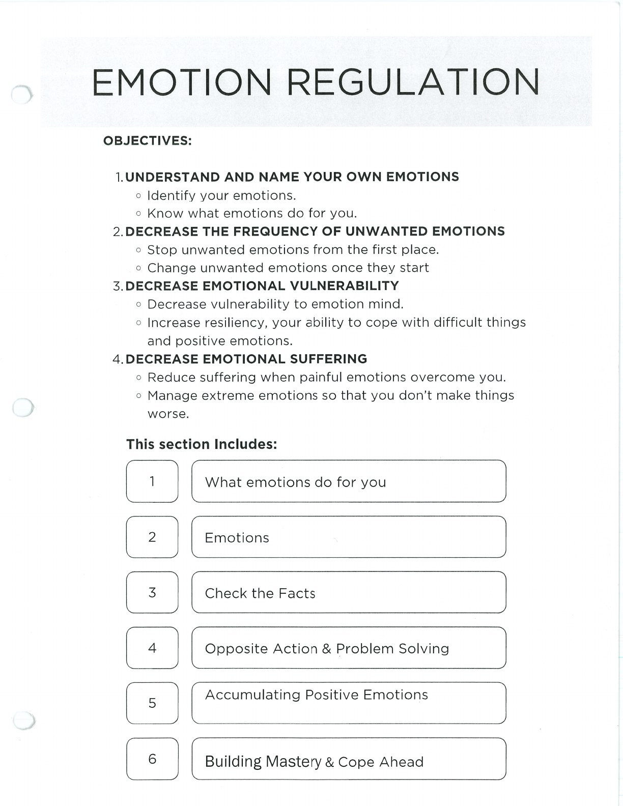
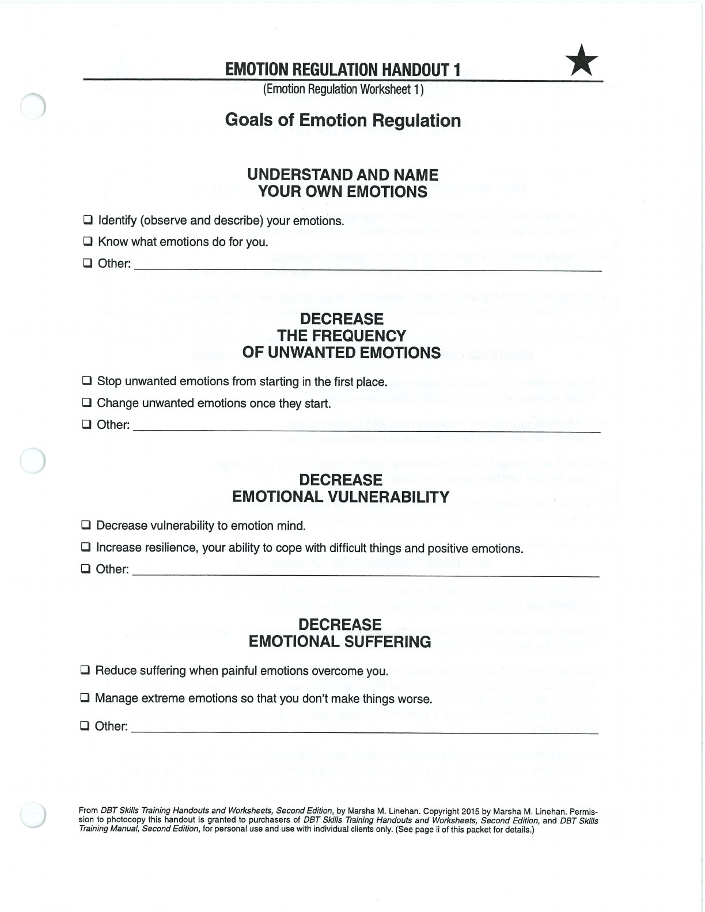

Emotion regulation begins with understanding emotions, checking facts, and reducing vulnerability before choosing a response.

## Handouts and Worksheets {#handouts-and-worksheets}

### Emotion Regulation Objectives and Overview - binder-p0050 {#binder-p0050}

binder-p0050

<!-- binder-resource: binder-p0050 -->

[{.img-fluid fig-alt="Preview of Emotion Regulation Objectives and Overview (binder-p0050)"}](../../assets/binder/binder-p0050.jpg)

[Open full page](../../assets/binder/binder-p0050.jpg)

### Emotion Regulation Goals - binder-p0053 {#binder-p0053}

binder-p0053

<!-- binder-resource: binder-p0053 -->

[{.img-fluid fig-alt="Preview of Emotion Regulation Goals (binder-p0053)"}](../../assets/binder/binder-p0053.jpg)

[Open full page](../../assets/binder/binder-p0053.jpg)
