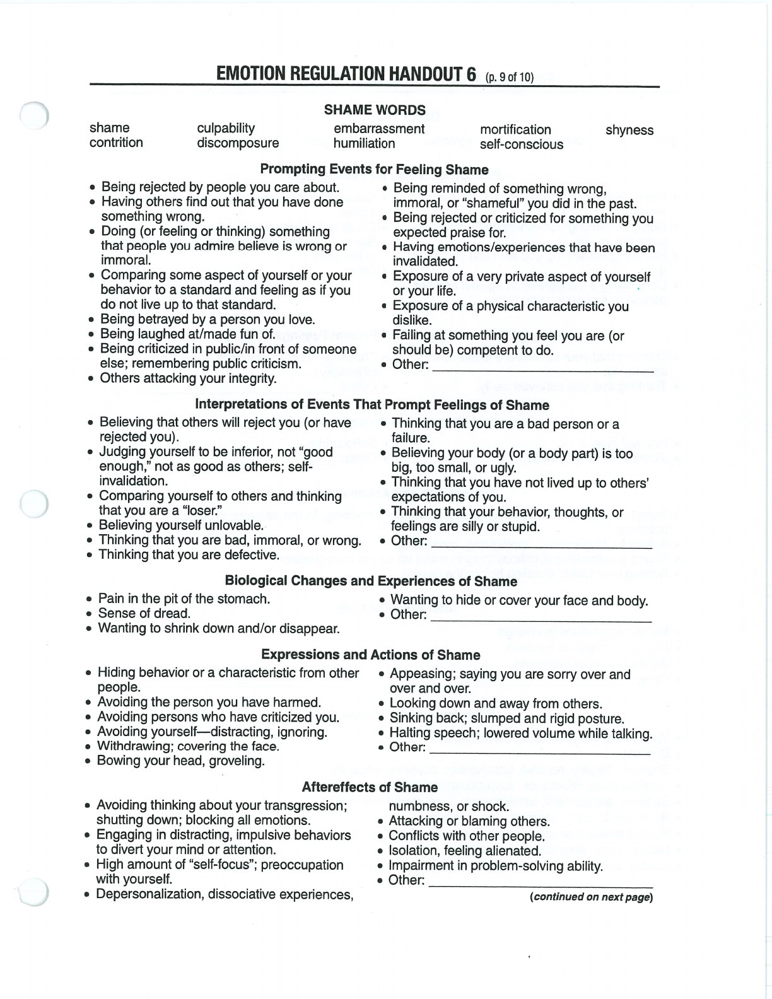
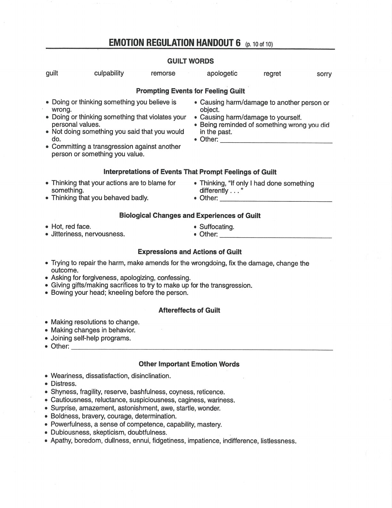
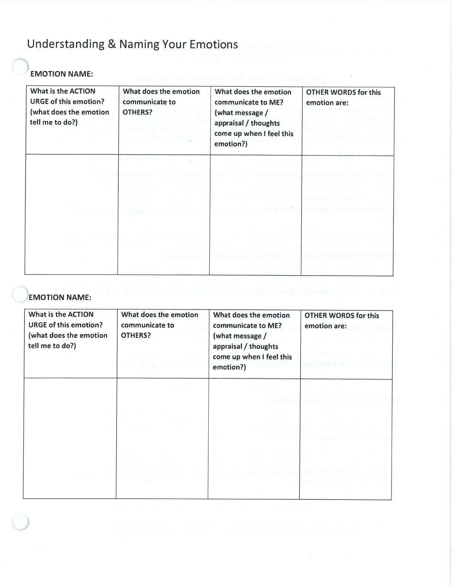
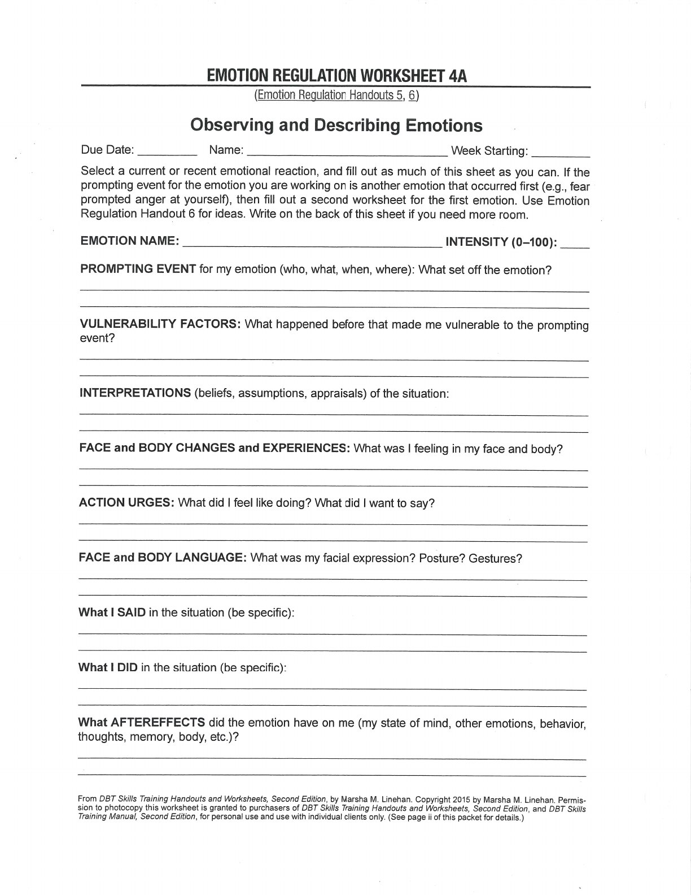
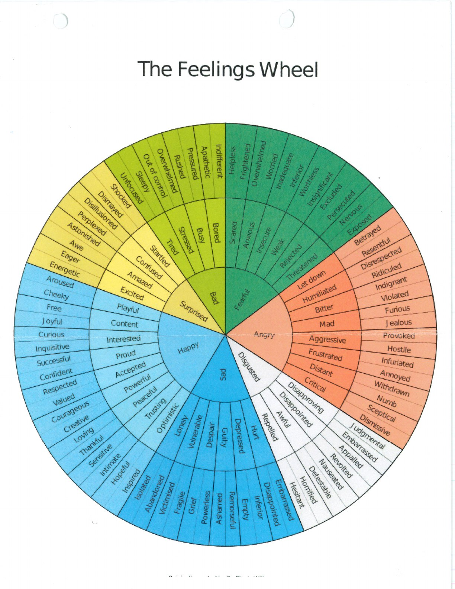

Detailed observation separates the parts of an emotional response and makes patterns easier to understand.

## Handouts and Worksheets {#handouts-and-worksheets}

### Observing and Describing Emotions - binder-p0043 {#binder-p0043}

binder-p0043

<!-- binder-resource: binder-p0043 -->

[{.img-fluid fig-alt="Preview of Observing and Describing Emotions (binder-p0043)"}](../../assets/binder/binder-p0043.jpg)

[Open full page](../../assets/binder/binder-p0043.jpg)

### Observing and Describing Emotions - binder-p0044 {#binder-p0044}

binder-p0044

<!-- binder-resource: binder-p0044 -->

[{.img-fluid fig-alt="Preview of Observing and Describing Emotions (binder-p0044)"}](../../assets/binder/binder-p0044.jpg)

[Open full page](../../assets/binder/binder-p0044.jpg)

### Observing and Describing Emotions - binder-p0045 {#binder-p0045}

binder-p0045

<!-- binder-resource: binder-p0045 -->

[{.img-fluid fig-alt="Preview of Observing and Describing Emotions (binder-p0045)"}](../../assets/binder/binder-p0045.jpg)

[Open full page](../../assets/binder/binder-p0045.jpg)

### Observing and Describing Emotions - binder-p0046 {#binder-p0046}

binder-p0046

<!-- binder-resource: binder-p0046 -->

[{.img-fluid fig-alt="Preview of Observing and Describing Emotions (binder-p0046)"}](../../assets/binder/binder-p0046.jpg)

[Open full page](../../assets/binder/binder-p0046.jpg)

### Feelings Wheel - binder-p0142 {#binder-p0142}

binder-p0142

<!-- binder-resource: binder-p0142 -->

[{.img-fluid fig-alt="Preview of Feelings Wheel (binder-p0142)"}](../../assets/binder/binder-p0142.jpg)

[Open full page](../../assets/binder/binder-p0142.jpg)
