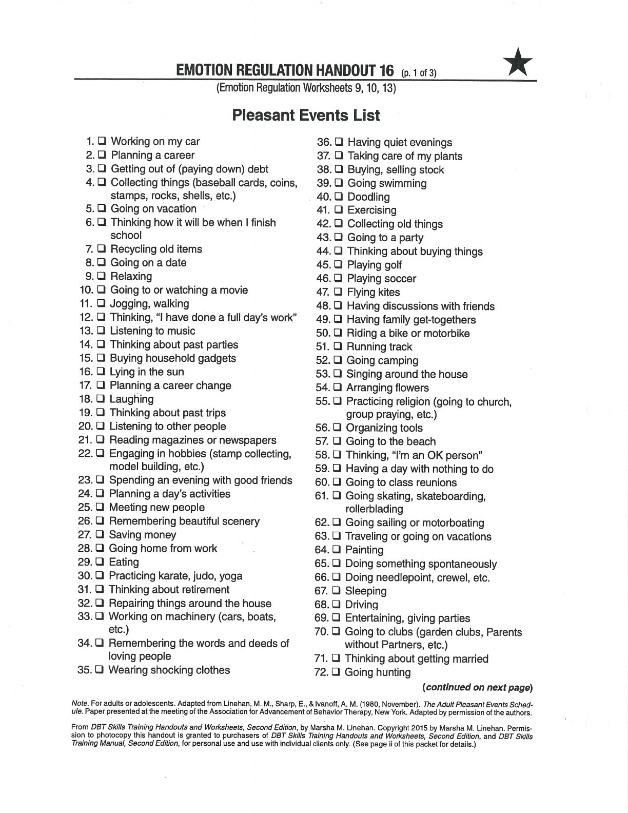
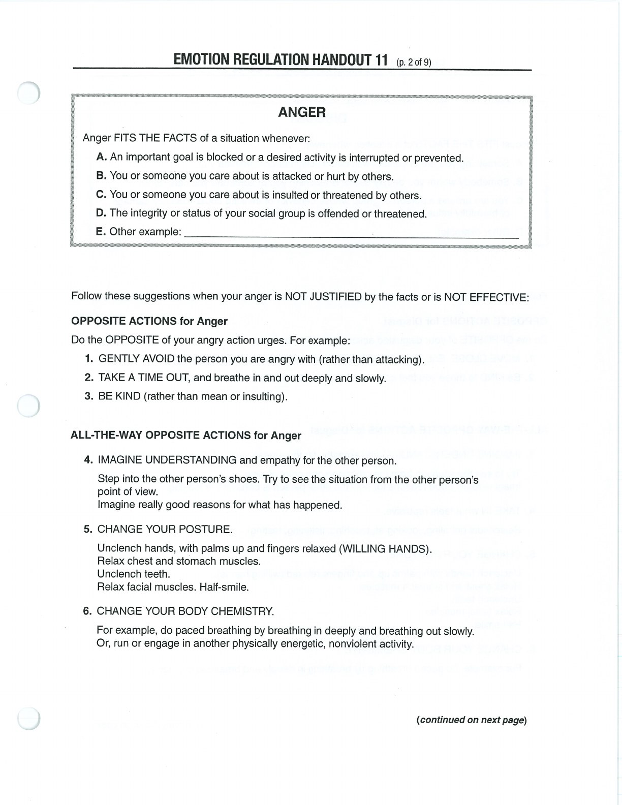
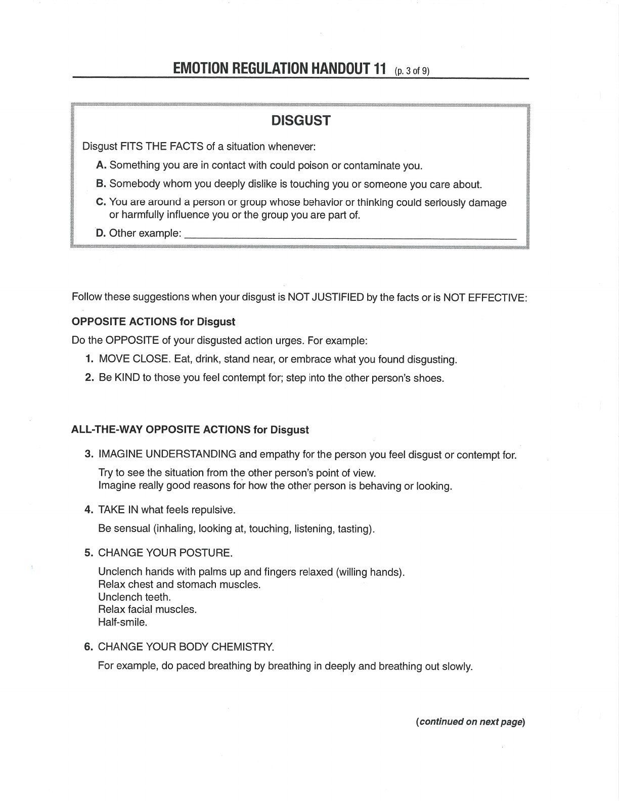
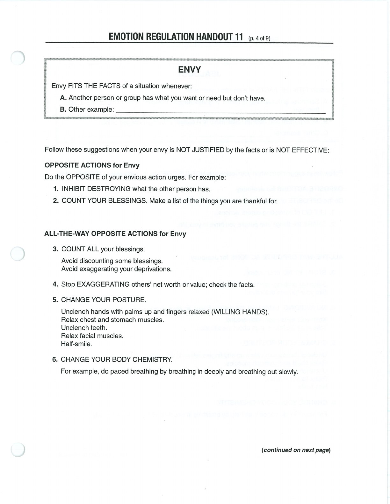
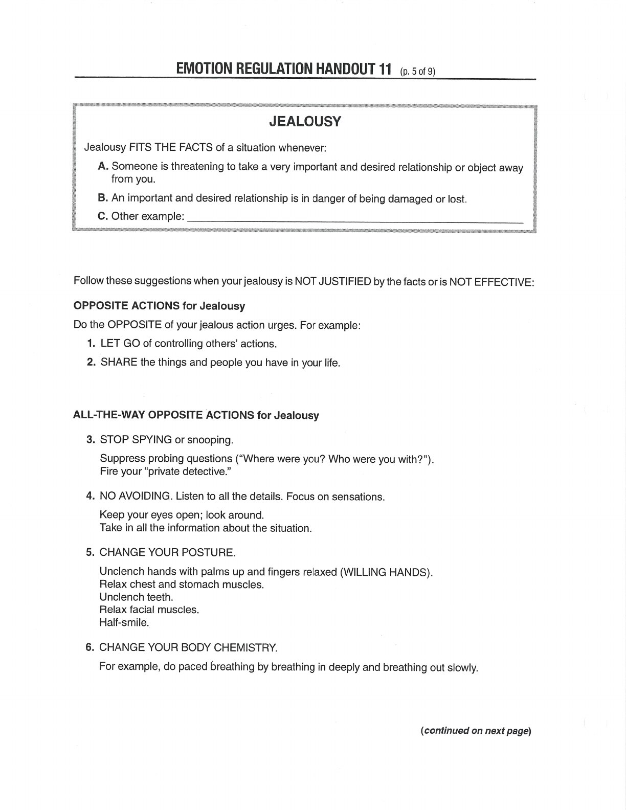
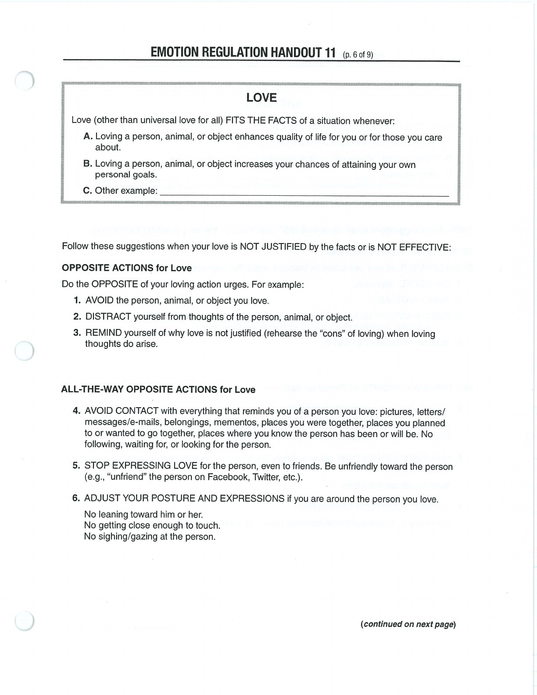

Opposite Action works best when the emotion does not fit the facts or acting on it would be ineffective.

## Handouts and Worksheets {#handouts-and-worksheets}

### Opposite Action - binder-p0033 {#binder-p0033}

binder-p0033

<!-- binder-resource: binder-p0033 -->

[{.img-fluid fig-alt="Preview of Opposite Action (binder-p0033)"}](../../assets/binder/binder-p0033.jpg)

[Open full page](../../assets/binder/binder-p0033.jpg)

### Opposite Action - binder-p0034 {#binder-p0034}

binder-p0034

<!-- binder-resource: binder-p0034 -->

[{.img-fluid fig-alt="Preview of Opposite Action (binder-p0034)"}](../../assets/binder/binder-p0034.jpg)

[Open full page](../../assets/binder/binder-p0034.jpg)

### Opposite Action - binder-p0035 {#binder-p0035}

binder-p0035

<!-- binder-resource: binder-p0035 -->

[{.img-fluid fig-alt="Preview of Opposite Action (binder-p0035)"}](../../assets/binder/binder-p0035.jpg)

[Open full page](../../assets/binder/binder-p0035.jpg)

### Opposite Action - binder-p0036 {#binder-p0036}

binder-p0036

<!-- binder-resource: binder-p0036 -->

[{.img-fluid fig-alt="Preview of Opposite Action (binder-p0036)"}](../../assets/binder/binder-p0036.jpg)

[Open full page](../../assets/binder/binder-p0036.jpg)

### Opposite Action - binder-p0037 {#binder-p0037}

binder-p0037

<!-- binder-resource: binder-p0037 -->

[{.img-fluid fig-alt="Preview of Opposite Action (binder-p0037)"}](../../assets/binder/binder-p0037.jpg)

[Open full page](../../assets/binder/binder-p0037.jpg)

### Opposite Action - binder-p0038 {#binder-p0038}

binder-p0038

<!-- binder-resource: binder-p0038 -->

[{.img-fluid fig-alt="Preview of Opposite Action (binder-p0038)"}](../../assets/binder/binder-p0038.jpg)

[Open full page](../../assets/binder/binder-p0038.jpg)
