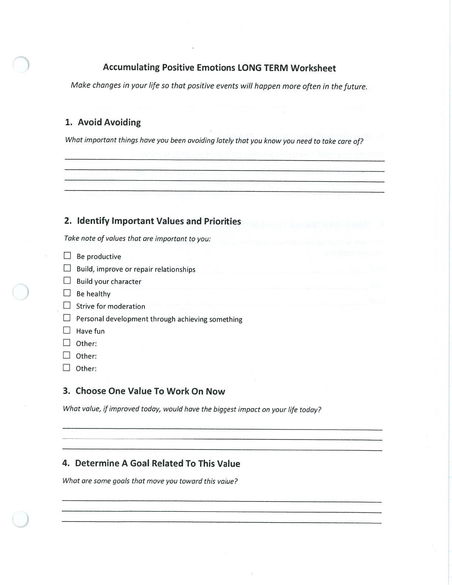
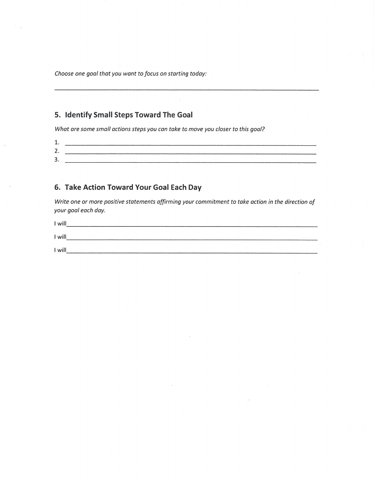
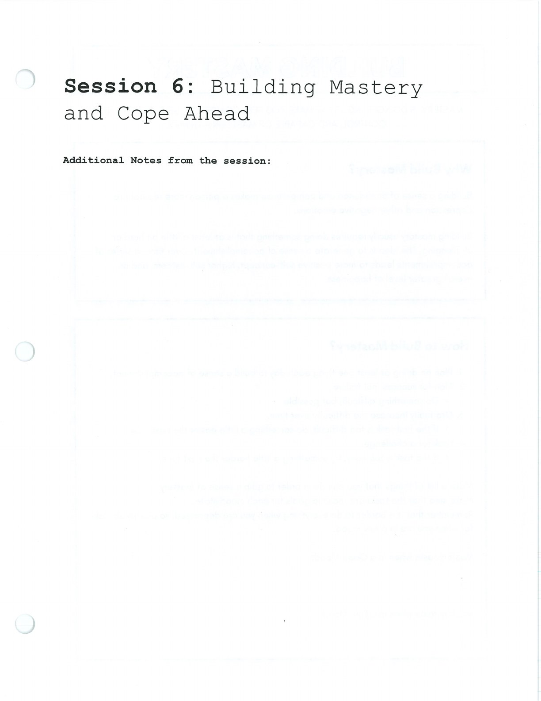
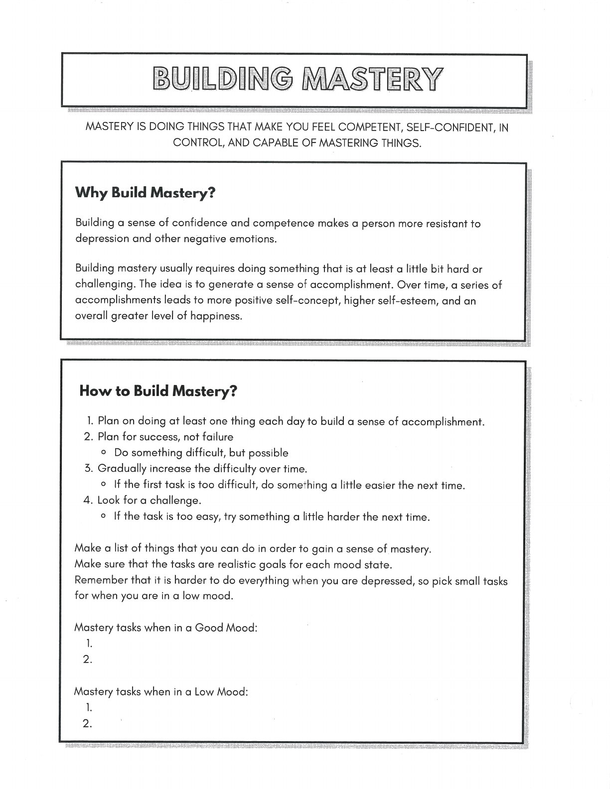
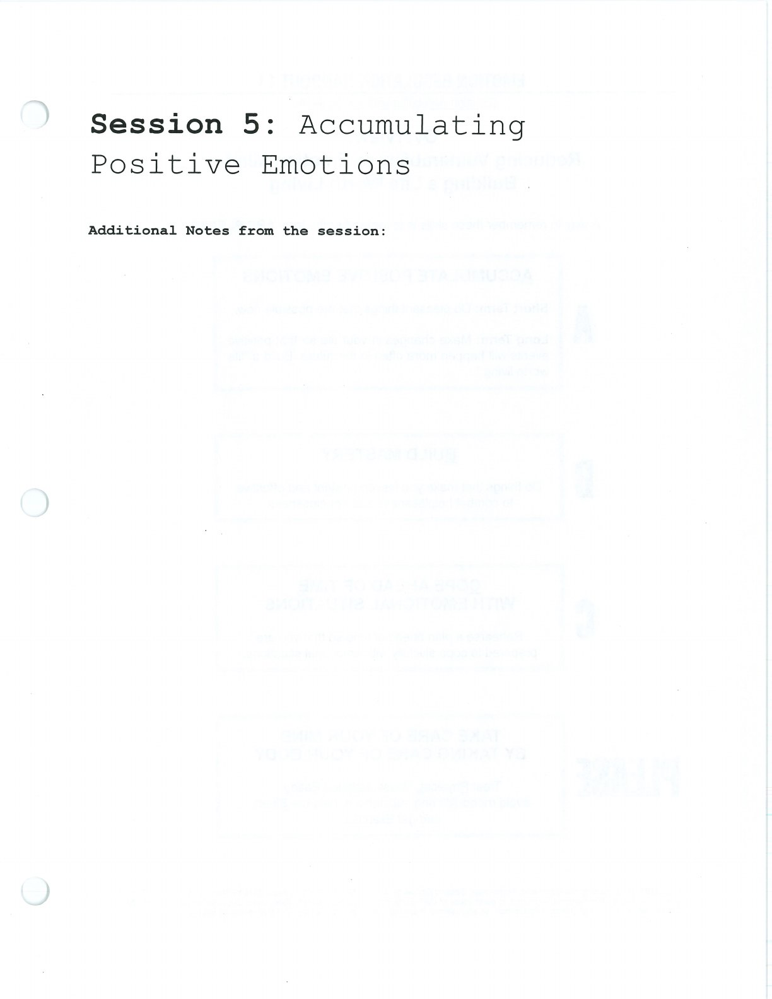
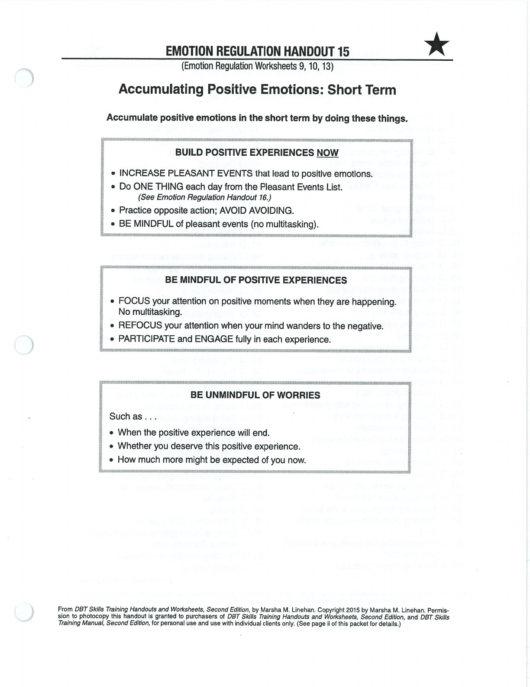

These practices strengthen resilience over time.

## Accumulating Positive Emotions {#positive-emotions}

## Build Mastery {#build-mastery}

## Cope Ahead {#cope-ahead}

## Handouts and Worksheets {#handouts-and-worksheets}

### Positive Emotions, Build Mastery, and Cope Ahead - binder-p0026 {#binder-p0026}

binder-p0026

<!-- binder-resource: binder-p0026 -->

[{.img-fluid fig-alt="Preview of Positive Emotions, Build Mastery, and Cope Ahead (binder-p0026)"}](../../assets/binder/binder-p0026.jpg)

[Open full page](../../assets/binder/binder-p0026.jpg)

### Positive Emotions, Build Mastery, and Cope Ahead - binder-p0027 {#binder-p0027}

binder-p0027

<!-- binder-resource: binder-p0027 -->

[{.img-fluid fig-alt="Preview of Positive Emotions, Build Mastery, and Cope Ahead (binder-p0027)"}](../../assets/binder/binder-p0027.jpg)

[Open full page](../../assets/binder/binder-p0027.jpg)

### Positive Emotions, Build Mastery, and Cope Ahead - binder-p0028 {#binder-p0028}

binder-p0028

<!-- binder-resource: binder-p0028 -->

[{.img-fluid fig-alt="Preview of Positive Emotions, Build Mastery, and Cope Ahead (binder-p0028)"}](../../assets/binder/binder-p0028.jpg)

[Open full page](../../assets/binder/binder-p0028.jpg)

### Positive Emotions, Build Mastery, and Cope Ahead - binder-p0029 {#binder-p0029}

binder-p0029

<!-- binder-resource: binder-p0029 -->

[{.img-fluid fig-alt="Preview of Positive Emotions, Build Mastery, and Cope Ahead (binder-p0029)"}](../../assets/binder/binder-p0029.jpg)

[Open full page](../../assets/binder/binder-p0029.jpg)

### Positive Emotions, Build Mastery, and Cope Ahead - binder-p0030 {#binder-p0030}

binder-p0030

<!-- binder-resource: binder-p0030 -->

[{.img-fluid fig-alt="Preview of Positive Emotions, Build Mastery, and Cope Ahead (binder-p0030)"}](../../assets/binder/binder-p0030.jpg)

[Open full page](../../assets/binder/binder-p0030.jpg)

### Positive Emotions, Build Mastery, and Cope Ahead - binder-p0032 {#binder-p0032}

binder-p0032

<!-- binder-resource: binder-p0032 -->

[{.img-fluid fig-alt="Preview of Positive Emotions, Build Mastery, and Cope Ahead (binder-p0032)"}](../../assets/binder/binder-p0032.jpg)

[Open full page](../../assets/binder/binder-p0032.jpg)
