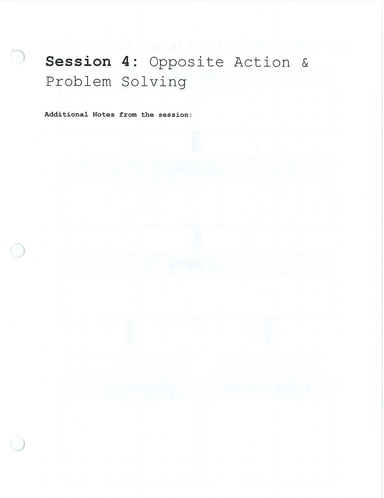
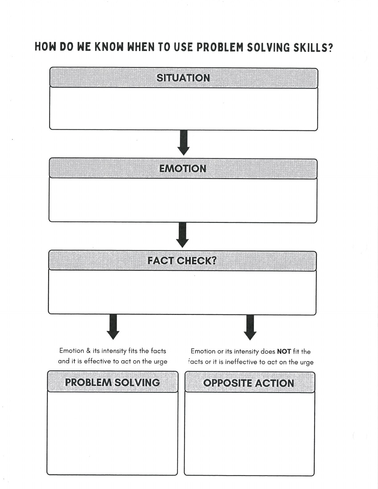

Use problem solving when the facts support the emotion and a practical change is possible.

## Handouts and Worksheets {#handouts-and-worksheets}

### Problem Solving - binder-p0041 {#binder-p0041}

binder-p0041

<!-- binder-resource: binder-p0041 -->

[{.img-fluid fig-alt="Preview of Problem Solving (binder-p0041)"}](../../assets/binder/binder-p0041.jpg)

[Open full page](../../assets/binder/binder-p0041.jpg)

### Problem Solving - binder-p0042 {#binder-p0042}

binder-p0042

<!-- binder-resource: binder-p0042 -->

[{.img-fluid fig-alt="Preview of Problem Solving (binder-p0042)"}](../../assets/binder/binder-p0042.jpg)

[Open full page](../../assets/binder/binder-p0042.jpg)
