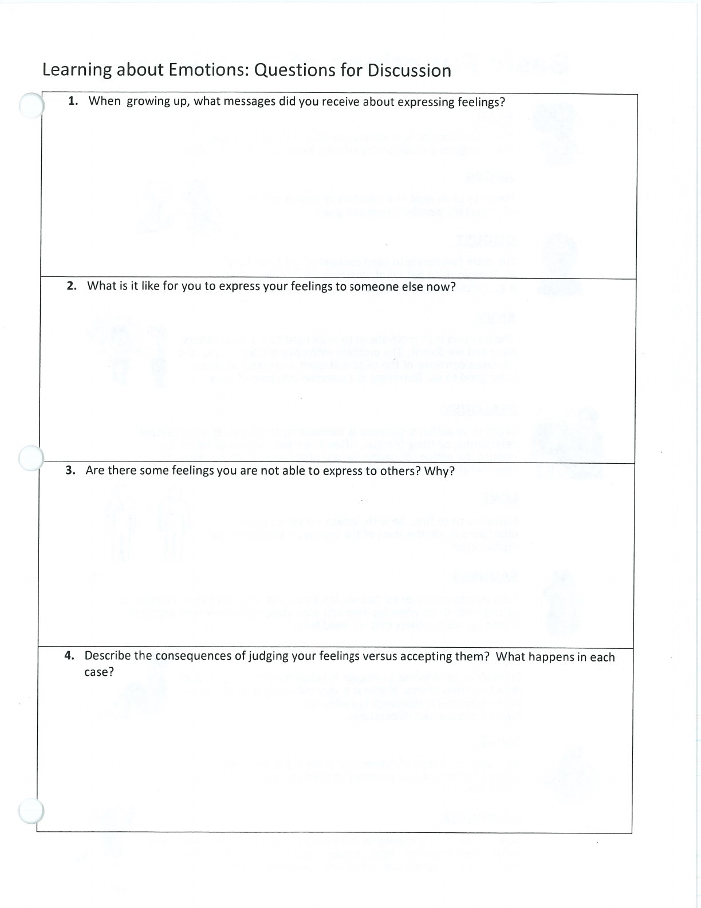
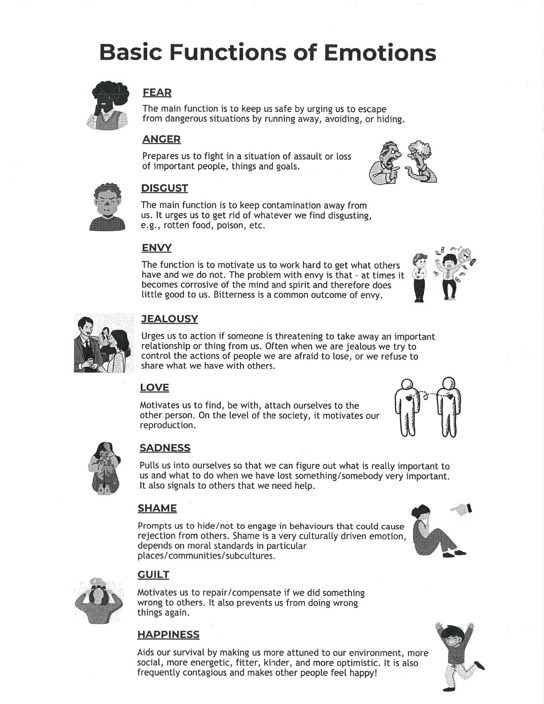
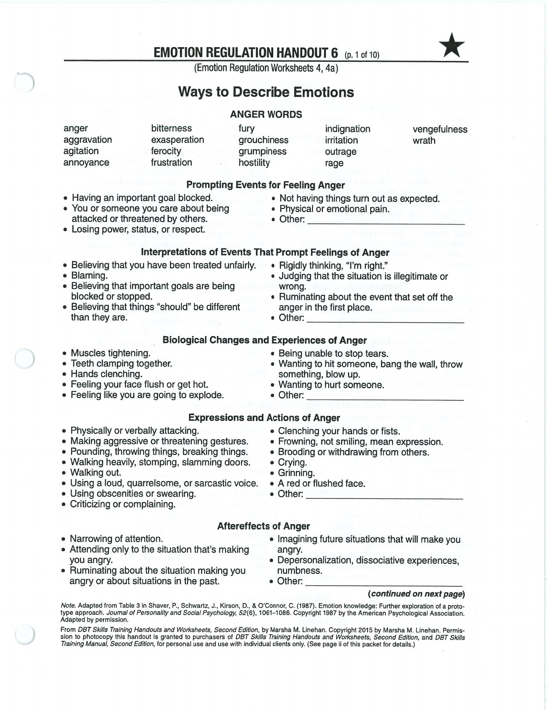
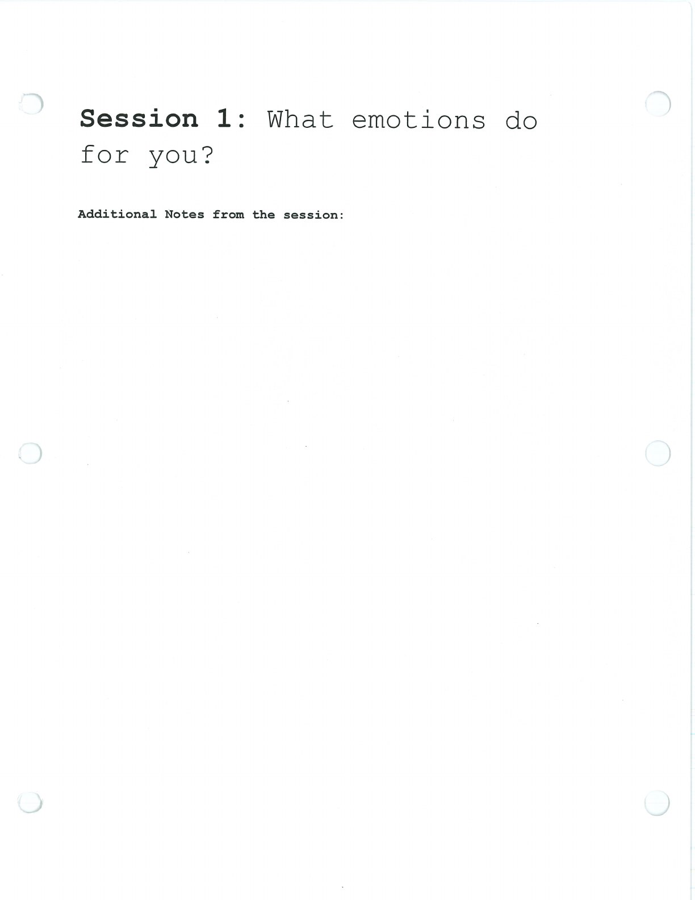
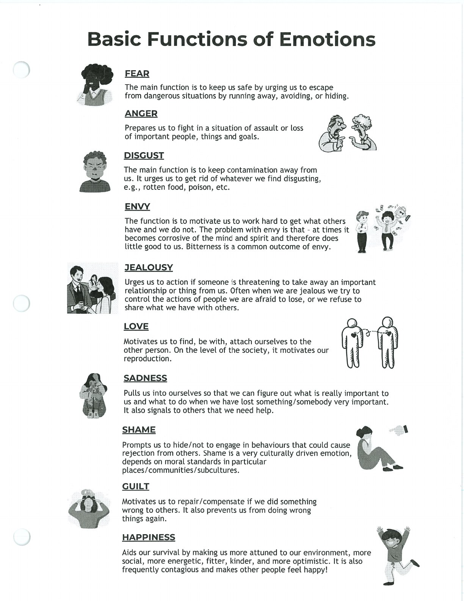

Emotions have functions. Understanding them can reduce confusion and support more deliberate action.

## Handouts and Worksheets {#handouts-and-worksheets}

### What Emotions Do for You - binder-p0047 {#binder-p0047}

binder-p0047

<!-- binder-resource: binder-p0047 -->

[{.img-fluid fig-alt="Preview of What Emotions Do for You (binder-p0047)"}](../../assets/binder/binder-p0047.jpg)

[Open full page](../../assets/binder/binder-p0047.jpg)

### What Emotions Do for You - binder-p0048 {#binder-p0048}

binder-p0048

<!-- binder-resource: binder-p0048 -->

[{.img-fluid fig-alt="Preview of What Emotions Do for You (binder-p0048)"}](../../assets/binder/binder-p0048.jpg)

[Open full page](../../assets/binder/binder-p0048.jpg)

### What Emotions Do for You - binder-p0049 {#binder-p0049}

binder-p0049

<!-- binder-resource: binder-p0049 -->

[{.img-fluid fig-alt="Preview of What Emotions Do for You (binder-p0049)"}](../../assets/binder/binder-p0049.jpg)

[Open full page](../../assets/binder/binder-p0049.jpg)

### What Emotions Do for You - binder-p0051 {#binder-p0051}

binder-p0051

<!-- binder-resource: binder-p0051 -->

[{.img-fluid fig-alt="Preview of What Emotions Do for You (binder-p0051)"}](../../assets/binder/binder-p0051.jpg)

[Open full page](../../assets/binder/binder-p0051.jpg)

### What Emotions Do for You - binder-p0052 {#binder-p0052}

binder-p0052

<!-- binder-resource: binder-p0052 -->

[{.img-fluid fig-alt="Preview of What Emotions Do for You (binder-p0052)"}](../../assets/binder/binder-p0052.jpg)

[Open full page](../../assets/binder/binder-p0052.jpg)
