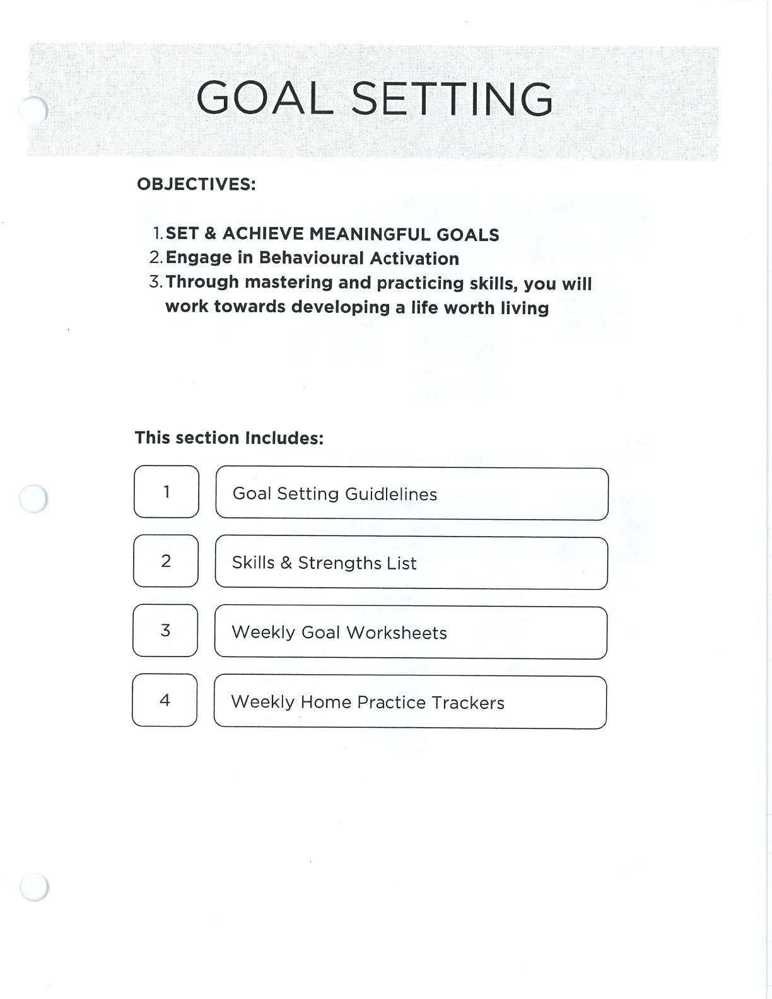
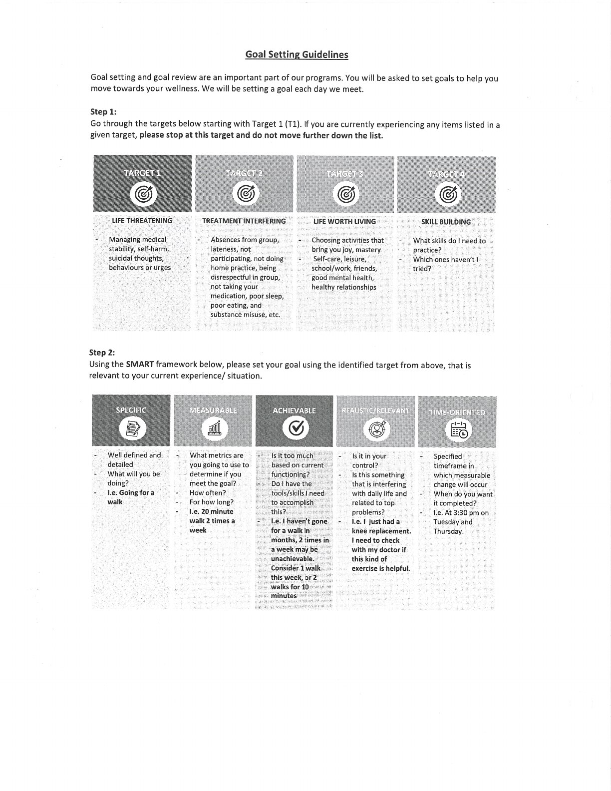

Use this lesson to choose a meaningful direction and define a goal you can act on.

## Goal Setting Guidelines {#goal-setting-guidelines}

Choose goals that matter to you, are realistic for your current circumstances, and can be reviewed without self-judgment.

## SMART Goals {#smart-goals}

A SMART goal is specific, measurable, achievable, relevant, and time-bound.

## Handouts and Worksheets {#handouts-and-worksheets}

### Goal Setting Guidelines - binder-p0144 {#binder-p0144}

binder-p0144

<!-- binder-resource: binder-p0144 -->

[{.img-fluid fig-alt="Preview of Goal Setting Guidelines (binder-p0144)"}](../../assets/binder/binder-p0144.jpg)

[Open full page](../../assets/binder/binder-p0144.jpg)

### Goal Setting Guidelines - binder-p0145 {#binder-p0145}

binder-p0145

<!-- binder-resource: binder-p0145 -->

[{.img-fluid fig-alt="Preview of Goal Setting Guidelines (binder-p0145)"}](../../assets/binder/binder-p0145.jpg)

[Open full page](../../assets/binder/binder-p0145.jpg)
