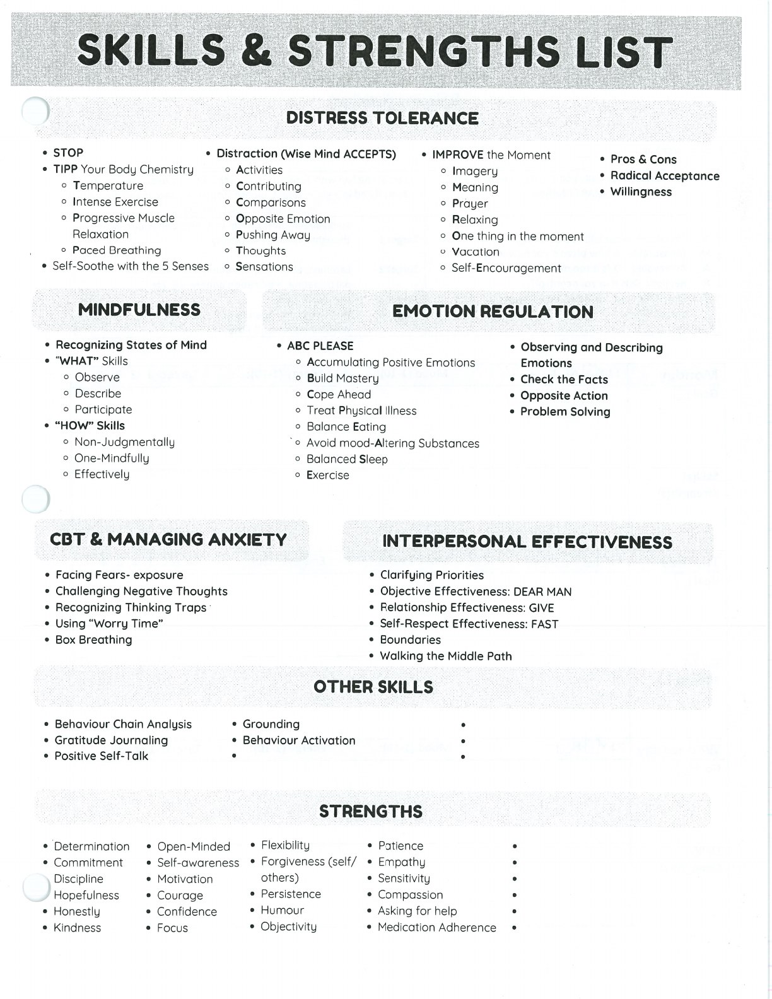

Strengths are qualities and practices you can draw on while working toward change.

- Determination
- Commitment
- Discipline
- Hopefulness
- Honesty
- Kindness
- Open-Minded
- Self-Awareness
- Motivation
- Courage
- Confidence
- Focus
- Flexibility
- Forgiveness (self / others)
- Persistence
- Humour
- Objectivity
- Patience
- Empathy
- Sensitivity
- Compassion
- Asking for Help
- Medication Adherence

## Handouts and Worksheets {#handouts-and-worksheets}

### Skills and Strengths List - binder-p0143 {#binder-p0143}

binder-p0143

<!-- binder-resource: binder-p0143 -->

[{.img-fluid fig-alt="Preview of Skills and Strengths List (binder-p0143)"}](../../assets/binder/binder-p0143.jpg)

[Open full page](../../assets/binder/binder-p0143.jpg)
