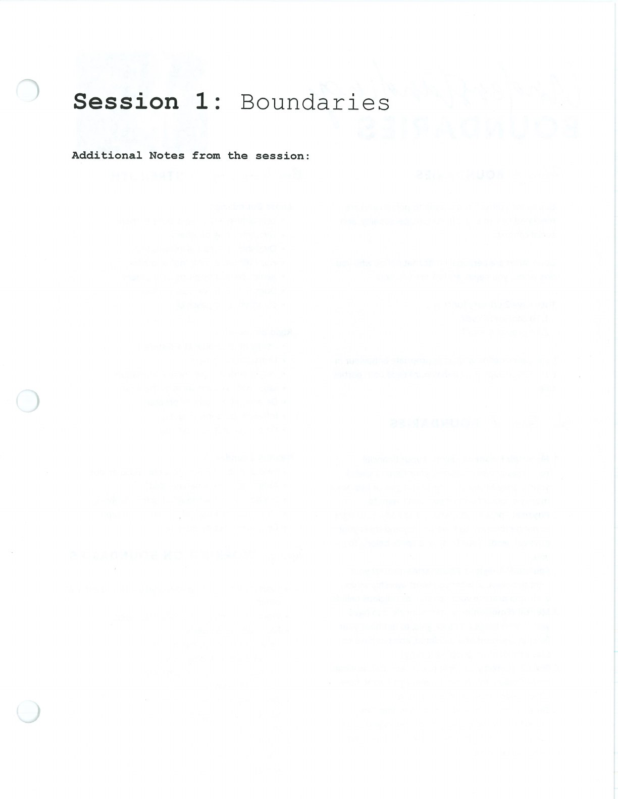
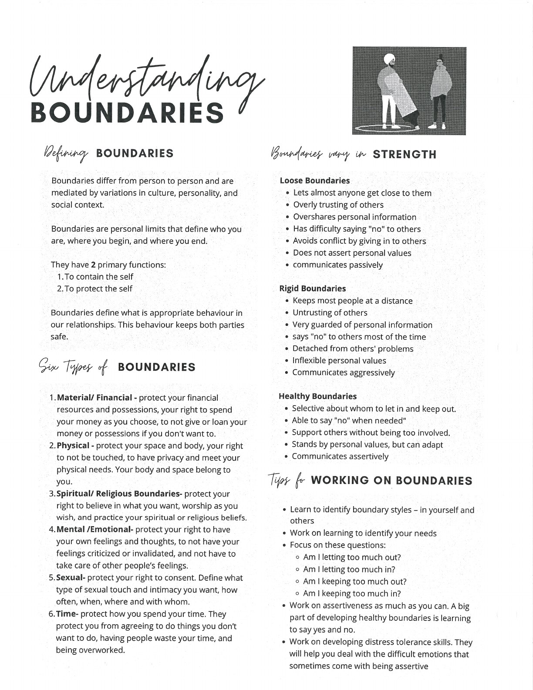
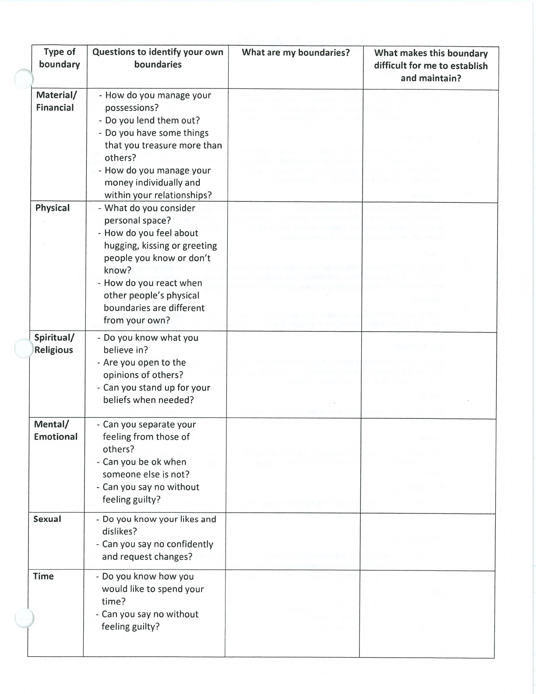

Boundaries clarify what you are responsible for, what you will accept, and how you will respond.

## Handouts and Worksheets {#handouts-and-worksheets}

### Boundaries - binder-p0084 {#binder-p0084}

binder-p0084

<!-- binder-resource: binder-p0084 -->

[{.img-fluid fig-alt="Preview of Boundaries (binder-p0084)"}](../../assets/binder/binder-p0084.jpg)

[Open full page](../../assets/binder/binder-p0084.jpg)

### Boundaries - binder-p0085 {#binder-p0085}

binder-p0085

<!-- binder-resource: binder-p0085 -->

[{.img-fluid fig-alt="Preview of Boundaries (binder-p0085)"}](../../assets/binder/binder-p0085.jpg)

[Open full page](../../assets/binder/binder-p0085.jpg)

### Boundaries - binder-p0086 {#binder-p0086}

binder-p0086

<!-- binder-resource: binder-p0086 -->

[{.img-fluid fig-alt="Preview of Boundaries (binder-p0086)"}](../../assets/binder/binder-p0086.jpg)

[Open full page](../../assets/binder/binder-p0086.jpg)
