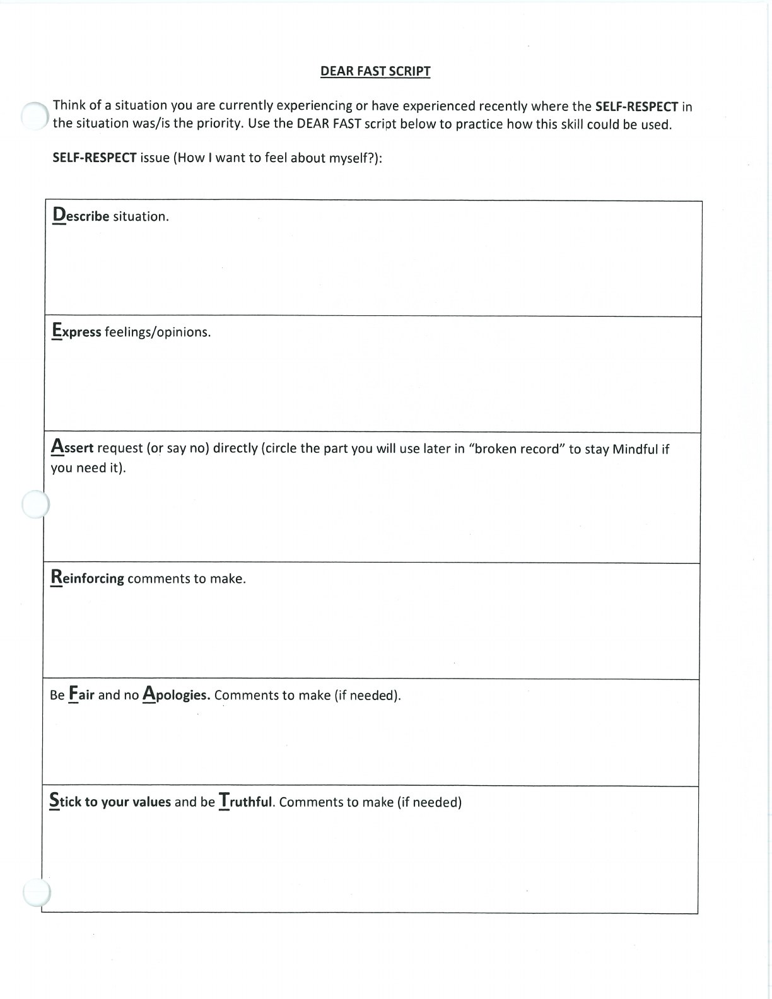

DEAR MAN helps organize what to say and how to stay focused.

## Describe {#describe}

## Express {#express}

## Assert {#assert}

## Reinforce {#reinforce}

## Mindful {#mindful}

## Appear Confident {#appear-confident}

## Negotiate {#negotiate}

## Handouts and Worksheets {#handouts-and-worksheets}

### DEAR MAN / FAST Practice - binder-p0073 {#binder-p0073}

binder-p0073

<!-- binder-resource: binder-p0073 -->

[{.img-fluid fig-alt="Preview of DEAR MAN / FAST Practice (binder-p0073)"}](../../assets/binder/binder-p0073.jpg)

[Open full page](../../assets/binder/binder-p0073.jpg)
