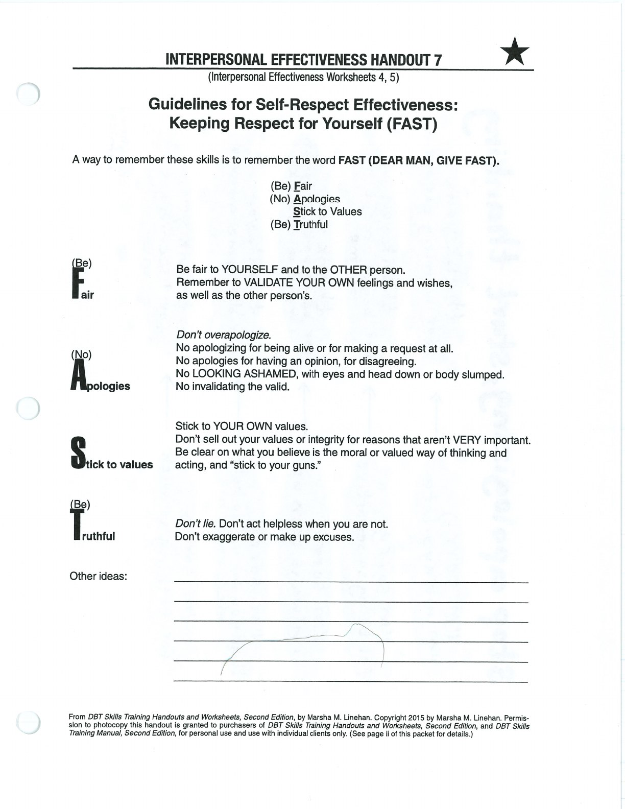
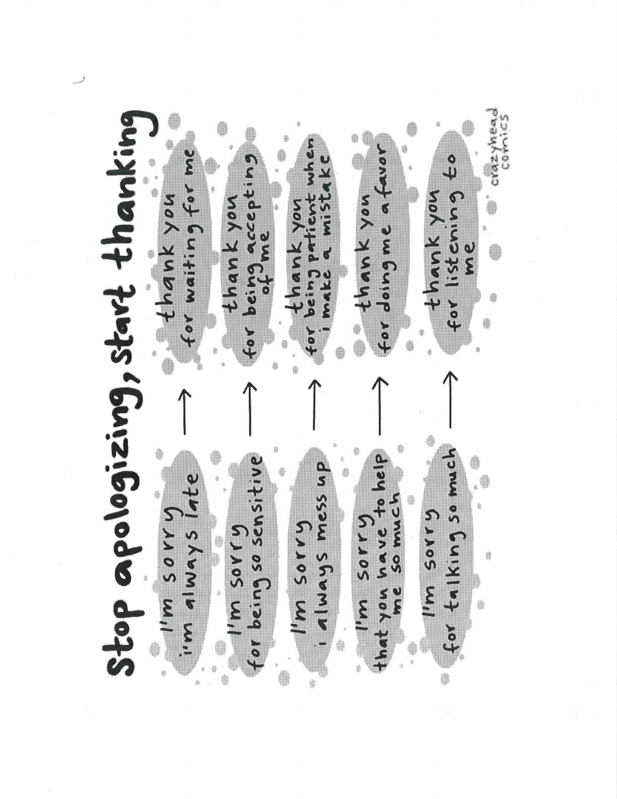

FAST helps you remain fair and aligned with your values.

## Fair {#fair}

## No Unnecessary Apologies {#no-unnecessary-apologies}

## Stick to Values {#stick-to-values}

## Truthful {#truthful}

## Handouts and Worksheets {#handouts-and-worksheets}

### FAST - binder-p0071 {#binder-p0071}

binder-p0071

<!-- binder-resource: binder-p0071 -->

[{.img-fluid fig-alt="Preview of FAST (binder-p0071)"}](../../assets/binder/binder-p0071.jpg)

[Open full page](../../assets/binder/binder-p0071.jpg)

### FAST - binder-p0072 {#binder-p0072}

binder-p0072

<!-- binder-resource: binder-p0072 -->

[{.img-fluid fig-alt="Preview of FAST (binder-p0072)"}](../../assets/binder/binder-p0072.jpg)

[Open full page](../../assets/binder/binder-p0072.jpg)
