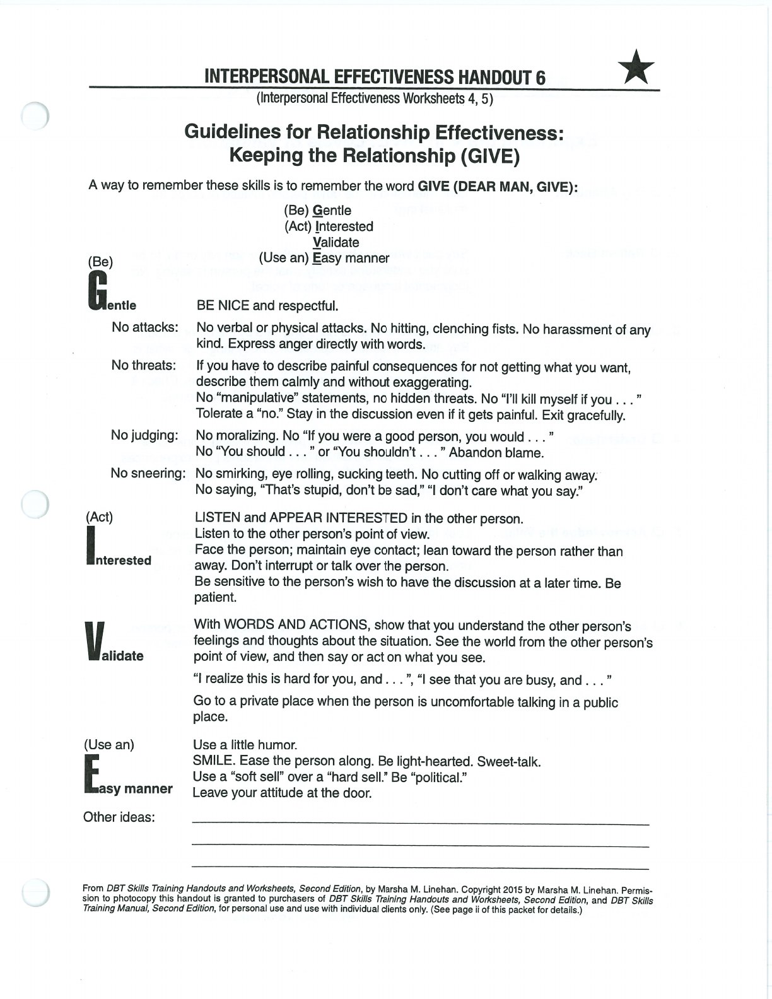
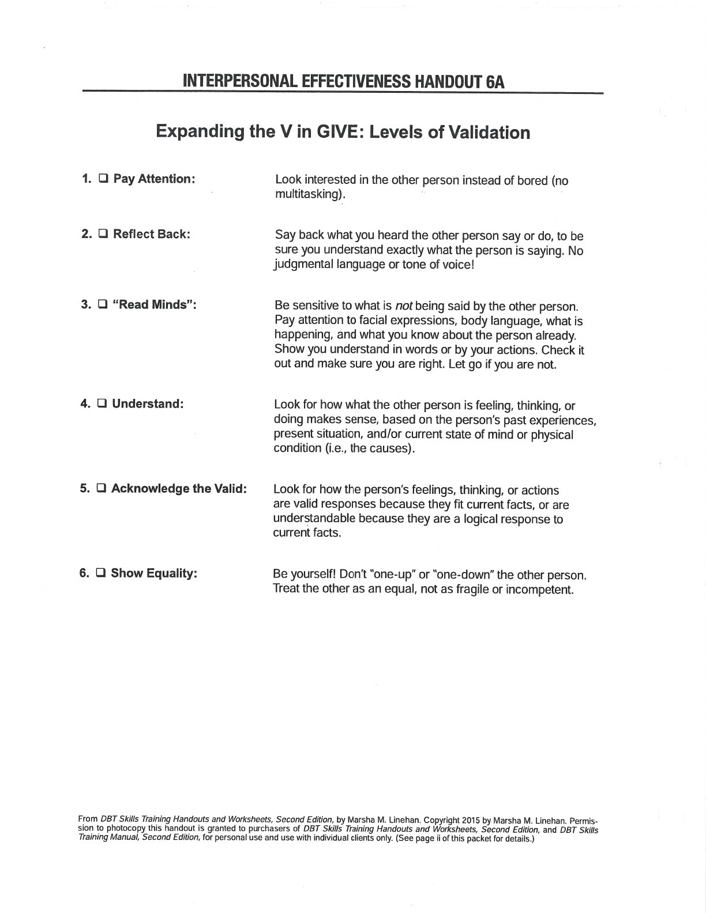
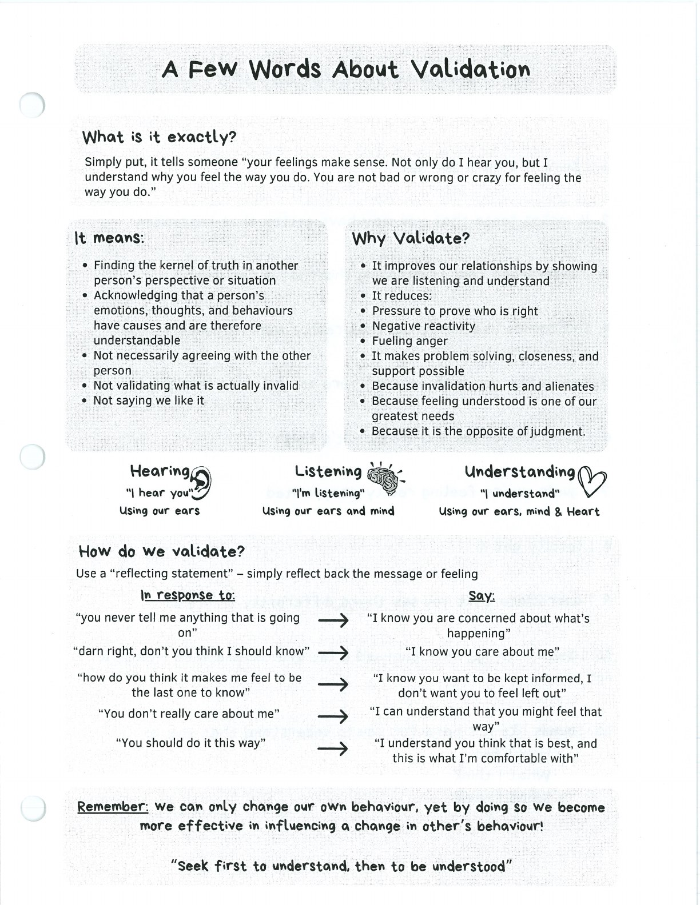
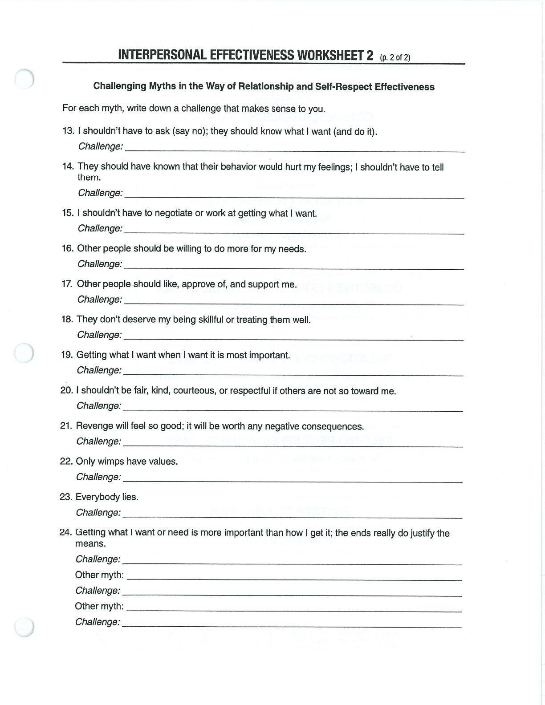

GIVE focuses on how you relate to the other person during an interaction.

## Gentle {#gentle}

## Interested {#interested}

## Validate {#validate}

## Easy Manner {#easy-manner}

## Handouts and Worksheets {#handouts-and-worksheets}

### GIVE and Validation - binder-p0075 {#binder-p0075}

binder-p0075

<!-- binder-resource: binder-p0075 -->

[{.img-fluid fig-alt="Preview of GIVE and Validation (binder-p0075)"}](../../assets/binder/binder-p0075.jpg)

[Open full page](../../assets/binder/binder-p0075.jpg)

### GIVE and Validation - binder-p0076 {#binder-p0076}

binder-p0076

<!-- binder-resource: binder-p0076 -->

[{.img-fluid fig-alt="Preview of GIVE and Validation (binder-p0076)"}](../../assets/binder/binder-p0076.jpg)

[Open full page](../../assets/binder/binder-p0076.jpg)

### GIVE and Validation - binder-p0077 {#binder-p0077}

binder-p0077

<!-- binder-resource: binder-p0077 -->

[{.img-fluid fig-alt="Preview of GIVE and Validation (binder-p0077)"}](../../assets/binder/binder-p0077.jpg)

[Open full page](../../assets/binder/binder-p0077.jpg)

### GIVE and Validation - binder-p0078 {#binder-p0078}

binder-p0078

<!-- binder-resource: binder-p0078 -->

[{.img-fluid fig-alt="Preview of GIVE and Validation (binder-p0078)"}](../../assets/binder/binder-p0078.jpg)

[Open full page](../../assets/binder/binder-p0078.jpg)
