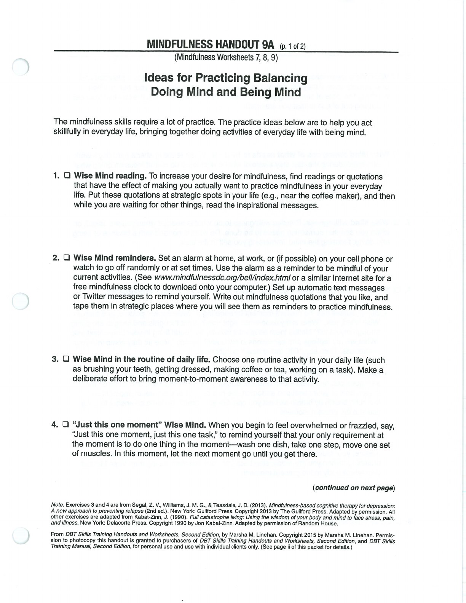
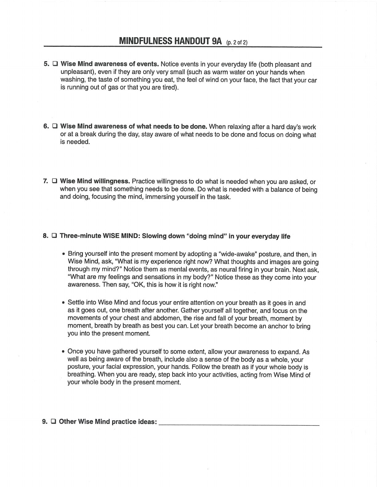

Being Mind and Doing Mind are complementary modes. Mindful practice helps you choose the balance a situation needs.

## Handouts and Worksheets {#handouts-and-worksheets}

### Being Mind and Doing Mind - binder-p0087 {#binder-p0087}

binder-p0087

<!-- binder-resource: binder-p0087 -->

[{.img-fluid fig-alt="Preview of Being Mind and Doing Mind (binder-p0087)"}](../../assets/binder/binder-p0087.jpg)

[Open full page](../../assets/binder/binder-p0087.jpg)

### Being Mind and Doing Mind - binder-p0088 {#binder-p0088}

binder-p0088

<!-- binder-resource: binder-p0088 -->

[{.img-fluid fig-alt="Preview of Being Mind and Doing Mind (binder-p0088)"}](../../assets/binder/binder-p0088.jpg)

[Open full page](../../assets/binder/binder-p0088.jpg)
