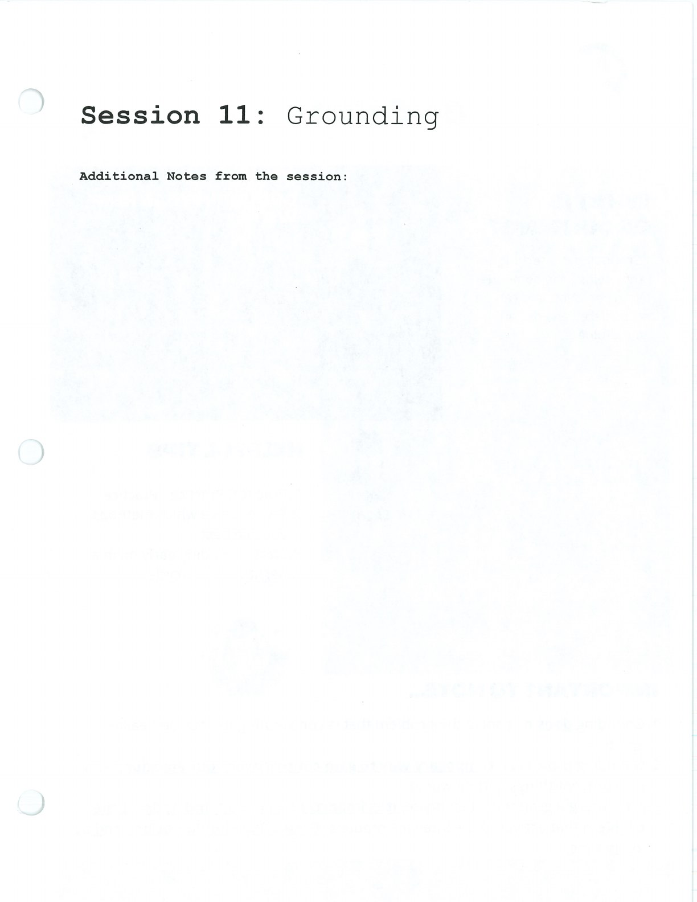

Grounding directs attention toward immediate sensory information, the body, and the current environment.

## Handouts and Worksheets {#handouts-and-worksheets}

### Grounding - binder-p0091 {#binder-p0091}

binder-p0091

<!-- binder-resource: binder-p0091 -->

[{.img-fluid fig-alt="Preview of Grounding (binder-p0091)"}](../../assets/binder/binder-p0091.jpg)

[Open full page](../../assets/binder/binder-p0091.jpg)
