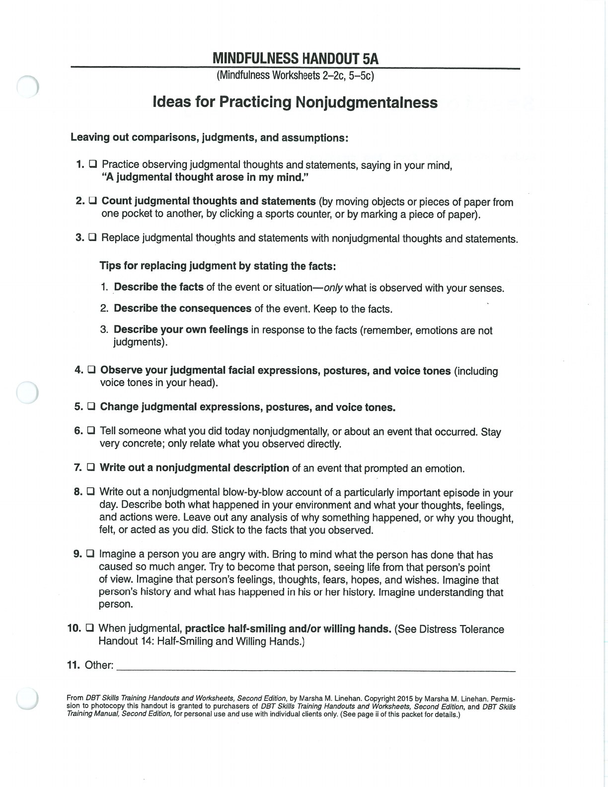

Non-judgmentally is the first HOW skill. Notice evaluations when they arise and return to facts, consequences, preferences, and values.

## Non-Judgmentally {#non-judgmentally}

## Handouts and Worksheets {#handouts-and-worksheets}

### Non-Judgmentally - binder-p0099 {#binder-p0099}

binder-p0099

<!-- binder-resource: binder-p0099 -->

[{.img-fluid fig-alt="Preview of Non-Judgmentally (binder-p0099)"}](../../assets/binder/binder-p0099.jpg)

[Open full page](../../assets/binder/binder-p0099.jpg)
