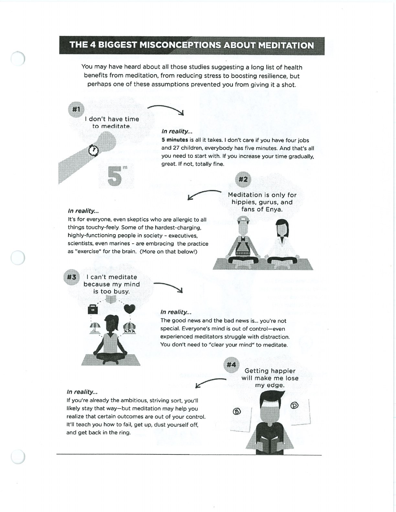
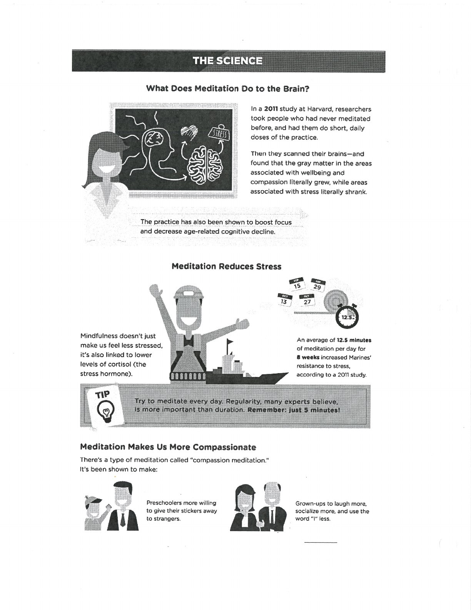
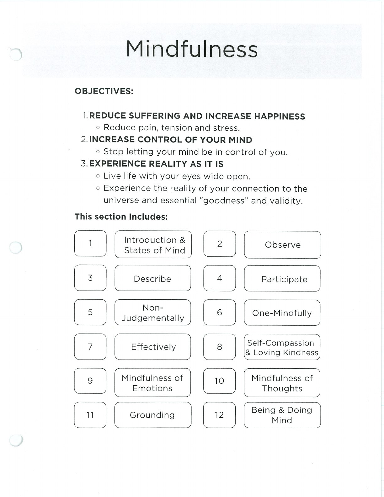
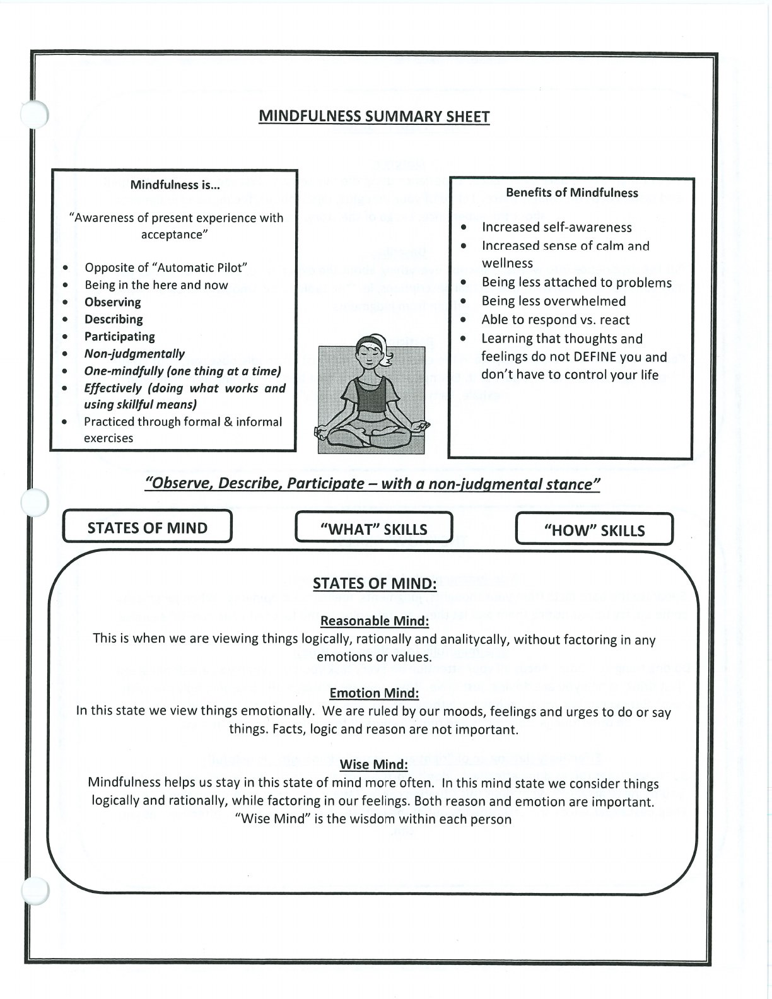
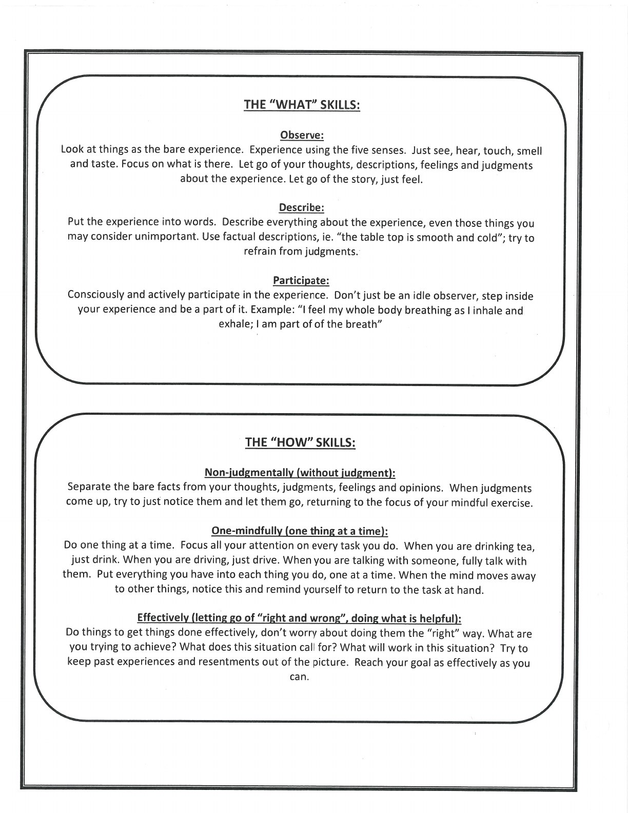
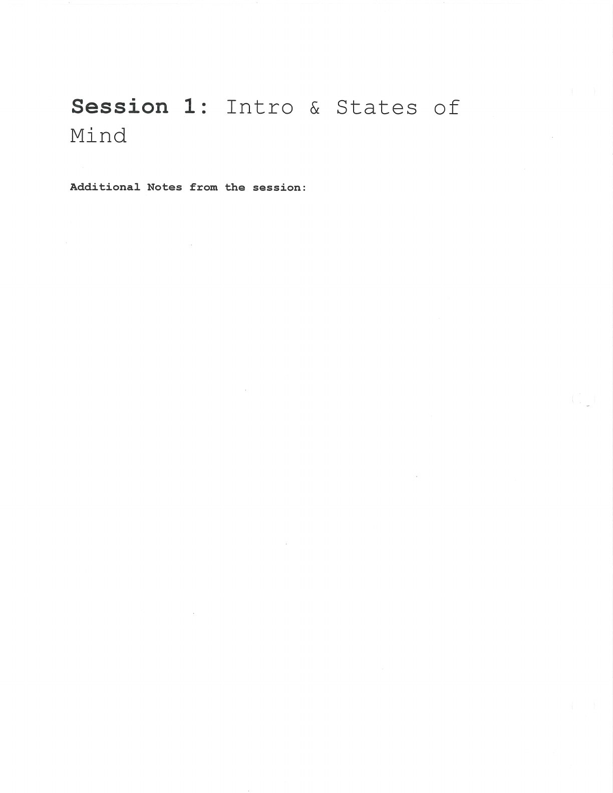

Mindfulness helps you notice the present moment and respond with greater choice. Wise Mind integrates emotion and reason.

## Emotion Mind {#emotion-mind}

## Reasonable Mind {#reasonable-mind}

## Wise Mind {#wise-mind}

## Handouts and Worksheets {#handouts-and-worksheets}

### Mindfulness Foundations and States of Mind - binder-p0108 {#binder-p0108}

binder-p0108

<!-- binder-resource: binder-p0108 -->

[{.img-fluid fig-alt="Preview of Mindfulness Foundations and States of Mind (binder-p0108)"}](../../assets/binder/binder-p0108.jpg)

[Open full page](../../assets/binder/binder-p0108.jpg)

### Mindfulness Foundations and States of Mind - binder-p0109 {#binder-p0109}

binder-p0109

<!-- binder-resource: binder-p0109 -->

[{.img-fluid fig-alt="Preview of Mindfulness Foundations and States of Mind (binder-p0109)"}](../../assets/binder/binder-p0109.jpg)

[Open full page](../../assets/binder/binder-p0109.jpg)

### Mindfulness Foundations and States of Mind - binder-p0110 {#binder-p0110}

binder-p0110

<!-- binder-resource: binder-p0110 -->

[{.img-fluid fig-alt="Preview of Mindfulness Foundations and States of Mind (binder-p0110)"}](../../assets/binder/binder-p0110.jpg)

[Open full page](../../assets/binder/binder-p0110.jpg)

### Mindfulness Foundations and States of Mind - binder-p0111 {#binder-p0111}

binder-p0111

<!-- binder-resource: binder-p0111 -->

[{.img-fluid fig-alt="Preview of Mindfulness Foundations and States of Mind (binder-p0111)"}](../../assets/binder/binder-p0111.jpg)

[Open full page](../../assets/binder/binder-p0111.jpg)

### Mindfulness Foundations and States of Mind - binder-p0112 {#binder-p0112}

binder-p0112

<!-- binder-resource: binder-p0112 -->

[{.img-fluid fig-alt="Preview of Mindfulness Foundations and States of Mind (binder-p0112)"}](../../assets/binder/binder-p0112.jpg)

[Open full page](../../assets/binder/binder-p0112.jpg)

### Mindfulness Foundations and States of Mind - binder-p0113 {#binder-p0113}

binder-p0113

<!-- binder-resource: binder-p0113 -->

[{.img-fluid fig-alt="Preview of Mindfulness Foundations and States of Mind (binder-p0113)"}](../../assets/binder/binder-p0113.jpg)

[Open full page](../../assets/binder/binder-p0113.jpg)
