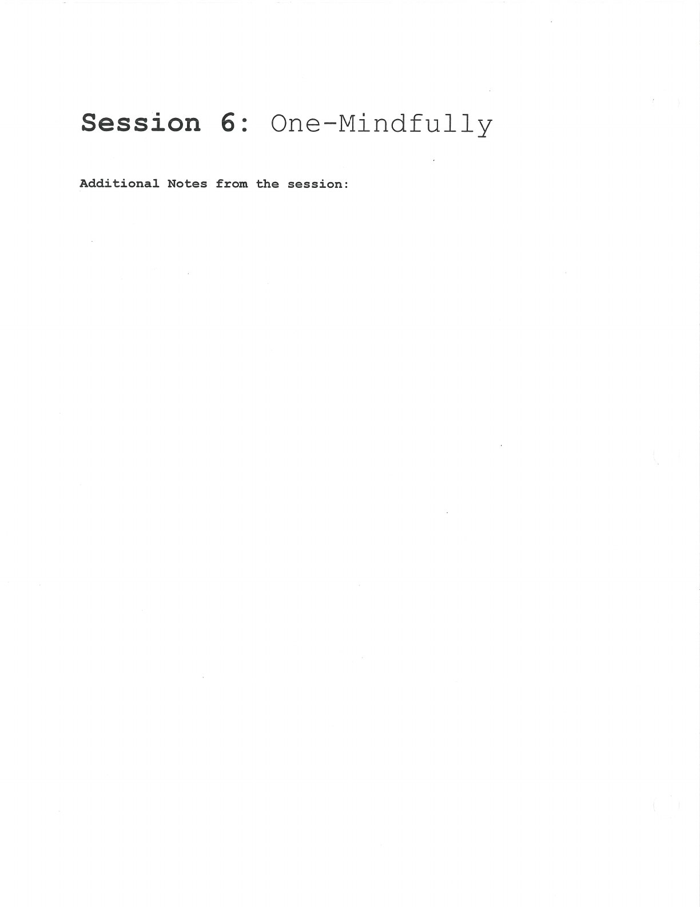
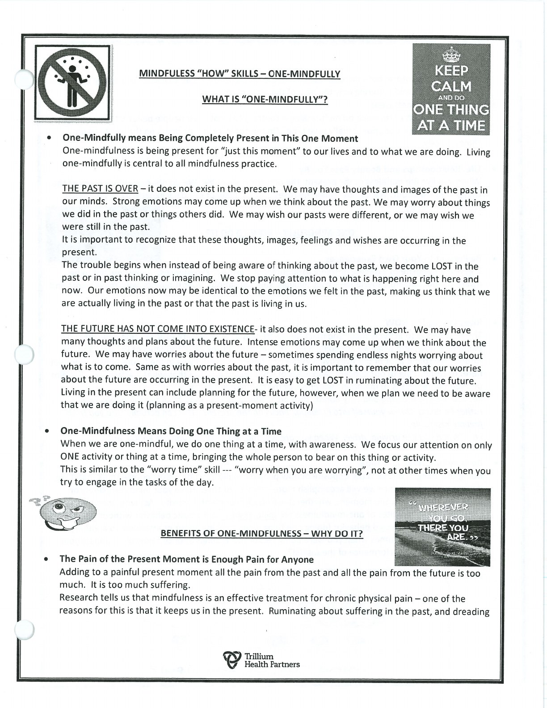

One-mindfully is the second HOW skill. Put your attention on this activity and this moment, returning gently when attention moves away.

## One-Mindfully {#one-mindfully}

Do one thing at a time. When you are worrying, worry; when you are planning, plan; when you are listening, listen.

## Handouts and Worksheets {#handouts-and-worksheets}

### One-Mindfully - binder-p0100 {#binder-p0100}

binder-p0100

<!-- binder-resource: binder-p0100 -->

[{.img-fluid fig-alt="Preview of One-Mindfully (binder-p0100)"}](../../assets/binder/binder-p0100.jpg)

[Open full page](../../assets/binder/binder-p0100.jpg)

### One-Mindfully - binder-p0101 {#binder-p0101}

binder-p0101

<!-- binder-resource: binder-p0101 -->

[{.img-fluid fig-alt="Preview of One-Mindfully (binder-p0101)"}](../../assets/binder/binder-p0101.jpg)

[Open full page](../../assets/binder/binder-p0101.jpg)
