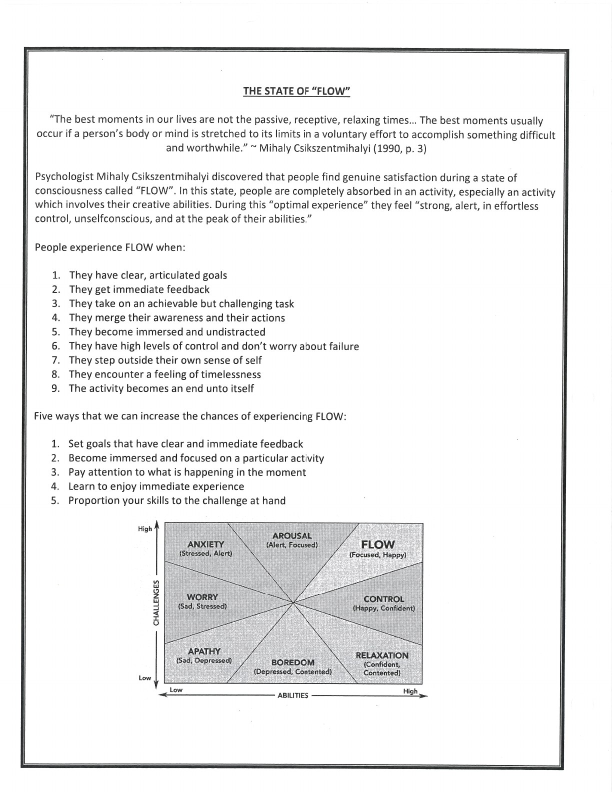
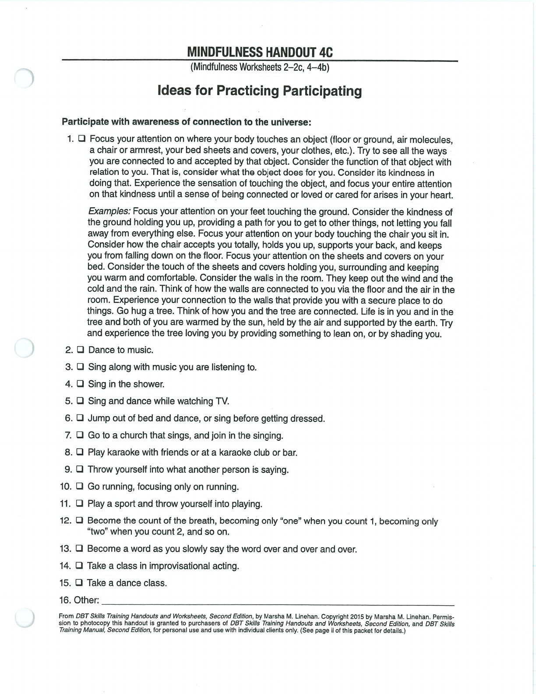

Participate is the third WHAT skill. Bring yourself fully into what you are doing instead of standing outside the experience and judging each step.

## Participate {#participate}

Practise joining the moment with attention, adjusting when observation or description is needed, and then returning to full participation.

## Handouts and Worksheets {#handouts-and-worksheets}

### Participate - binder-p0103 {#binder-p0103}

binder-p0103

<!-- binder-resource: binder-p0103 -->

[{.img-fluid fig-alt="Preview of Participate (binder-p0103)"}](../../assets/binder/binder-p0103.jpg)

[Open full page](../../assets/binder/binder-p0103.jpg)

### Participate - binder-p0104 {#binder-p0104}

binder-p0104

<!-- binder-resource: binder-p0104 -->

[{.img-fluid fig-alt="Preview of Participate (binder-p0104)"}](../../assets/binder/binder-p0104.jpg)

[Open full page](../../assets/binder/binder-p0104.jpg)
