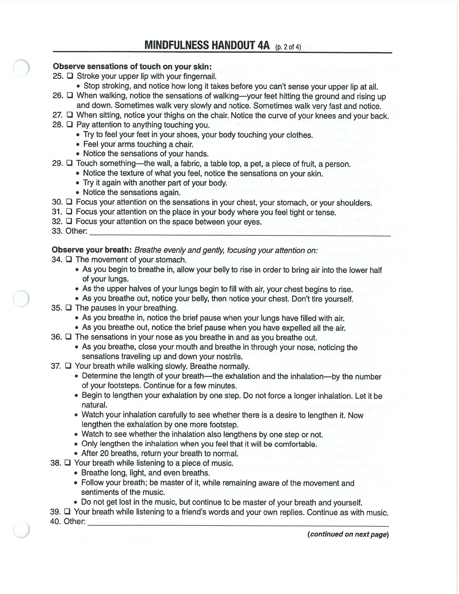
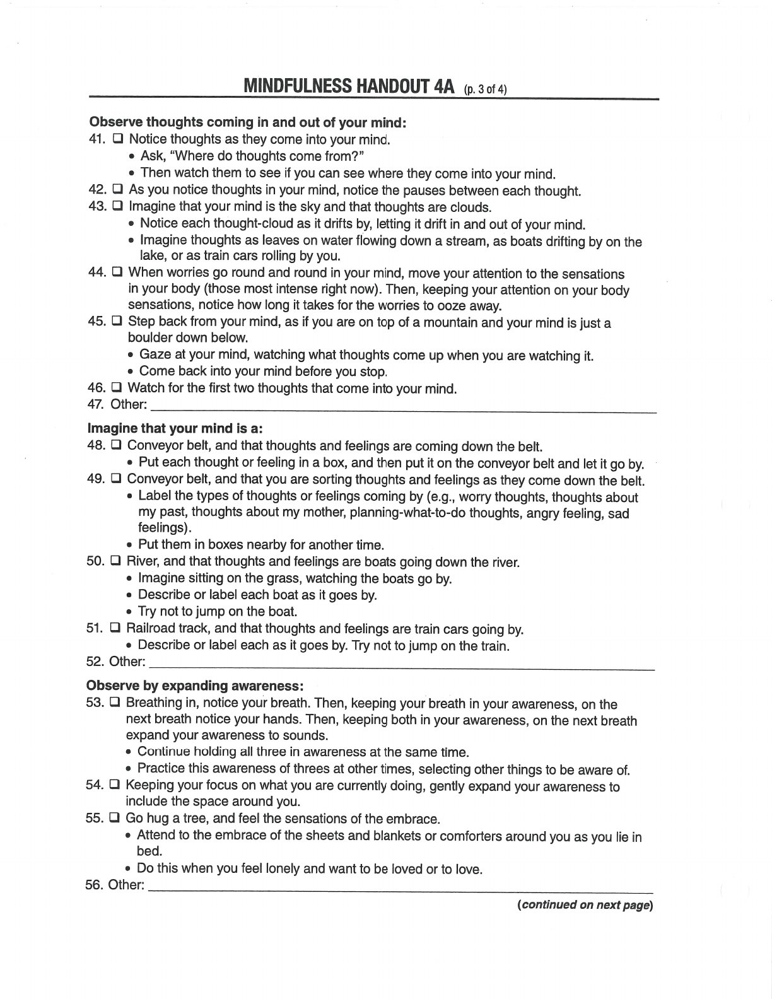
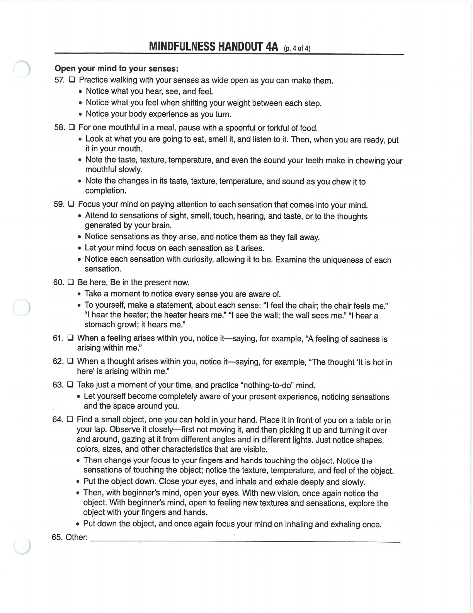

Observe is the first WHAT skill: intentionally notice sensations, thoughts, emotions, and events as they arise.

## Observe {#observe}

## Handouts and Worksheets {#handouts-and-worksheets}

### Observe - binder-p0105 {#binder-p0105}

binder-p0105

<!-- binder-resource: binder-p0105 -->

[{.img-fluid fig-alt="Preview of Observe (binder-p0105)"}](../../assets/binder/binder-p0105.jpg)

[Open full page](../../assets/binder/binder-p0105.jpg)

### Observe - binder-p0106 {#binder-p0106}

binder-p0106

<!-- binder-resource: binder-p0106 -->

[{.img-fluid fig-alt="Preview of Observe (binder-p0106)"}](../../assets/binder/binder-p0106.jpg)

[Open full page](../../assets/binder/binder-p0106.jpg)

### Observe - binder-p0107 {#binder-p0107}

binder-p0107

<!-- binder-resource: binder-p0107 -->

[{.img-fluid fig-alt="Preview of Observe (binder-p0107)"}](../../assets/binder/binder-p0107.jpg)

[Open full page](../../assets/binder/binder-p0107.jpg)
