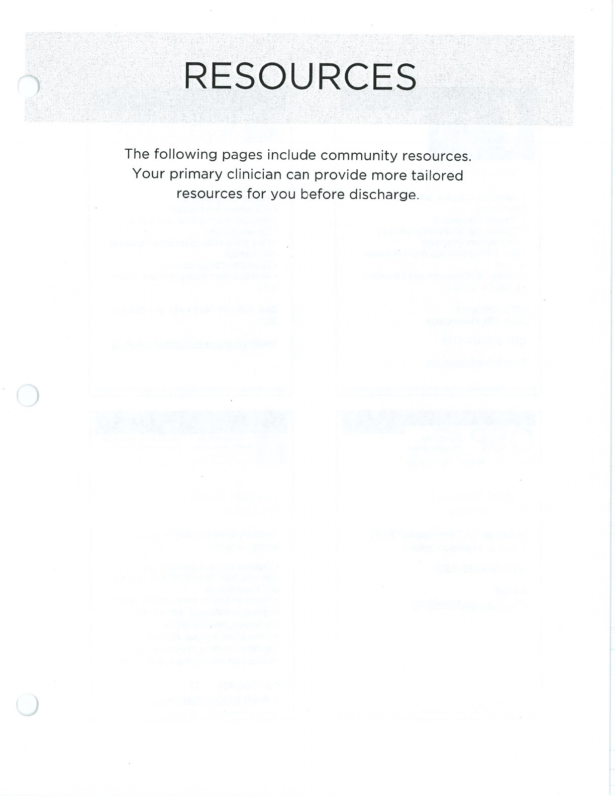
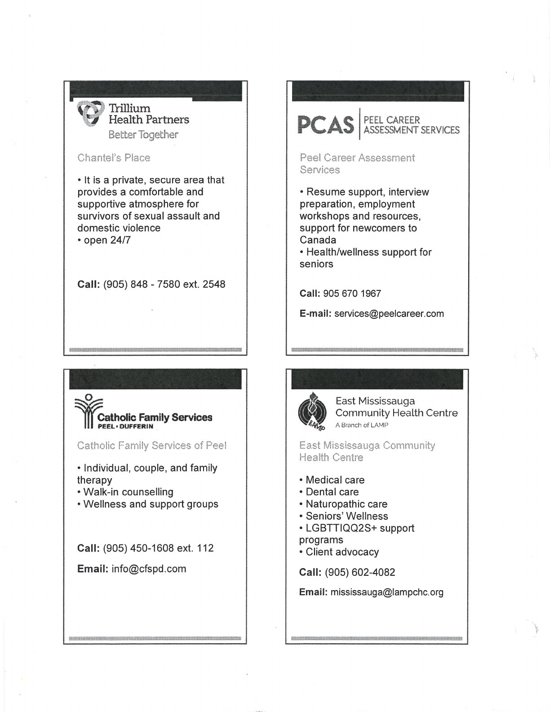

These scanned listings are preserved as binder resources. Confirm current contact details before relying on them.

## Handouts and Worksheets {#handouts-and-worksheets}

### Community Resources - binder-p0001 {#binder-p0001}

binder-p0001

<!-- binder-resource: binder-p0001 -->

[{.img-fluid fig-alt="Preview of Community Resources (binder-p0001)"}](../../assets/binder/binder-p0001.jpg)

[Open full page](../../assets/binder/binder-p0001.jpg)

### Community Resources - binder-p0002 {#binder-p0002}

binder-p0002

<!-- binder-resource: binder-p0002 -->

[{.img-fluid fig-alt="Preview of Community Resources (binder-p0002)"}](../../assets/binder/binder-p0002.jpg)

[Open full page](../../assets/binder/binder-p0002.jpg)

### Community Resources - binder-p0003 {#binder-p0003}

binder-p0003

<!-- binder-resource: binder-p0003 -->

[{.img-fluid fig-alt="Preview of Community Resources (binder-p0003)"}](../../assets/binder/binder-p0003.jpg)

[Open full page](../../assets/binder/binder-p0003.jpg)

### Community Resources - binder-p0004 {#binder-p0004}

binder-p0004

<!-- binder-resource: binder-p0004 -->

[{.img-fluid fig-alt="Preview of Community Resources (binder-p0004)"}](../../assets/binder/binder-p0004.jpg)

[Open full page](../../assets/binder/binder-p0004.jpg)
