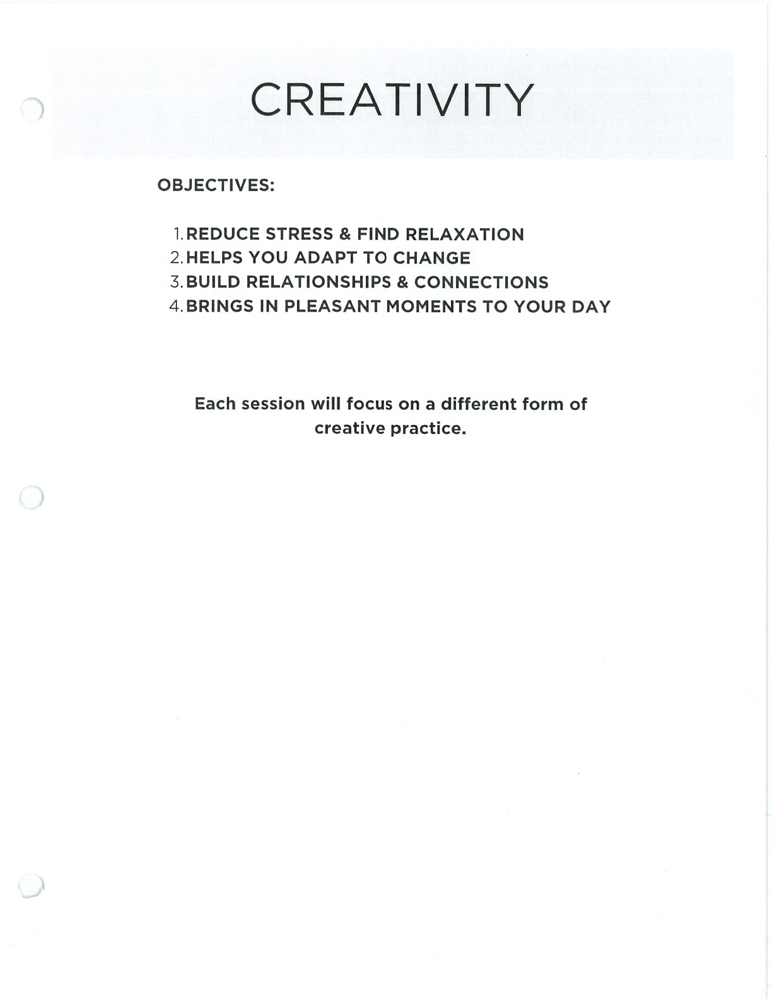
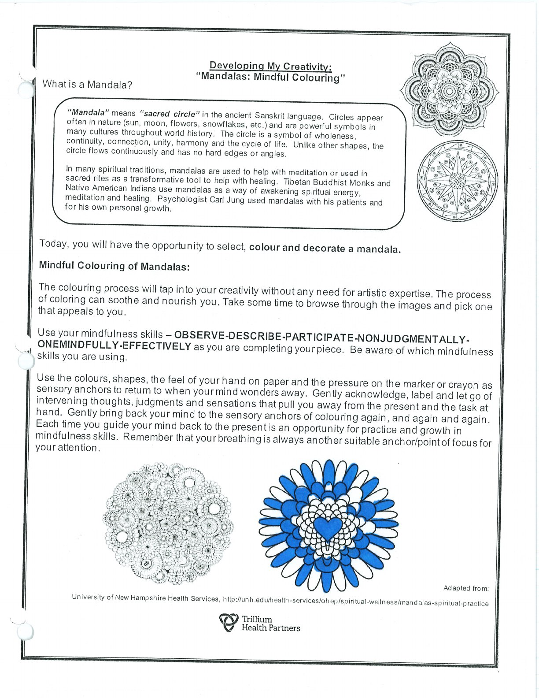
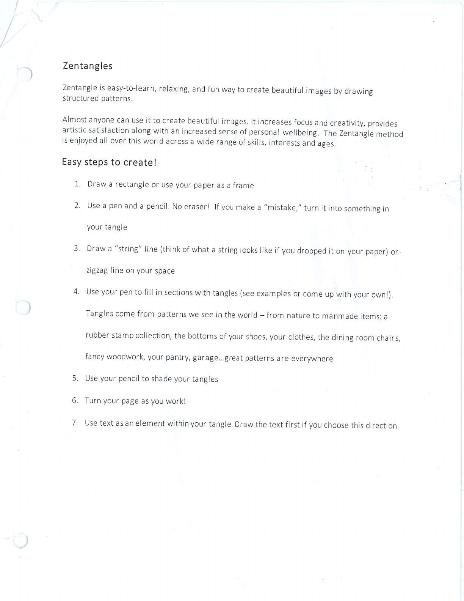

Creative practice can provide a gentle way to focus attention and make room for enjoyment.

## Handouts and Worksheets {#handouts-and-worksheets}

### Creative Practice - binder-p0023 {#binder-p0023}

binder-p0023

<!-- binder-resource: binder-p0023 -->

[{.img-fluid fig-alt="Preview of Creative Practice (binder-p0023)"}](../../assets/binder/binder-p0023.jpg)

[Open full page](../../assets/binder/binder-p0023.jpg)

### Creative Practice - binder-p0024 {#binder-p0024}

binder-p0024

<!-- binder-resource: binder-p0024 -->

[{.img-fluid fig-alt="Preview of Creative Practice (binder-p0024)"}](../../assets/binder/binder-p0024.jpg)

[Open full page](../../assets/binder/binder-p0024.jpg)

### Creative Practice - binder-p0025 {#binder-p0025}

binder-p0025

<!-- binder-resource: binder-p0025 -->

[{.img-fluid fig-alt="Preview of Creative Practice (binder-p0025)"}](../../assets/binder/binder-p0025.jpg)

[Open full page](../../assets/binder/binder-p0025.jpg)
