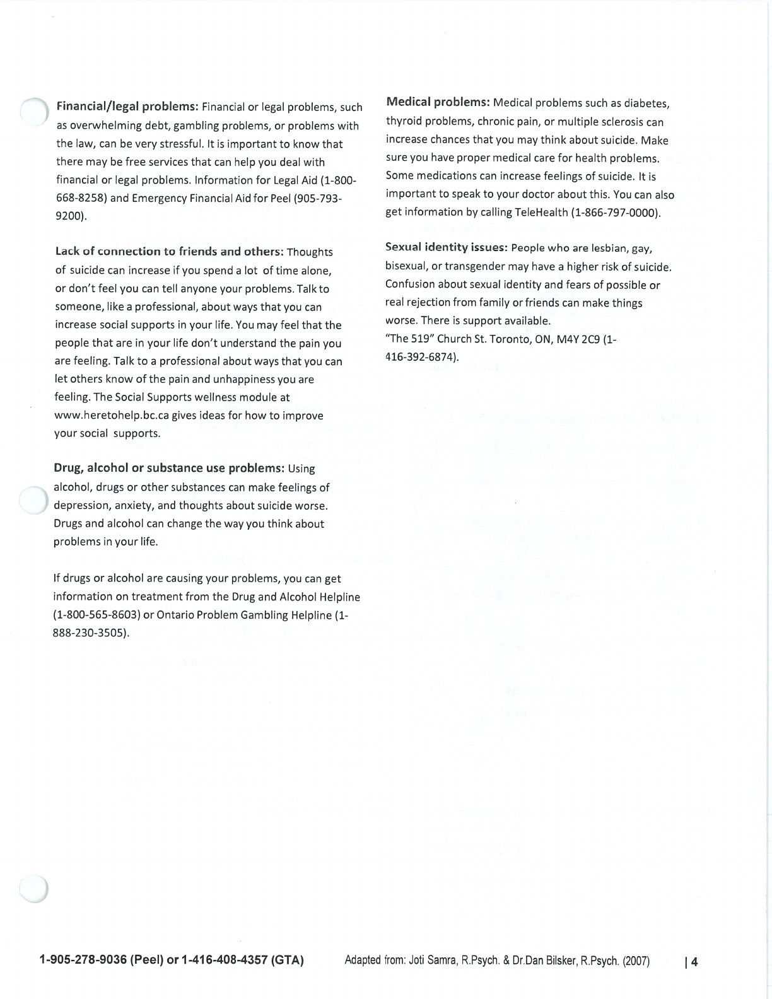
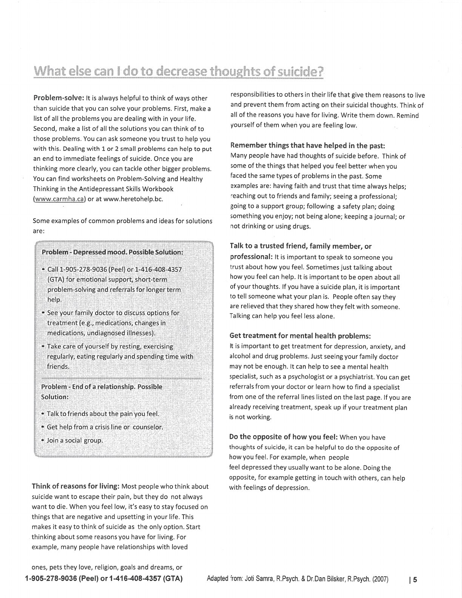
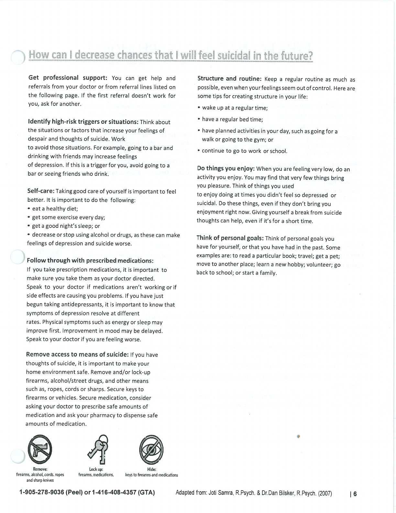

These resources are educational and do not replace emergency or clinical care. If there is immediate danger, contact local emergency services.

## Handouts and Worksheets {#handouts-and-worksheets}

### Crisis and Safety Resources - binder-p0147 {#binder-p0147}

binder-p0147

<!-- binder-resource: binder-p0147 -->

[{.img-fluid fig-alt="Preview of Crisis and Safety Resources (binder-p0147)"}](../../assets/binder/binder-p0147.jpg)

[Open full page](../../assets/binder/binder-p0147.jpg)

### Crisis and Safety Resources - binder-p0148 {#binder-p0148}

binder-p0148

<!-- binder-resource: binder-p0148 -->

[{.img-fluid fig-alt="Preview of Crisis and Safety Resources (binder-p0148)"}](../../assets/binder/binder-p0148.jpg)

[Open full page](../../assets/binder/binder-p0148.jpg)

### Crisis and Safety Resources - binder-p0149 {#binder-p0149}

binder-p0149

<!-- binder-resource: binder-p0149 -->

[{.img-fluid fig-alt="Preview of Crisis and Safety Resources (binder-p0149)"}](../../assets/binder/binder-p0149.jpg)

[Open full page](../../assets/binder/binder-p0149.jpg)
