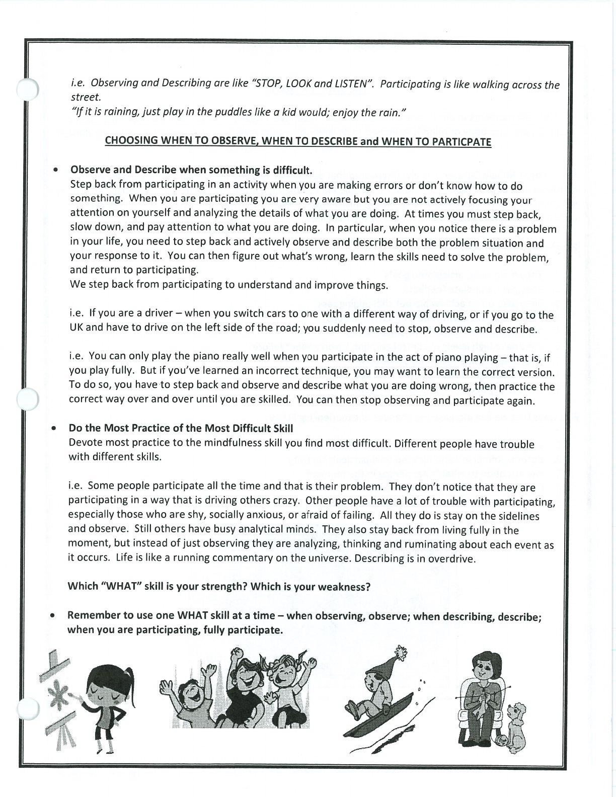

This page discusses when to observe, describe, and participate. It remains in the temporary review area rather than being forced into one of the three individual lessons.

## Review-Needed Binder Resource {#review-needed-binder-resource}

### WHAT Skills - binder-p0102 {#binder-p0102}

binder-p0102

<!-- binder-resource: binder-p0102 -->

[{.img-fluid fig-alt="Preview of WHAT Skills (binder-p0102)"}](../../assets/binder/binder-p0102.jpg)

[Open full page](../../assets/binder/binder-p0102.jpg)
