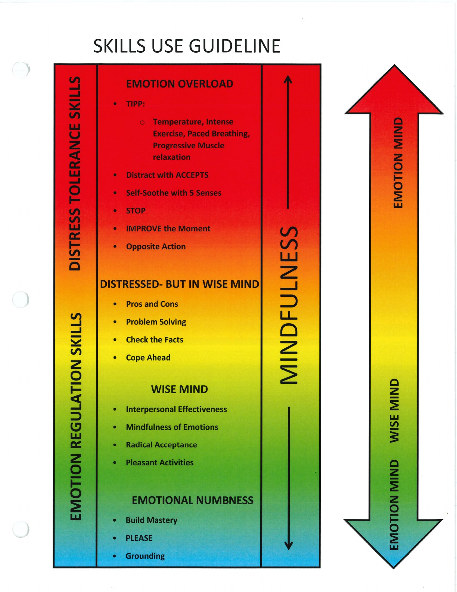

This overview links distress tolerance, emotion regulation, and mindfulness skills to different levels of arousal.

## Handouts and Worksheets {#handouts-and-worksheets}

### Skills Use Guideline - binder-p0146 {#binder-p0146}

binder-p0146

<!-- binder-resource: binder-p0146 -->

[{.img-fluid fig-alt="Preview of Skills Use Guideline (binder-p0146)"}](../../assets/binder/binder-p0146.jpg)

[Open full page](../../assets/binder/binder-p0146.jpg)
