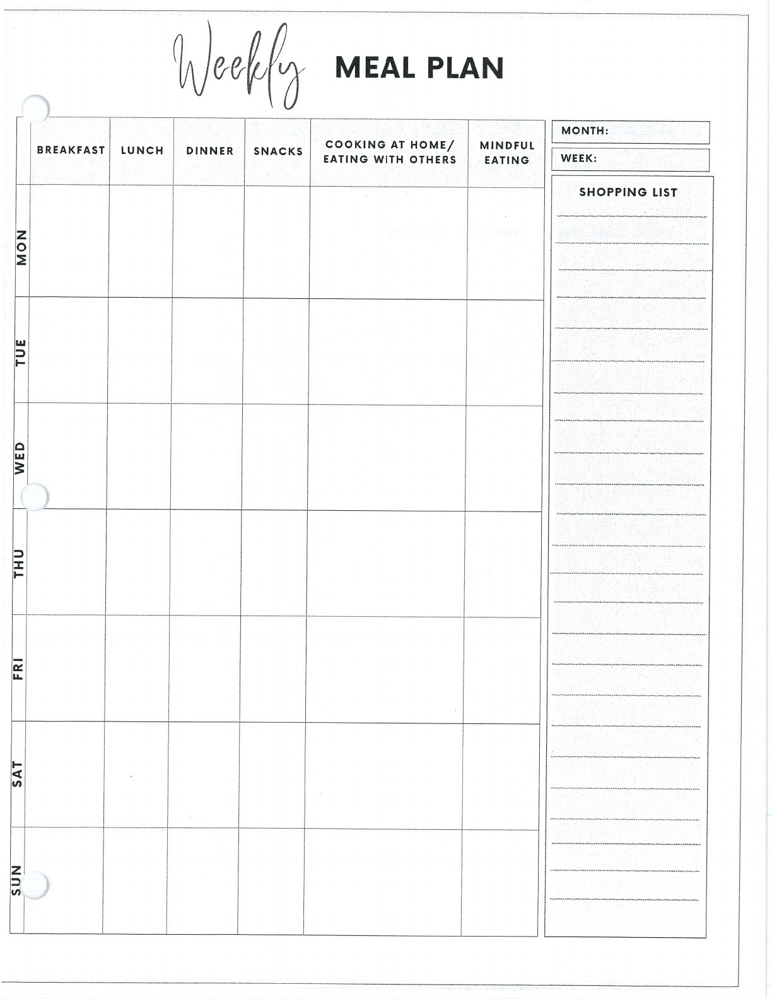
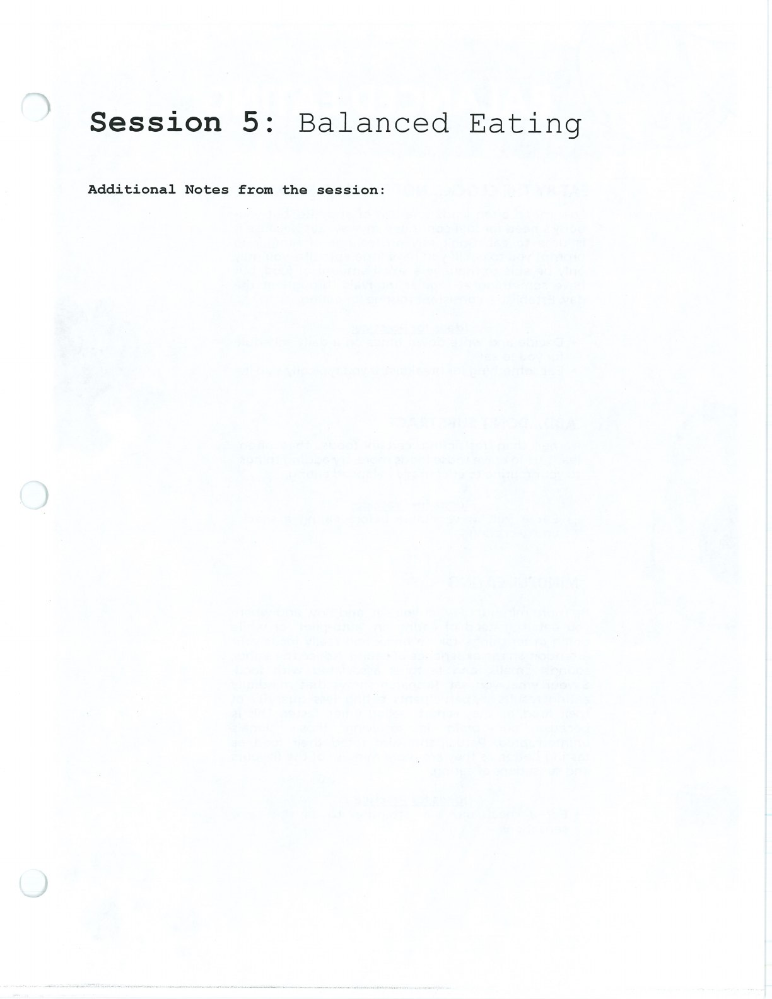

Balanced eating is body care, not perfection. Use the planning tools in a way that fits your needs and clinical guidance.

## Handouts and Worksheets {#handouts-and-worksheets}

### Weekly Meal Plan - binder-p0055 {#binder-p0055}

binder-p0055

<!-- binder-resource: binder-p0055 -->

[{.img-fluid fig-alt="Preview of Weekly Meal Plan (binder-p0055)"}](../../assets/binder/binder-p0055.jpg)

[Open full page](../../assets/binder/binder-p0055.jpg)

### Balanced Eating - binder-p0058 {#binder-p0058}

binder-p0058

<!-- binder-resource: binder-p0058 -->

[{.img-fluid fig-alt="Preview of Balanced Eating (binder-p0058)"}](../../assets/binder/binder-p0058.jpg)

[Open full page](../../assets/binder/binder-p0058.jpg)
