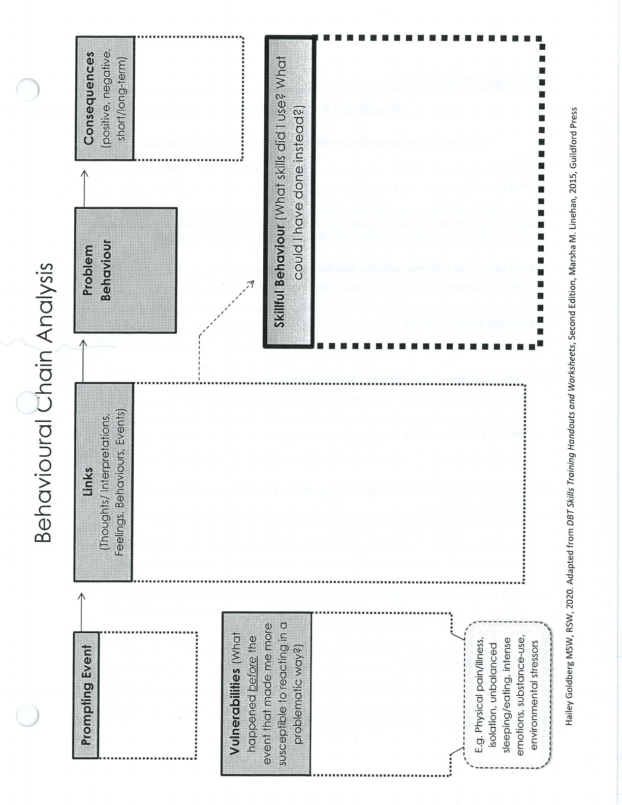
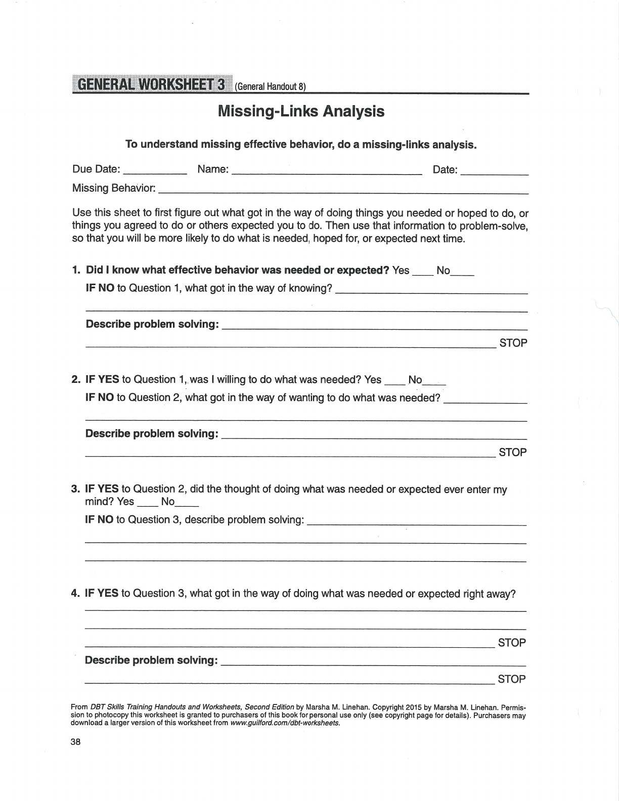
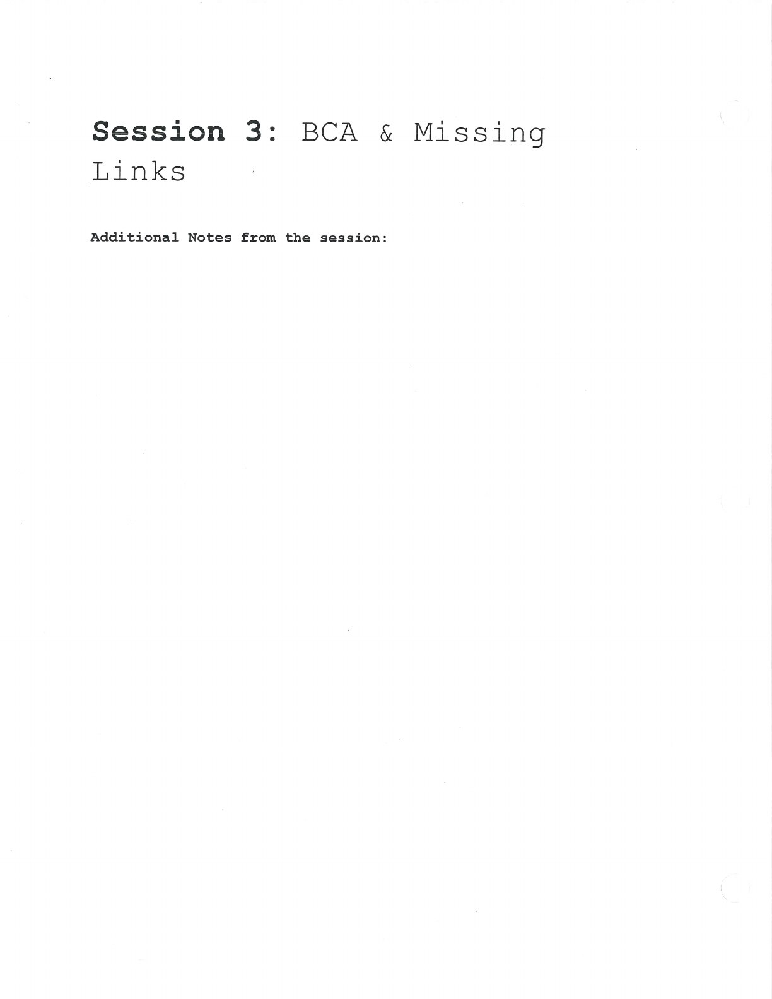
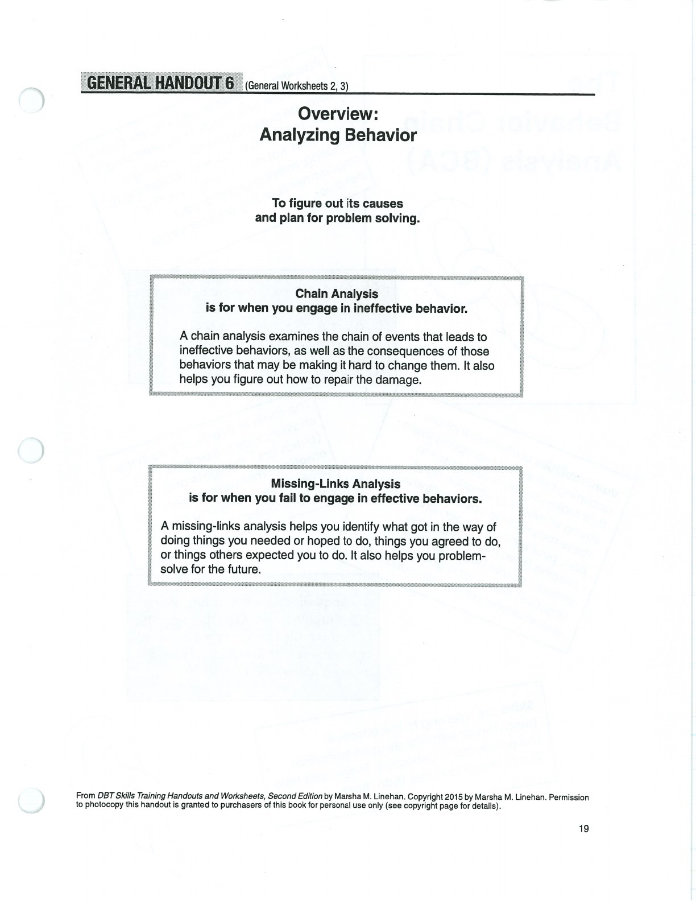
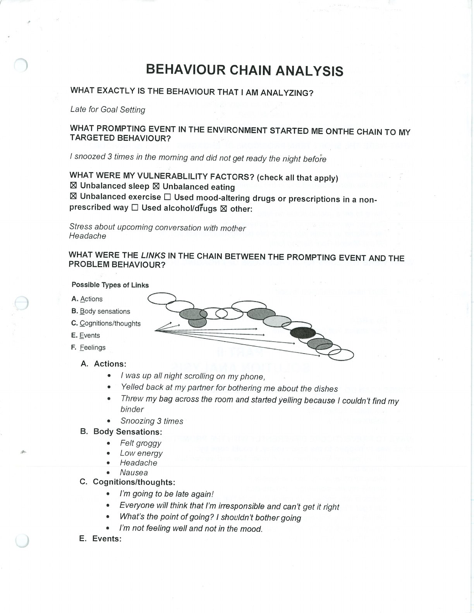
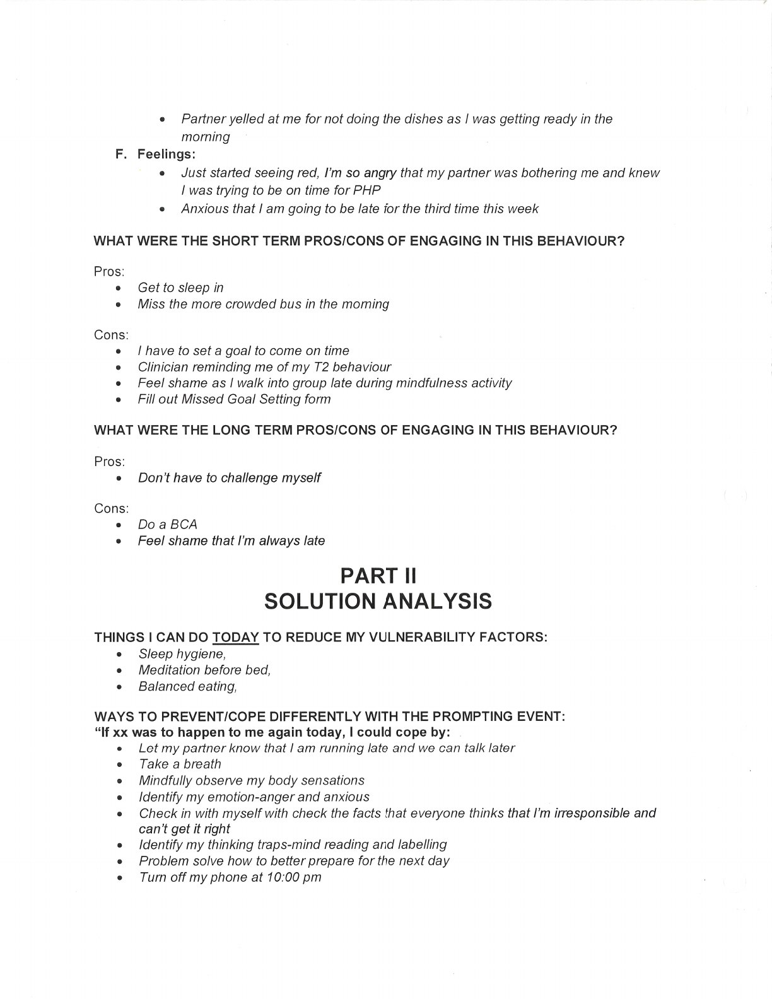
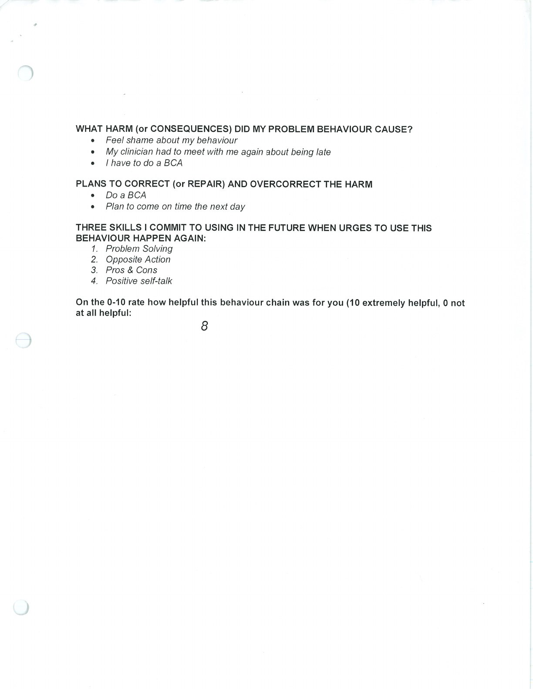

A behaviour chain traces prompting events, vulnerabilities, links, consequences, and possible solutions.

## Behaviour Chain Analysis {#behaviour-chain-analysis}

## Missing-Links Analysis {#missing-links-analysis}

## Handouts and Worksheets {#handouts-and-worksheets}

### Behaviour Chain Analysis - binder-p0059 {#binder-p0059}

binder-p0059

<!-- binder-resource: binder-p0059 -->

[{.img-fluid fig-alt="Preview of Behaviour Chain Analysis (binder-p0059)"}](../../assets/binder/binder-p0059.jpg)

[Open full page](../../assets/binder/binder-p0059.jpg)

### Missing-Links Analysis - binder-p0060 {#binder-p0060}

binder-p0060

<!-- binder-resource: binder-p0060 -->

[{.img-fluid fig-alt="Preview of Missing-Links Analysis (binder-p0060)"}](../../assets/binder/binder-p0060.jpg)

[Open full page](../../assets/binder/binder-p0060.jpg)

### Behaviour Chain Analysis and Missing Links - binder-p0063 {#binder-p0063}

binder-p0063

<!-- binder-resource: binder-p0063 -->

[{.img-fluid fig-alt="Preview of Behaviour Chain Analysis and Missing Links (binder-p0063)"}](../../assets/binder/binder-p0063.jpg)

[Open full page](../../assets/binder/binder-p0063.jpg)

### Behaviour Chain Analysis and Missing Links - binder-p0064 {#binder-p0064}

binder-p0064

<!-- binder-resource: binder-p0064 -->

[{.img-fluid fig-alt="Preview of Behaviour Chain Analysis and Missing Links (binder-p0064)"}](../../assets/binder/binder-p0064.jpg)

[Open full page](../../assets/binder/binder-p0064.jpg)

### Behaviour Chain and Solution Analysis - binder-p0150 {#binder-p0150}

binder-p0150

<!-- binder-resource: binder-p0150 -->

[{.img-fluid fig-alt="Preview of Behaviour Chain and Solution Analysis (binder-p0150)"}](../../assets/binder/binder-p0150.jpg)

[Open full page](../../assets/binder/binder-p0150.jpg)

### Behaviour Chain and Solution Analysis - binder-p0151 {#binder-p0151}

binder-p0151

<!-- binder-resource: binder-p0151 -->

[{.img-fluid fig-alt="Preview of Behaviour Chain and Solution Analysis (binder-p0151)"}](../../assets/binder/binder-p0151.jpg)

[Open full page](../../assets/binder/binder-p0151.jpg)

### Behaviour Chain and Solution Analysis - binder-p0152 {#binder-p0152}

binder-p0152

<!-- binder-resource: binder-p0152 -->

[{.img-fluid fig-alt="Preview of Behaviour Chain and Solution Analysis (binder-p0152)"}](../../assets/binder/binder-p0152.jpg)

[Open full page](../../assets/binder/binder-p0152.jpg)
