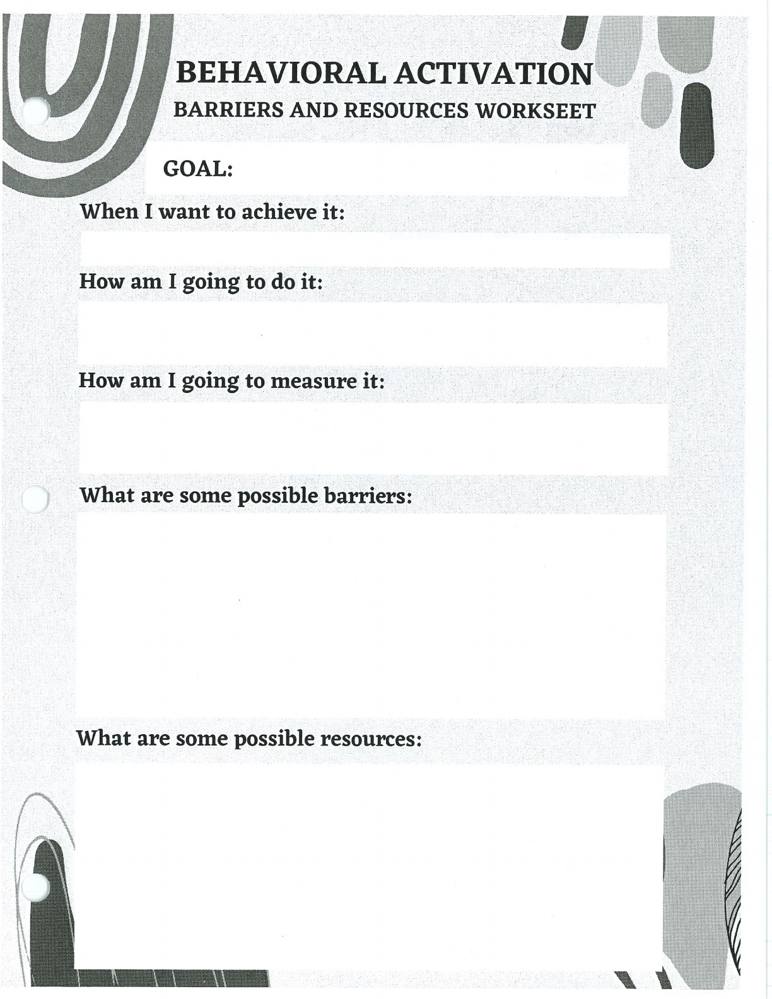
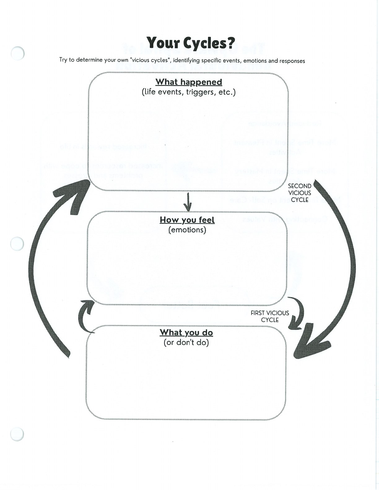
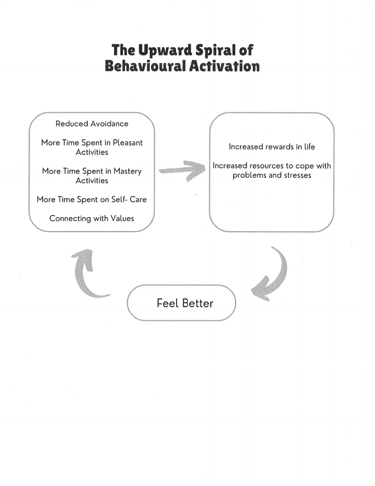

Behavioural activation uses planned action to interrupt avoidance and increase contact with meaningful activities.

## Handouts and Worksheets {#handouts-and-worksheets}

### Behavioural Activation Barriers and Resources - binder-p0062 {#binder-p0062}

binder-p0062

<!-- binder-resource: binder-p0062 -->

[{.img-fluid fig-alt="Preview of Behavioural Activation Barriers and Resources (binder-p0062)"}](../../assets/binder/binder-p0062.jpg)

[Open full page](../../assets/binder/binder-p0062.jpg)

### Behavioural Activation - binder-p0065 {#binder-p0065}

binder-p0065

<!-- binder-resource: binder-p0065 -->

[{.img-fluid fig-alt="Preview of Behavioural Activation (binder-p0065)"}](../../assets/binder/binder-p0065.jpg)

[Open full page](../../assets/binder/binder-p0065.jpg)

### Behavioural Activation - binder-p0066 {#binder-p0066}

binder-p0066

<!-- binder-resource: binder-p0066 -->

[{.img-fluid fig-alt="Preview of Behavioural Activation (binder-p0066)"}](../../assets/binder/binder-p0066.jpg)

[Open full page](../../assets/binder/binder-p0066.jpg)
