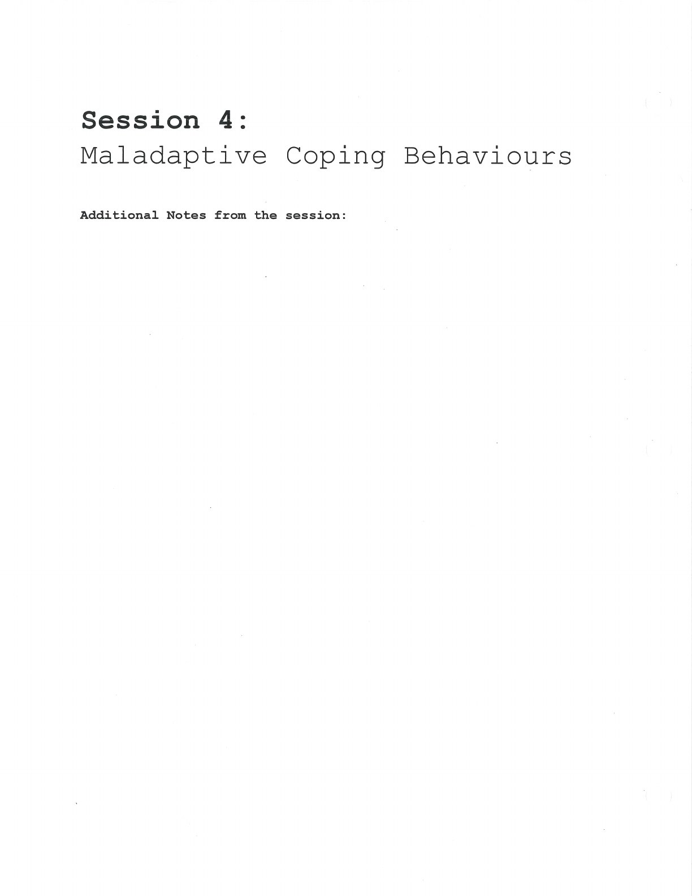

The aim is to understand the function of a coping behaviour and build safer alternatives.

## Handouts and Worksheets {#handouts-and-worksheets}

### Maladaptive Coping Behaviours - binder-p0061 {#binder-p0061}

binder-p0061

<!-- binder-resource: binder-p0061 -->

[{.img-fluid fig-alt="Preview of Maladaptive Coping Behaviours (binder-p0061)"}](../../assets/binder/binder-p0061.jpg)

[Open full page](../../assets/binder/binder-p0061.jpg)
