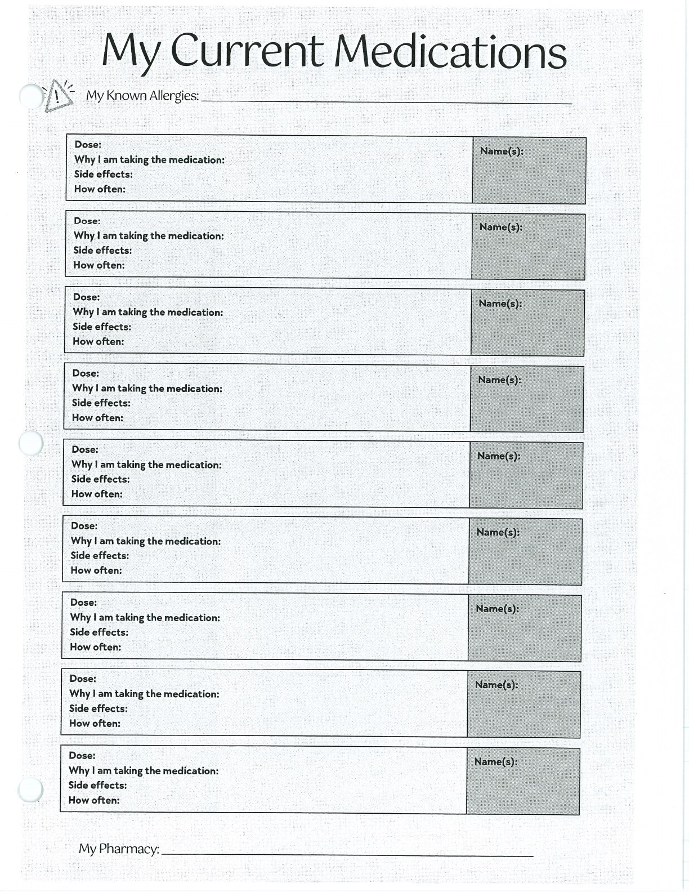
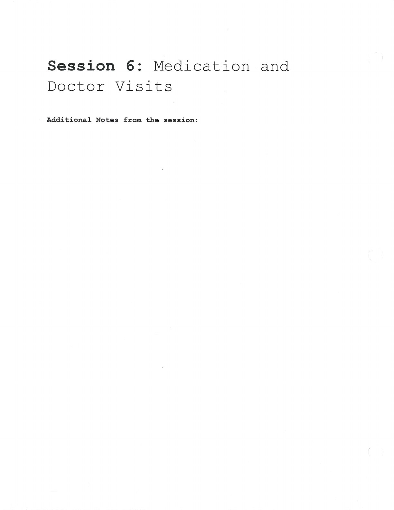
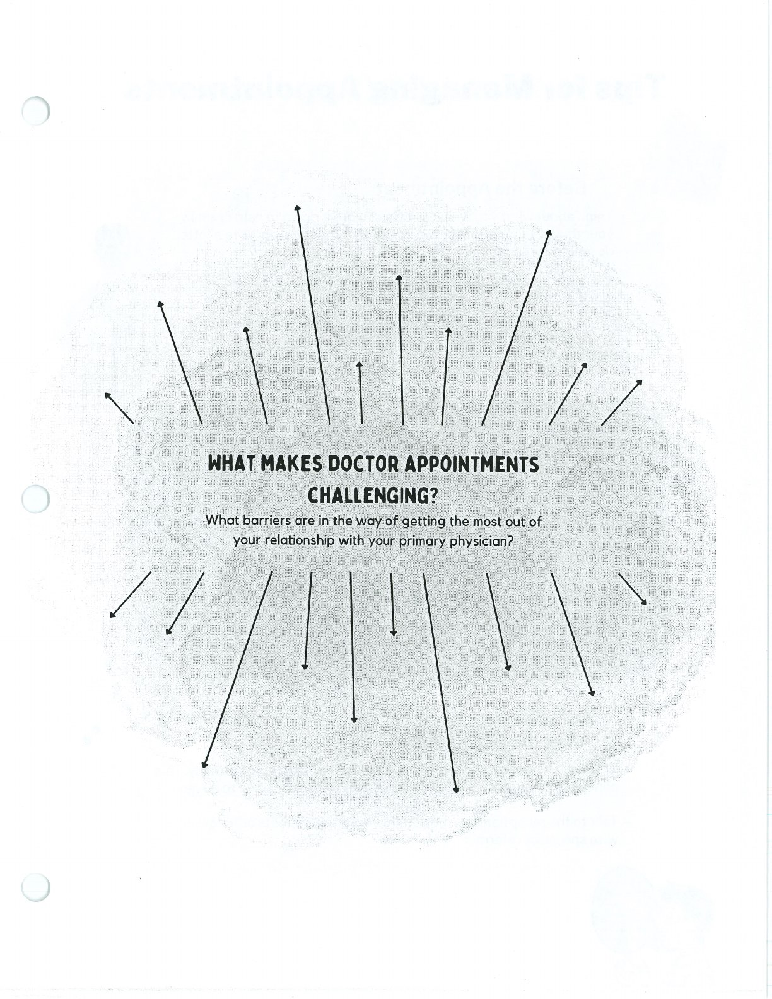

These tools support accurate communication with prescribers and other health-care providers.

## Handouts and Worksheets {#handouts-and-worksheets}

### My Current Medications - binder-p0054 {#binder-p0054}

binder-p0054

<!-- binder-resource: binder-p0054 -->

[{.img-fluid fig-alt="Preview of My Current Medications (binder-p0054)"}](../../assets/binder/binder-p0054.jpg)

[Open full page](../../assets/binder/binder-p0054.jpg)

### Medication and Doctor Visits - binder-p0056 {#binder-p0056}

binder-p0056

<!-- binder-resource: binder-p0056 -->

[{.img-fluid fig-alt="Preview of Medication and Doctor Visits (binder-p0056)"}](../../assets/binder/binder-p0056.jpg)

[Open full page](../../assets/binder/binder-p0056.jpg)

### Medication and Doctor Visits - binder-p0057 {#binder-p0057}

binder-p0057

<!-- binder-resource: binder-p0057 -->

[{.img-fluid fig-alt="Preview of Medication and Doctor Visits (binder-p0057)"}](../../assets/binder/binder-p0057.jpg)

[Open full page](../../assets/binder/binder-p0057.jpg)
