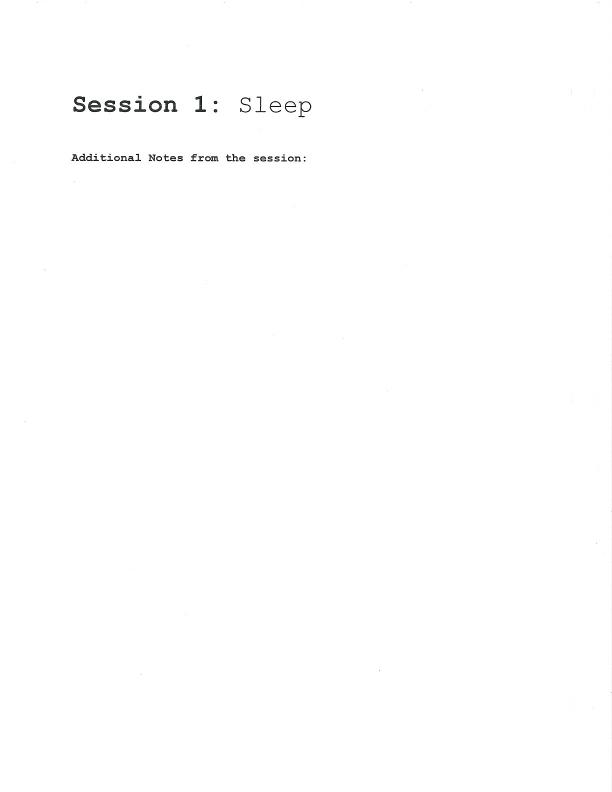
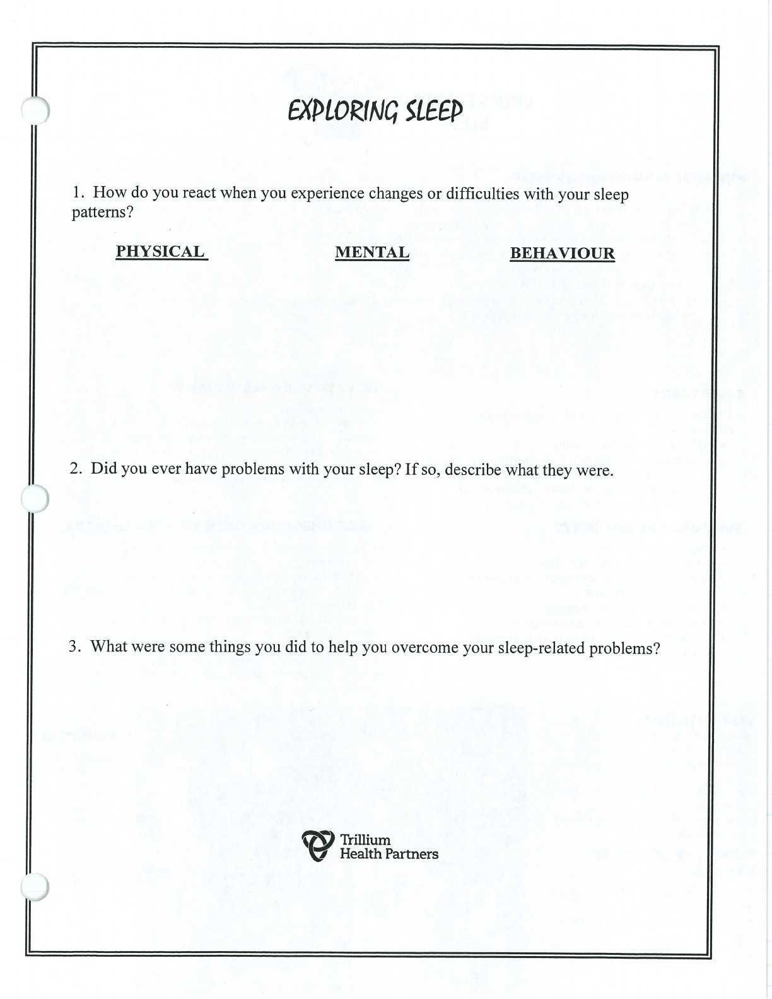

Sleep tracking and small routine changes can clarify what helps or disrupts rest.

## Handouts and Worksheets {#handouts-and-worksheets}

### Sleep - binder-p0069 {#binder-p0069}

binder-p0069

<!-- binder-resource: binder-p0069 -->

[{.img-fluid fig-alt="Preview of Sleep (binder-p0069)"}](../../assets/binder/binder-p0069.jpg)

[Open full page](../../assets/binder/binder-p0069.jpg)

### Sleep - binder-p0070 {#binder-p0070}

binder-p0070

<!-- binder-resource: binder-p0070 -->

[{.img-fluid fig-alt="Preview of Sleep (binder-p0070)"}](../../assets/binder/binder-p0070.jpg)

[Open full page](../../assets/binder/binder-p0070.jpg)
