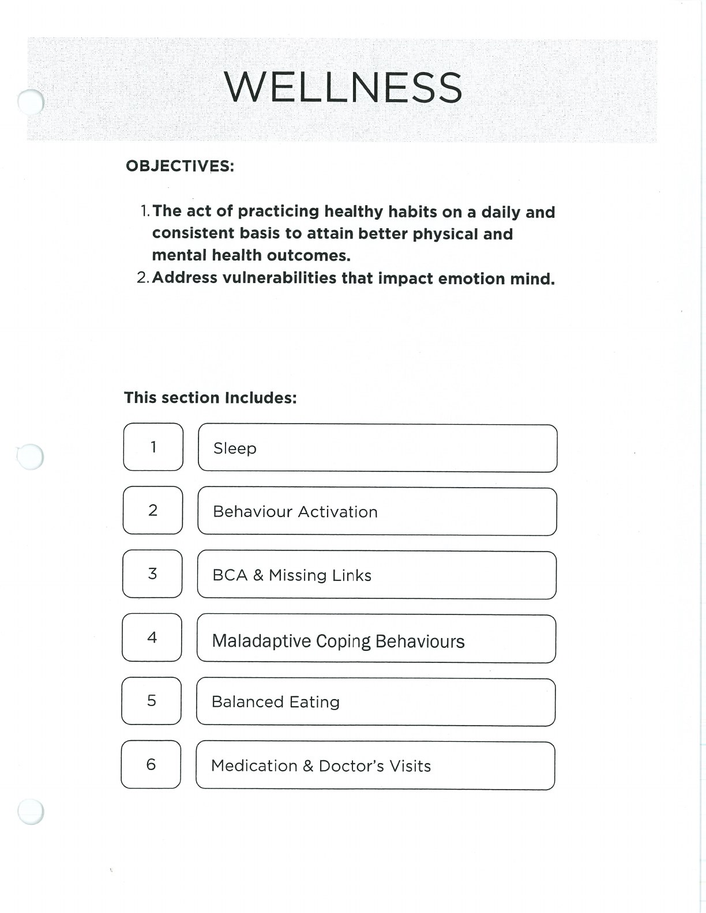
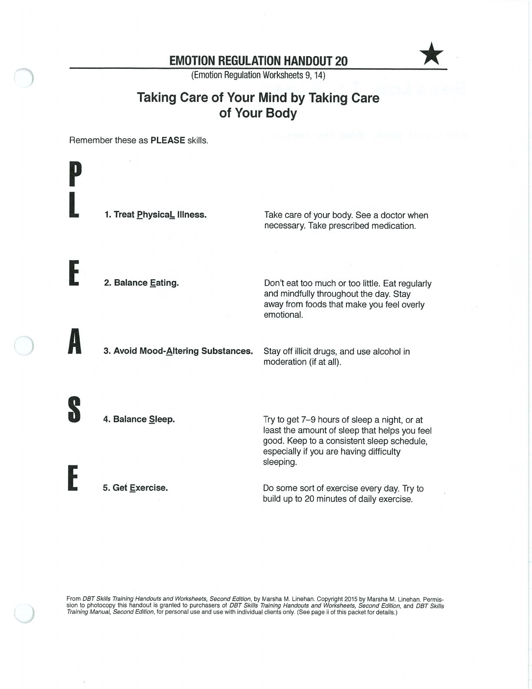

Wellness skills reduce preventable vulnerability and create a steadier base for other skills.

## Treat Physical Illness {#treat-physical-illness}

## Balanced Eating {#balanced-eating}

## Avoid Mood-Altering Substances {#avoid-mood-altering-substances}

## Balanced Sleep {#balanced-sleep}

## Exercise {#exercise}

## Handouts and Worksheets {#handouts-and-worksheets}

### Wellness and PLEASE Body Care - binder-p0067 {#binder-p0067}

binder-p0067

<!-- binder-resource: binder-p0067 -->

[{.img-fluid fig-alt="Preview of Wellness and PLEASE Body Care (binder-p0067)"}](../../assets/binder/binder-p0067.jpg)

[Open full page](../../assets/binder/binder-p0067.jpg)

### Wellness and PLEASE Body Care - binder-p0068 {#binder-p0068}

binder-p0068

<!-- binder-resource: binder-p0068 -->

[{.img-fluid fig-alt="Preview of Wellness and PLEASE Body Care (binder-p0068)"}](../../assets/binder/binder-p0068.jpg)

[Open full page](../../assets/binder/binder-p0068.jpg)
